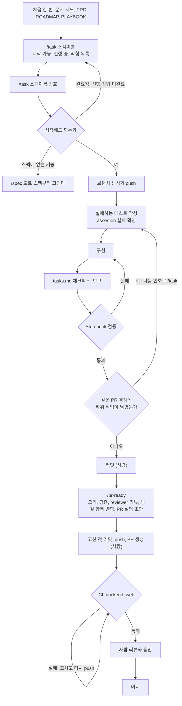

# 작업 수행 흐름: 작업 선정에서 머지까지

스펙의 작업 하나를 골라 머지하기까지 어떤 순서로 무엇을 실행하는지 정리한 문서입니다. 사람이 읽는 안내서이고, Claude에게 주는 지시가 아닙니다(`CLAUDE.md`가 이 문서를 가져오지 않습니다).

규칙의 원본은 따로 있습니다. 이 문서와 원본이 다르면 원본이 맞습니다.

| 내용 | 원본 |
|---|---|
| 브랜치, PR 단위, 승인 규칙 | [PLAYBOOK](../product/PLAYBOOK.md) 2장 "승인 규칙 요약", 6장 "작업 규칙" |
| `/task`, `/pr-ready`가 하는 일 | [`.claude/skills/task/SKILL.md`](../../.claude/skills/task/SKILL.md), [`.claude/skills/pr-ready/SKILL.md`](../../.claude/skills/pr-ready/SKILL.md) |
| Stop hook과 권한 규칙 | [claude-code-setup.md](claude-code-setup.md) |

## 한눈에 보기

| 단계 | 실행하는 것 | 누가 | 결과 |
|---|---|---|---|
| 0. 처음 한 번 | [문서 지도](../README.md) 읽기 | 사람 | 무엇을 만드는지, 이번 주에 무엇을 하는지 안다 |
| 1. 작업 고르기 | `/task <스펙>` | Claude | 시작 가능, 진행 중, 막힘 목록 |
| 2. 작업 시작 | `/task <스펙> <번호>` | Claude | 브랜치를 만들고 push한다 |
| 3. 구현 | `/task` (이어서) | Claude | 실패 테스트, 구현, 체크박스, 보고 |
| 3-1. 검증 | Stop hook | 자동 | 바뀐 스택의 포맷과 테스트 통과 |
| 4. 커밋 | `git commit` | 사람 | Conventional Commits 커밋 |
| 5. PR 준비 | `/pr-ready` | Claude | AI 리뷰 반영, 뒤 작업에 넘길 항목을 스펙 문서에 반영, PR 설명 초안 |
| 6. PR 생성 | `git push`, PR 만들기 | 사람 | PR과 CI 실행 |
| 7. 리뷰와 머지 | GitHub | 사람 | `main`에 머지 |

## 흐름도

## 단계별 설명

### 0. 처음 한 번
[문서 지도](../README.md)에서 시작해 PRD, ROADMAP, PLAYBOOK, 그리고 맡은 스펙의 색인(`docs/specs/<스펙>/README.md`)을 읽습니다. 스펙 본문(`requirements.md`, `design.md`, `tasks.md`)은 크므로 통째로 읽을 필요가 없습니다. 작업마다 필요한 절은 `/task`가 찾아 읽습니다.

### 1. 작업 고르기: `/task <스펙>`
번호 없이 실행하면 구현하지 않고 목록만 보여 줍니다. 예: `/task pr-lens-p1-cli`

- **시작 가능**: 선행 작업이 끝났고 아무도 하고 있지 않은 작업
- **진행 중**: 원격 브랜치 이름으로 찾습니다. 브랜치 이름, 작성자, 날짜가 나옵니다
- **막힘**: 기다리는 작업 번호가 나옵니다

진행 중인지는 원격 브랜치 이름으로만 알 수 있습니다. push하지 않은 다른 사람의 작업은 보이지 않습니다.

### 2. 작업 시작: `/task <스펙> <번호>`
예: `/task pr-lens-p1-cli 2.1`

Claude가 먼저 시작해도 되는지 확인합니다.

- 이미 완료됐거나 선행 작업이 끝나지 않았으면 멈춥니다.
- 다른 사람의 브랜치가 있으면 계속할지 묻습니다.
- 결정 대기 항목(D-n, G-n)에 걸린 작업은 스펙의 제안값으로 구현한다고 알리고 계속합니다.
- "사람이 수행"이라고 적힌 작업은 할 일 목록만 보여 주고 멈춥니다.

그다음 브랜치 이름을 제안하고, 확인을 받으면 `origin/main`에서 브랜치를 만들어 바로 push합니다. push가 "이 작업을 내가 하고 있다"는 표시입니다.

### 3. 구현
Claude가 다음 순서로 진행합니다.

1. `requirements.md`에서 그 작업의 인수 기준만, `design.md`에서 그 작업의 클래스가 나오는 절만 읽습니다.
2. 인수 기준마다 테스트를 하나 이상 쓰고, 그 테스트가 assertion에서 실패하는지 확인합니다.
3. 구현합니다. 테스트를 고치거나 지워서 통과시키지 않습니다. 테스트가 인수 기준을 잘못 옮긴 것이면 멈추고 알린 뒤 고칩니다.
4. `tasks.md`의 체크박스를 고치고, 대응시킨 인수 기준과 테스트, 설계와 달라진 점, 다음에 할 작업을 보고합니다. 뒤 작업이 알아야 할 것이 생겼으면 "뒤 작업에 넘길 것"으로 함께 보고합니다(문서에 쓰는 것은 `/pr-ready`가 합니다).

작업 본문에 "주의(… 리뷰)"나 "미정(여기서 정함)"이 있으면 앞 작업의 리뷰가 넘긴 것입니다. Claude가 테스트를 쓰기 전에 읽고, "미정"은 그 작업에서 정한 뒤 `결정`으로 바꿉니다. 추론이 섞여 있으므로 틀린 "주의"는 그 줄을 고칩니다.

응답이 끝나면 Stop hook이 바뀐 스택만 검증합니다(backend는 `gradlew spotlessApply test`, web은 `npm run verify`). 실패하면 Claude에게 한 번 되돌려 보내 고치게 하고, 다시 실패하면 사용자에게 알립니다. 자세한 동작은 [claude-code-setup.md](claude-code-setup.md)의 "VerifyOnStop 동작"에 있습니다.

같은 PR 경계에 하위 작업이 남아 있으면 같은 브랜치에서 다음 번호로 `/task`를 다시 실행합니다.

### 4. 커밋
`/task`는 커밋하지 않습니다. 변경을 읽어 본 뒤 Conventional Commits 형식(`feat:`, `fix:`, `test:`, `docs:`)으로 커밋합니다. 직접 해도 되고 Claude에게 시켜도 됩니다.

`/pr-ready`의 리뷰는 커밋된 변경만 보므로, 커밋하지 않고 다음 단계로 가면 `/pr-ready`가 알리고 멈춥니다.

### 5. PR 준비: `/pr-ready`
1. 변경 범위를 확인합니다. 브랜치가 PR 경계 하나에 해당하는지, `src/main` 변경이 400줄 이하인지 봅니다.
2. 바뀐 스택을 검증하고 결과를 증거로 남깁니다.
3. reviewer 에이전트가 diff를 스펙과 팀 규칙에 대조해 리뷰합니다. 이 에이전트는 구현 대화의 맥락을 모르는 상태로 코드와 스펙만 봅니다. `.claude/`나 `CLAUDE.md`를 고친 변경은 `context-reviewer` 에이전트가 리뷰합니다(지침끼리 맞물리는지, 기존 규칙이나 hook과 충돌하는지). 설정과 그 문서만 바뀐 브랜치는 `context-reviewer`만 실행하고, `backend/`나 `web/`도 함께 바뀌었으면 둘 다 실행합니다(`.claude/hooks/`의 Java 파일이 바뀌어도 `reviewer`를 함께 실행합니다).
4. 리뷰 결과를 "반드시 수정", "선택", "뒤 작업에 넘길 것"으로 나눠 보여 주고, "반드시 수정"만 고친 뒤 테스트를 다시 실행합니다.
5. "뒤 작업에 넘길 것"이 있으면 스펙 문서 수정안(대상 작업 본문에 넣을 `주의(… 리뷰)`, `미정(여기서 정함)` 줄)을 보여 주고, 승인한 항목만 반영합니다. PR 설명은 뒤 작업을 하는 세션이 읽지 못하므로 `/task`가 읽는 `tasks.md`에 남깁니다. 작업 번호가 있는 브랜치인데 `/task`를 실행한 세션이 아니면 `/task`가 보고한 넘길 항목이 있었는지 묻습니다.
6. [PR 템플릿](../../.github/pull_request_template.md) 형식으로 PR 설명 초안을 출력합니다.

`/pr-ready`도 커밋, push, PR 생성은 하지 않습니다. 4번에서 고친 것과 5번에서 반영한 문서 변경이 있으면 다시 커밋합니다(문서 변경은 `docs:` 커밋으로 나눕니다).

### 6. PR 생성
push하고 PR을 만듭니다. `git push`는 Claude가 실행할 때마다 승인을 묻습니다.

- PR 설명은 `/pr-ready`의 초안을 붙이고 "AI 사용" 체크리스트를 직접 확인합니다.
- "AI 리뷰 지적 n건 / 반영 m건"을 적고, 기각한 지적은 이유를 한 줄씩 남깁니다.
- `.claude/`나 `CLAUDE.md`를 고친 PR에는 `context` 라벨을 붙입니다.

PR이 열리면 CI가 `backend`, `web` 두 job을 실행합니다. 둘 다 필수 체크입니다.

### 7. 리뷰와 머지
사람이 리뷰하고 승인합니다. 누가 승인하는지는 PR 종류에 따라 다르고, 표는 [PLAYBOOK](../product/PLAYBOOK.md)의 "승인 규칙 요약"에 있습니다.

머지되면 `origin/main`의 `tasks.md` 체크박스가 바뀌고, 그때부터 다른 사람의 `/task <스펙>` 목록에 완료로 보입니다.

## 자주 헷갈리는 것

### 하위 번호를 주면 브랜치는 어떻게 되는가
브랜치는 PR 단위로 하나이고, 구현은 준 번호만큼 합니다. P1의 작업 2는 PR 경계가 `2.1~2.3 / 2.4~2.6`입니다.

| 실행 | 브랜치 | 구현 범위 |
|---|---|---|
| `/task pr-lens-p1-cli 2.1` | `feat/shared-p1-2.1-model-types`를 새로 만든다 | 2.1 |
| `/task pr-lens-p1-cli 2.2` | 같은 브랜치를 그대로 쓴다 | 2.2 |
| `/task pr-lens-p1-cli 2.3` | 같은 브랜치를 그대로 쓴다 | 2.3 |
| `/task pr-lens-p1-cli 2` | `feat/shared-p1-2.1-model-types` | 2.1, 2.2, 2.3을 순서대로 하고 멈춘다 |

브랜치 이름의 번호는 그 PR 경계의 첫 하위 작업 번호입니다. 2.2를 실행할 때 Claude가 "다른 작업의 브랜치"라고 보고 물으면, 같은 PR 경계라고 답하면 됩니다.

### TDD인가
아닙니다. "테스트 먼저(test-first)"입니다. 실패하는 테스트를 먼저 쓰고 구현으로 통과시키는 것까지는 같지만, 테스트 하나씩 짧게 반복하지 않고 작업의 테스트를 한꺼번에 먼저 씁니다. 클래스와 시그니처를 `design.md`가 이미 정해 두어서, 테스트가 설계를 이끄는 방식은 맞지 않습니다.

### 테스트를 먼저 쓰지 않는 작업

| 작업 종류 | 하는 일 |
|---|---|
| `*` 속성 테스트 작업 | 구현이 이미 있으므로 테스트만 쓴다. 반례가 나오면 예시 테스트로 고정한 뒤 구현을 고친다 |
| Checkpoint 작업 | 코드를 쓰지 않는다. 전체 테스트를 돌리고 결과를 보고한다 |
| 코드가 아닌 작업 (패키지 이름 변경, 문서, `.claude/`) | 테스트 단계를 건너뛴다 |

### 스펙에 없는 것이 필요할 때

| 상황 | 할 일 |
|---|---|
| 스펙에 없는 기능 | `/spec <스펙>`으로 요구사항, 설계, 작업을 먼저 더한다 |
| 결정 대기 항목을 확정해야 함 | 팀이 정한 뒤 `/adr <제목>`으로 기록하고, 스펙의 결정 대기 표를 "확정"으로 바꾼다 |
| 새 의존성 | Claude가 멈추고 묻는다. 사람의 승인이 필요하다 |
| 설계와 다르게 구현함 | 같은 PR에서 `design.md`의 그 절을 함께 고친다 |
