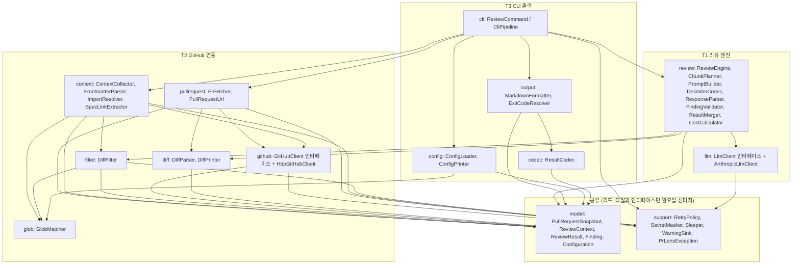
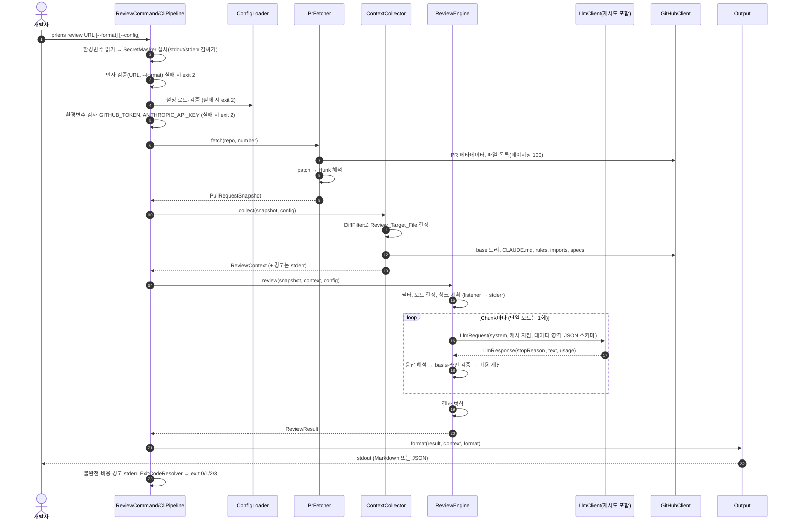

# Design Document: PR Lens P1 CLI

## Overview

`prlens review <PR URL>`는 GitHub PR을 가져와(T2), 팀 컨텍스트 기준으로 Claude API에 리뷰를 요청하고(T1), 결과를 Markdown 또는 JSON으로 출력합니다(T3). 이 문서는 [requirements.md](requirements.md)의 요구사항 1~22를 구현하는 설계이며, 요구사항 문구를 반복하지 않고 "어떻게"만 다룹니다.

설계의 중심 목표는 세 가지입니다.

1. **P2/P3 재사용**: 공유 타입(`model` 패키지)과 `ReviewEngine`은 CLI, Spring, HTTP 구현에 의존하지 않습니다. P2 서버는 `LlmClient`와 `GitHubClient` 구현(또는 인증 방식)만 바꿔 끼우고 엔진 코드는 고치지 않습니다(요구사항 17.3, P2 요구사항 16.4).
2. **순수 함수 우선**: diff 해석, 필터, glob, 청크 계획, basis 검증, 라인 판정, 이스케이프, 직렬화, 비용 계산, 종료 코드 결정은 I/O 없는 순수 함수로 만들어 속성 기반 테스트로 검증합니다. I/O(GitHub, Claude, 파일, 표준 스트림)는 얇은 어댑터로 가장자리에 둡니다.
3. **트랙 병렬화**: 월요일에 기능 리드(B)가 `model` 패키지와 경계 인터페이스("공유 경계"의 코드)를 먼저 머지하고, T1~T3는 이 타입과 시그니처만 보고 진행합니다. 재시도와 마스킹의 구현(`support`)은 선머지 대상이 아니고 리드가 트랙과 병렬로 만듭니다.

### 작업 환경 확인 결과

- 이 저장소(`claude-team-prlen`)는 스타터를 복사한 상태입니다. `backend/`는 Spring Boot 4.1.1, Java 17이고 패키지는 아직 `com.example.starter`(메모 샘플)입니다. 1주차에 `com.prlens`로 바꾸고(ROADMAP 1주차), 메모 샘플은 작업 1에서 지웁니다.
- 패키지 구조는 [ADR 0003](../../adr/0003-role-based-flat-packages.md)을 따릅니다. ADR 0001의 `<feature>.{domain,api}`를 대체해 `com.prlens` 아래 역할 단위 평면 패키지를 쓰고, 의존 규칙은 ArchUnit으로 강제합니다.
- ADR 0002(표준 에러 응답 `ErrorResponse`)는 HTTP API 오류 형식이므로 P1 CLI에는 적용 대상이 없습니다. P2의 webhook·조회 API부터 적용합니다(P2 요구사항의 Standard_Error_Response).
- 스타터의 테스트 도구는 Spring Boot 4.1이 관리하는 JUnit Jupiter 6.0.3입니다. jqwik 1.10.1과 ArchUnit 1.5.1(`archunit-junit5`)이 이 조합에서 도는 것은 임시 프로젝트로 확인했습니다("1주차 spike 확인 목록").

### 결정 대기 항목에 대한 권고

| ID | 권고 | 근거 | 상태 |
|---|---|---|---|
| D-1 CLI 라이브러리 | **picocli** | 단발 실행 CLI에 맞고(Spring Shell은 대화형 셸 중심), Spring 컨텍스트 없이 시작할 수 있어 시작 시간이 짧고, 종료 코드 제어가 명시적입니다. 명령 해석은 `cli` 패키지에만 두므로 결정이 바뀌어도 다른 패키지는 영향이 없습니다 | 확정 ([ADR 0004](../../adr/0004-cli-library-picocli.md)) |
| D-2 effort 기본값 | `medium`을 설정 기본값으로 두고 **요청에 항상 명시** | PRD 6장: 이 모델의 기본값이 `medium`이라 명시하지 않으면 모델 교체 시 조용히 바뀝니다. 실측에서 1회 $0.06~$0.16, 18~29초였습니다([spike](../../spikes/2026-10-08-llm-settings.md)) | 확정 ([ADR 0005](../../adr/0005-llm-settings.md)) |
| D-2 최대 출력 토큰 | 기본 16,000, 설정 상한 20,000 | thinking 토큰이 출력으로 과금되고(PRD 6장) `max_tokens` 도달 시 불완전 처리되므로 여유를 둡니다. 실측 최대 출력은 3,374 토큰이었습니다. 상한은 가장 빠른 관측 속도(초당 약 110 토큰)로 비스트리밍 180초 동안 받는 양을 올림한 값이고, 한도 가까이 쓰면 타임아웃이 날 수 있습니다 | 확정 ([ADR 0005](../../adr/0005-llm-settings.md)) |
| D-4 불완전 종료 코드 | 3 (요구사항 제안값 그대로) | | T3 스펙 검토 |
| D-5 설정 파일 | YAML, `./.prlens.yml` → `~/.prlens.yml` | Spring Boot가 YAML 파서를 이미 포함합니다 | T3 결정 |
| D-6 생성 코드 패턴 | 요구사항 3.1 제안값 그대로 | | T2 결정 |

## Architecture

### 계층과 의존 방향



의존 규칙(ArchUnit 테스트로 CI에서 강제, 제안):

- `model`은 JDK 외 어떤 패키지에도 의존하지 않습니다(Jackson 애너테이션도 넣지 않음. 직렬화는 `codec`이 담당).
- `review`는 `cli`, `output`, `github`, `config`(로더)에 의존하지 않습니다. `llm`은 인터페이스(`LlmClient`)에만 의존하고 `AnthropicLlmClient`는 참조하지 않습니다.
- `context`, `pullrequest`는 `GitHubClient` 인터페이스에만 의존합니다.
- Spring 애너테이션은 `cli`의 조립 코드(또는 P2의 설정 클래스)에만 둡니다. `ReviewEngine`은 상태가 없는 일반 Java 클래스이고, P2는 Review_Job마다 새 인스턴스를 만듭니다(P2 설계 Overview). 스타터의 `common` 패키지는 P2 스펙에서 위치를 정할 때까지 이 규칙의 예외로 둡니다(ADR 0003).
- picocli 타입은 `cli`에서만 씁니다([ADR 0004](../../adr/0004-cli-library-picocli.md)).

### 패키지 배치 (`backend/src/main/java/com/prlens/`)

| 패키지 | 트랙 | 주요 클래스 | 관련 요구사항 |
|---|---|---|---|
| `model` | 리드(월요일 선머지) | 공유 레코드 전부 (Data Models 참고), `RepoPaths`(Normalized_Repo_Path 변환. 여러 패키지가 쓰는 순수 함수) | 17, 4.8, 11.1, 22.2, 22.6 |
| `github` | T2 (P2와 공유) | `GitHubClient`, `GitHubCredentials`, `HttpGitHubClient`, `GitHubApiException` | 1.8, 1.11, 21 |
| `pullrequest` | T2 | `PullRequestUrl`, `PrFetcher` | 1 |
| `diff` | T2 | `DiffParser`, `DiffPrinter`, `LineRanges` | 2, 22.4 |
| `glob` | T2 | `GlobMatcher`, `GlobSyntaxException` | 5.7, 5.8 |
| `filter` | T2 | `DiffFilter`, `FilterOutcome` | 3 |
| `context` | T2 | `ContextCollector`, `RepoTreeIndex`, `FrontmatterParser`, `ImportResolver`, `SpecLinkExtractor` | 4~8 |
| `llm` | T1 | `LlmClient`, `LlmRequest`, `LlmResponse`, `RetryingLlmClient`, `AnthropicLlmClient` | 9, 20.8, 21 |
| `review` | T1 | `ReviewEngine`, `ReviewListener`, `ChunkPlanner`, `PromptBuilder`, `DelimiterCodec`, `ReviewJsonSchema`, `ResponseParser`, `FindingValidator`, `ResultMerger`, `CostCalculator` | 9, 11~14, 16, 20 |
| `codec` | T3 | `ResultCodec`, `CodecException` | 10 |
| `output` | T3 | `MarkdownFormatter`, `ExitCodeResolver` | 8, 11.6, 12.8, 15, 16 |
| `config` | T3 | `ConfigLoader`, `ConfigPrinter`, `ConfigException` | 18 |
| `cli` | T3 | `PrLensMain`, `ReviewCommand`, `CliPipeline`, `StderrReporter` | 15, 19, 22 |
| `support` | 리드(인터페이스와 예외 기반 타입만 선머지, 구현은 병렬) | `RetryPolicy`, `RetryExecutor`, `RetryListener`, `Sleeper`, `SecretMasker`, `MaskingPrintStream`, `Warning`, `WarningSink`, `Attempt`, `PrLensException`과 재시도 관련 하위 예외 | 19, 21 |

패키지 구조의 근거는 ADR 0003입니다. P2는 이 배치에 `webhook/`, `store/`, `query/`, `publish/`, `server/`, `execution/`을 추가하고 `github/`를 확장합니다(App 인증용 `GitHubCredentials` 구현 추가). 브랜치는 플레이북 형식 `feat/<track>-<단계>-<번호>-<slug>`(예: `feat/t2-p1-6-diff-filter`)을 따릅니다.

### `prlens review` 실행 순서



사전 검증 순서는 "마스커 설치 → 인자 → 설정 → 환경변수 → 외부 호출"입니다. 환경변수 값을 읽자마자 마스커를 가장 먼저 설치하므로, 인자·설정 오류 메시지에 비밀값이 섞여도 치환됩니다(요구사항 19.4). 값이 없는 환경변수는 마스커에서 빼고, 없다는 오류는 환경변수 검사 단계에서 냅니다. 어느 단계든 실패하면 외부 API를 호출하지 않고 종료 코드 2로 끝나므로 요구사항 1.9, 1.10, 3.11, 15.12, 18.7, 19.2, 19.3을 한 곳(`CliPipeline.preflight`)에서 만족합니다.

## Components and Interfaces

### 공유 경계 (월요일 선머지: 작업 1.1, 2.1~2.3, 요구사항 17)

```java
// github 패키지: P1은 PAT, P2는 GitHub App installation token 구현을 끼운다
public interface GitHubCredentials { String authorizationHeader(RepoRef repo); }

public interface GitHubClient {
  PullRequestMeta getPullRequest(RepoRef repo, int number);
  FilePage listFiles(RepoRef repo, int number, int page);          // per_page=100 고정
  RepoTree getTree(RepoRef repo, String sha);                      // recursive. 잘림은 RepoTree.truncated, 404는 다른 조회처럼 GitHubApiException (Optional로 감싸지 않음)
  FileFetch getFile(RepoRef repo, String path, String sha);        // Found(content) | NotFound | IsDirectory | TooLarge
}
public record PullRequestMeta(String title, /*@Nullable*/ String body, String baseSha, String headSha, int changedFiles) {}
public record FilePage(List<Entry> files, boolean hasNext) {       // hasNext = Link 헤더 rel="next"
  // GitHub가 준 값 그대로. 상태 매핑과 patch 해석은 PrFetcher가 한다
  public record Entry(String filename, /*@Nullable*/ String previousFilename, String status,
                      int additions, int deletions, /*@Nullable*/ String patch) {}
}
public record RepoTree(List<Entry> entries, boolean truncated) {
  public record Entry(String path, Kind kind) {}
  public enum Kind { BLOB, TREE, COMMIT }                          // COMMIT은 서브모듈
}

// pullrequest, context 패키지 (T2 구현, T3가 조립)
public final class PrFetcher {
  public PrFetcher(GitHubClient github, WarningSink warnings) { ... }
  public PullRequestSnapshot fetch(RepoRef repo, int number);      // CLI는 PullRequestUrl.repo()/number(), P2 webhook은 payload 값
}
public final class ContextCollector {
  public ContextCollector(GitHubClient github, WarningSink warnings) { ... }
  public ReviewContext collect(PullRequestSnapshot snapshot, Configuration config);
}

// llm 패키지
public interface LlmClient { LlmResponse send(LlmRequest request); }   // HTTP 오류와 네트워크 오류는 LlmApiException
public class LlmApiException extends PrLensException {                 // RetryingLlmClient가 Attempt로 바꾼다
  public /*@Nullable*/ Integer status();        // null이면 연결 실패 또는 제한 시간 초과
  public String errorKind();                    // 상태 코드 문자열 또는 네트워크 오류 종류
  public /*@Nullable*/ String retryAfter();     // 헤더 원문
}
public record LlmRequest(String model, int maxOutputTokens, String effort, String system,
                         String cachedUserBlock,          // Review_Criteria_Area, 끝에 캐시 지점
                         String dataUserBlock,            // Review_Data_Area
                         String jsonSchema) {}
public record LlmResponse(String stopReason, String text, LlmUsage usage) {}
public record LlmUsage(long inputTokens, long outputTokens, long cacheWriteTokens, long cacheReadTokens) {}

// support 패키지
public record Warning(String code, String message) {}
public interface WarningSink { void warn(Warning warning); }       // CLI는 stderr 한 줄, P2는 로그
public interface Sleeper { void sleep(Duration duration); }
public interface RetryListener {
  // wait는 정책이 계산한 대기 시간이다. Sleeper가 실제로는 더 짧게 자더라도 이 값을 그대로 전달한다
  void onRetry(String api, int nextAttempt, int maxAttempts, String lastStatusOrError, Duration wait);
}
public abstract class PrLensException extends RuntimeException { ... }   // sealed 아님 ("예외 계층과 종료 코드")

// 재시도 실행기와 호출자(HttpGitHubClient, RetryingLlmClient) 사이의 계약
public sealed interface Attempt<T> {
  record Success<T>(T value) implements Attempt<T> {}
  record Retryable<T>(String statusOrError, /*@Nullable*/ String retryAfter,   // 헤더 원문. 유효성은 실행기가 판단
                      /*@Nullable*/ Duration delay) implements Attempt<T> {}  // 호출자가 정한 대기(GitHub rate limit). `wait`는 record 구성 요소 이름으로 쓸 수 없음
  record Fatal<T>(String api, int status) implements Attempt<T> {}             // 실행기가 NonRetryableApiException으로 던진다
}
// RetryExecutor: public <T> T execute(String api, Supplier<Attempt<T>> call)

// T2가 구현하고 T1·T3가 쓰는 순수 함수의 시그니처 (2.3에서 스텁으로 선머지, 본문은 UnsupportedOperationException)
public final class GlobMatcher { public static boolean matches(String pattern, String path); public static void validate(String pattern) throws GlobSyntaxException; }
public class GlobSyntaxException extends PrLensException { public GlobSyntaxException(String pattern, String reason); public String pattern(); public String reason(); }   // 타입은 2.3에서 선머지, 던지는 조건은 6.1
public final class DiffPrinter { public static String print(List<Hunk> hunks); }
public final class LineRanges  { public static LineRanges of(List<Hunk> hunks); public boolean contains(int line); }
public final class DiffFilter  { public static FilterOutcome apply(List<ChangedFile> files, Configuration config); }
public record FilterOutcome(List<ChangedFile> targets, List<ExcludedFile> excluded, List<Warning> warnings) {}

// review 패키지: CLI·서버 공통 진입점
public final class ReviewEngine {
  public ReviewEngine(LlmClient llm, ReviewListener listener) { ... }
  public ReviewResult review(PullRequestSnapshot snapshot, ReviewContext context, Configuration config);
}

public interface ReviewListener {                  // CLI는 stderr, P2는 로그/DB로 구현
  default void modeDecided(ReviewStats stats) {}
  default void chunkStarted(int index, int total) {}          // "n/N"
  default void costThresholdExceeded(BigDecimal cumulative, BigDecimal limit, int remainingChunks) {}
}
```

어댑터와 데코레이터는 협력 객체를 모두 생성자로 받습니다. P2가 작업마다 다른 자격 증명과 재시도 설정으로 다시 조립하기 때문입니다(P2 설계).

```java
public RetryExecutor(RetryPolicy policy, Sleeper sleeper, RetryListener listener)
public HttpGitHubClient(HttpClient http, GitHubCredentials credentials, RetryExecutor retry)
public RetryingLlmClient(LlmClient delegate, RetryExecutor retry)
```

- 경고 전달 방식은 셋으로 고정합니다.
  - I/O를 하는 구성 요소(`PrFetcher`, `ContextCollector`)는 생성자로 받은 `WarningSink`에 즉시 알립니다.
  - 순수 함수(`DiffFilter`, `FrontmatterParser` 등)는 결과 타입에 경고 목록을 담아 돌려주고 호출자가 `WarningSink`로 넘깁니다. `DiffFilter`는 수집기와 엔진에서 두 번 호출되는데, 경고는 수집기만 `WarningSink`로 넘기고 엔진은 버립니다(같은 경고가 두 번 나오지 않게).
  - 엔진은 `WarningSink`를 받지 않습니다. 진행 중에 알릴 것(모드, Chunk 진행, 누적 비용 첫 초과)은 `ReviewListener`로 알리고, 결과로 알 수 있는 것은 CLI가 `ReviewResult`에서 유도합니다: 파일 수 부족(`fileCountGap`, 요구사항 1.14), 단가 없음(`estimatedCostUsd == null`, 요구사항 20.5), 1회 비용 상한 초과(`estimatedCostUsd`와 설정값 비교, 요구사항 20.3). 분할 모드에서 상한을 넘으면 진행 중 경고(20.4)와 끝난 뒤 경고(20.3)가 한 번씩 나옵니다.
- 트랙 사이 구현 의존은 다음 넷입니다. 시그니처는 위 코드대로 2.3에서 스텁으로 먼저 머지하므로 T1과 T3는 구현을 기다리지 않고 시작합니다. 구현은 T2가 가장 먼저 합니다(화요일 목표).
  - `GlobMatcher`(6.1): T3 `ConfigLoader`가 패턴 검증에 사용
  - `DiffPrinter`(5.2): T1 `PromptBuilder`가 patch 출력에 사용
  - `LineRanges`(5.3): T1 `FindingValidator`가 라인 판정에 사용
  - `DiffFilter`(6.3): T1 `ReviewEngine`이 대상 파일 결정에 사용
- `ReviewEngine`의 입력은 요구사항 17.3대로 snapshot, context, configuration 세 가지뿐입니다. 필터 결과는 엔진이 `DiffFilter`(순수 함수)로 다시 계산합니다. `ContextCollector`도 같은 함수를 호출하므로 두 곳의 결과는 항상 같습니다(요구사항 3.13 멱등 속성이 이를 뒷받침).
- `files_truncated`(요구사항 1.14)는 엔진이 `snapshot.reportedChangedFiles() > snapshot.files().size()`로 직접 판정합니다. P2도 추가 코드 없이 같은 동작을 얻습니다.
- 재시도는 `RetryingLlmClient`(데코레이터)와 `HttpGitHubClient` 내부의 `RetryExecutor`가 담당합니다. 재시도 이벤트는 `RetryListener`(`support`)로 알리며, CLI는 stderr 한 줄(요구사항 21.7), P2는 대기 시간 합 기록(P2 요구사항 17.3)에 씁니다. 대기 시간은 `Duration`으로 전달하므로 단위를 따로 맞출 필요가 없습니다.

### T2 GitHub 연동 (요구사항 1~8)

**PullRequestUrl** (요구사항 1.3, 1.4, 1.9): 정규식 한 개로 검증하고 `repo()`(`RepoRef`)와 `number()`를 돌려줍니다.

```
^https://github\.com/([A-Za-z0-9_.-]{1,100})/([A-Za-z0-9_.-]{1,100})/pull/([1-9][0-9]{0,9})(?:/(?:files|commits)?)?(?:\?[^#]*)?(?:#.*)?$
```

번호는 `long`으로 읽어 2,147,483,647 이하인지 따로 확인합니다. 호스트 대소문자(`GitHub.com`)는 요구사항이 정하지 않았으므로 정확히 `github.com`만 허용합니다.

**PrFetcher** (요구사항 1):

- `GET /repos/{o}/{r}/pulls/{n}`으로 메타데이터, `GET /repos/{o}/{r}/pulls/{n}/files?per_page=100&page=k`로 파일 목록을 받습니다. 중단 조건은 "누적 수 == `changed_files`" 또는 "빈 페이지/`Link: rel=next` 없음"입니다. 같은 `filename`이 다시 오면 버립니다.
- GitHub 문서상 이 엔드포인트의 최대 파일 수는 3,000개이지만 실제로는 300개에서 끊긴다는 보고가 있습니다([GitHub REST: pulls](https://docs.github.com/en/rest/pulls/pulls), [community discussion #118311](https://github.com/orgs/community/discussions/118311)). 어느 쪽이든 요구사항 1.14의 `files_truncated` 경로로 처리되므로 설계는 상한 값에 의존하지 않습니다. **1주차 spike에서 확인할 항목**: 실제 상한, `changed_files` 필드와의 관계.
- GitHub 상태 문자열 매핑: `added`→`ADDED`, `modified`/`changed`→`MODIFIED`, `removed`→`REMOVED`, `renamed`→`RENAMED`, `copied`→`ADDED`(이전 경로 유지), `unchanged`→`MODIFIED`. `copied`/`unchanged`는 요구사항에 없는 값이라 이 매핑을 제안합니다.
- patch가 없으면 `PatchContent.Absent`, 해석 오류면 `PatchContent.Unparseable(error)`로 담습니다(아래 "요구사항 공백" 참고).

**DiffParser / DiffPrinter** (요구사항 2, 22.4):

- 입력을 먼저 `\r\n`과 단독 `\r` 뒤 `\n`을 `\n`으로 바꾸고(CR 제거), 끝의 `\n` 하나를 떼어 줄로 나눕니다.
- 상태 기계: `EXPECT_HEADER` → 헤더 정규식 `^@@ -(\d+)(?:,(\d+))? \+(\d+)(?:,(\d+))? @@(.*)$` → `IN_HUNK`(남은 base/head 줄 수를 줄여 가며 ` `, `+`, `-` 소비, `\`는 직전 줄의 `noNewlineAtEnd=true`) → 두 카운터가 0이면 `EXPECT_HEADER`. 헤더 뒤 텍스트(`(.*)`)는 앞 공백 포함 그대로 `sectionHeading`에 저장해 round-trip을 보장합니다.
- 검증: 카운터가 음수가 되거나 파일 끝에서 0이 아니면 줄 수 불일치, 이전 Hunk의 head 구간 끝 ≥ 다음 시작이면 겹침/비증가. 오류는 `DiffParseException(path, lineNo, hunkIndex, kind)`이고 부분 결과를 반환하지 않습니다.
- Printer는 `@@ -a,b +c,d @@` + `sectionHeading`, 줄 접두어 + 내용 + `\n`, `noNewlineAtEnd`이면 다음 줄에 `\ No newline at end of file\n`을 씁니다.
- `LineRanges.of(hunks)`: `headCount ≥ 1`인 Hunk마다 `[headStart, headStart+headCount-1]`을 만들고 정렬·병합한 불변 구간 목록을 돌려줍니다. `contains(line)`은 이진 탐색입니다.

**GlobMatcher** (요구사항 5.7, 5.8, 3.2):

- `java.nio.file.PathMatcher`는 쓰지 않습니다. `**/x`가 루트의 `x`와 일치하지 않고, Windows에서 구분자와 대소문자 처리가 OS에 따라 달라 요구사항 22.6과 충돌하기 때문입니다.
- 직접 구현합니다. 패턴을 `/`로 구간을 나누고, 구간 전체가 `**`이면 "0개 이상의 구간", 아니면 구간 정규식(`*`→`[^/]*`, `?`→`[^/]`, `{a,b}`→`(?:a|b)`(중첩 허용), 그 외 `Pattern.quote`)으로 컴파일합니다. 매칭은 구간 배열에 대한 메모이제이션 DP(`O(패턴 구간 × 경로 구간)`)입니다.
- 중괄호를 정규식 교대(`(?:…|…)`)로 직접 컴파일하므로, "중괄호를 먼저 펼친 뒤 하나라도 일치" 모델(요구사항 5.8)이 독립된 비교 대상이 됩니다. 단, 중괄호가 `/`를 포함하면(`{a/b,c}`) 구간 분할 전에 펼쳐야 하므로 그 경우에만 펼친 뒤 컴파일합니다.
- 문법 오류: 짝이 맞지 않는 중괄호, 빈 패턴, `\` 포함, `**`가 구간 일부로 쓰임(`a**b`), 펼친 개수가 256 초과. 설정 파일 패턴은 요구사항 3.11대로 exit 2, rule `paths` 패턴은 해당 패턴을 무시하고 경고한 뒤 나머지 패턴으로 판정합니다(모든 패턴이 무효면 요구사항 5.10과 같이 항상 포함 + 경고).

**DiffFilter** (요구사항 3): `FilterOutcome(targets, excluded, warnings)`를 돌려주는 순수 함수입니다. 패턴 목록 = 기본 목록 − (해제 목록 ∩ 비밀정보 아닌 기본 패턴) + 추가 목록. 판정 순서는 (1) 새 경로 또는 이전 경로가 패턴과 일치 → 처음 일치한 패턴, (2) `Absent` → `binary_or_too_large`, (3) `Unparseable` → `unparseable_patch`, (4) 대상. 입력 순서를 유지합니다. `excluded`는 `model`의 `ExcludedFile(path, reason)` 목록이고 엔진이 그대로 `ReviewResult.excludedFileDetails`에 옮깁니다(요구사항 3.7). 비밀정보 패턴 해제 요청을 무시했다는 경고(요구사항 3.10)는 `FilterOutcome`에 담아 돌려줍니다.

**ContextCollector** (요구사항 4~8):

1. base SHA의 재귀 트리를 한 번 조회해 `RepoTreeIndex`(경로 → blob/tree)를 만듭니다. 후보 파일의 존재와 폴더 여부를 트리로 먼저 판정하므로 404 호출이 줄어듭니다. 트리 응답이 `truncated`이면 트리 없이 경로별 조회(404 = 없음)로 대체합니다. 이때 `.claude/rules/` 아래 파일은 열거할 방법이 없으므로(`GitHubClient`에 폴더 목록 조회가 없음) 경고를 내고 rule 수집을 건너뜁니다(아래 "요구사항 공백" G-9).
2. 수집 순서는 `claude_md`(루트, `.claude/CLAUDE.md`, 대상 파일 상위 폴더를 가까운 순) → `rule`(트리에서 `.claude/rules/**` 중 `.md`, 프런트매터 매칭) → `import`(BFS, 깊이 1~4) → `spec`(PR 본문 순서, 최대 20개)입니다. 같은 경로가 다시 들어오면 누적기가 출처 우선순위를 비교해 더 높은 출처를 남깁니다(요구사항 8.2). 수집 순서가 우선순위와 같아서 실제 수집에서는 항상 먼저 들어온 출처가 남으므로 "이미 있으면 기존 출처 유지"(요구사항 6.7)와도 맞습니다. 누적기가 순서에 기대지 않으므로 Property 18은 임의 추가 순서로 검증합니다.
3. `ReviewContext`는 누적기(`LinkedHashMap<경로, ContextFile>`, 우선순위 비교)로 쌓고 `ReviewContext.of(...)`로 불변화합니다. 경로는 모두 Normalized_Repo_Path입니다.

- **FrontmatterParser**: 첫 줄이 `---`일 때만 다음 `---` 줄까지를 YAML(SafeConstructor 수준의 안전 로더)로 읽습니다. `paths`가 문자열이면 한 개짜리 목록으로 바꿉니다. 오류 종류는 `YAML_ERROR`, `UNCLOSED`, `INVALID_PATHS`이고 모두 "포함 + 경고"입니다.
- **ImportResolver**: 간단한 Markdown 토크나이저로 펜스 블록(```` ``` ````로 열고, 닫히지 않으면 파일 끝까지)과 인라인 코드(같은 길이의 백틱 쌍)를 건너뛰고, `(^|\s)@(\S+)`를 import로 읽습니다. 경로 해석은 선언 파일의 폴더 기준으로 `.`/`..`를 정규화하고, `~/`, `/`, `X:` 시작이나 루트 위로 올라가는 `..`는 거부합니다. BFS 큐에 `(path, depth, declaredBy)`를 넣고, 깊이 5 이상은 가져오지 않고 경고합니다.
- **SpecLinkExtractor**: 두 정규식(상대 경로 `(?<![\w/])\.?/?docs/specs/[^\s)\]>"'#?]+`, URL `https://github\.com/([^/\s]+)/([^/\s]+)/blob/[^/\s]+/(docs/specs/[^\s)\]>"'#?]+)`)의 일치 위치를 본문 순서로 합쳐 처리합니다. 정규화 후 `..` 포함이나 `docs/specs/` 밖이면 경고하고 건너뜁니다. 조회는 base → (404일 때만) head이며, head에서 가져온 파일은 `Revision.HEAD`로 표시합니다.
- **파일 조회 API**: `GET /repos/{o}/{r}/contents/{path}?ref={sha}`(base64)를 씁니다. 1MB를 넘는 파일은 `content`가 비고 `encoding`이 `"none"`으로 옵니다. base64만 가정하면 큰 `CLAUDE.md`나 스펙이 조용히 빈 문자열이 되므로, 이 경우를 `FileFetch.TooLarge`로 따로 돌려주고 수집기가 경고합니다(처리 방법은 "요구사항 공백" G-12). 트리 API는 재귀 조회에서 100,000 항목 또는 7MB를 넘으면 `truncated`입니다. 두 수치는 스펙 검토에서 공식 문서 요약으로 확인한 값이라 구현 전에 원문을 확인합니다.

### T1 리뷰 엔진 (요구사항 9~14, 16, 20)

**ReviewEngine.review 흐름**

```
outcome = DiffFilter.apply(snapshot.files(), config)
count   = sum(additions + deletions of outcome.targets)
truncated = snapshot.reportedChangedFiles() > snapshot.files().size()      // 요구사항 1.14
mode    = targets 비어 있음 ? NO_TARGET : count ≤ L ? SINGLE : count ≤ 3L ? SPLIT : SUMMARY_ONLY
chunks  = mode == SPLIT ? ChunkPlanner.plan(targets, L) : mode == NO_TARGET ? [] : [targets]
listener.modeDecided(stats)                                                // NO_TARGET에서도 호출 (요구사항 13.12)
if mode == NO_TARGET → API 호출 없이 빈 결과 (요구사항 13.11). truncated이면 incomplete + files_truncated
for each chunk (index i):
    request  = PromptBuilder.build(mode, chunk, snapshot, context, config)
    response = llm.send(request)                 // RetriesExhausted → SPLIT이면 chunk_failed 기록 후 계속
    partial  = ResponseParser.parse(response)    // complete / schema_violation / refusal / max_tokens
    partial  = FindingValidator.apply(partial, context, 전체 targets)
    partial  = CostCalculator.price(partial, config)
    누적 비용 상한 첫 초과 시 listener.costThresholdExceeded(...)
return ResultMerger.merge(partials, outcome.excluded, truncated 여부, stats)
```

- 모든 청크가 `RetriesExhausted`로 실패하면 `AllChunksFailedException`(→ exit 2, 요구사항 13.8). 429 외 4xx, `retry-after` > 60은 청크 실패가 아니라 즉시 예외로 전파합니다(요구사항 21.5, 21.8).
- 대상 파일이 있는데 Changed_Line_Count가 0인 경우(순수 이름 변경 등)는 요구사항의 모드 정의 밖입니다. 이 설계는 **단일 모드**로 처리하도록 제안합니다(아래 "요구사항 공백").

**ChunkPlanner** (요구사항 13.2~13.4, 13.13, 13.14): 결정적 순차 greedy입니다.

```
files = targets를 Normalized_Repo_Path(head 쪽) 코드 포인트 오름차순으로 정렬
chunks = [], cur = [], sum = 0
for f in files:
    n = f.additions + f.deletions
    if n > L:                      // 단독 Chunk
        if cur 비어있지 않음: chunks.add(cur); cur = []; sum = 0
        chunks.add([f]); continue
    if sum + n > L: chunks.add(cur); cur = []; sum = 0
    cur.add(f); sum += n
if cur 비어있지 않음: chunks.add(cur)
```

경로 정렬 덕분에 같은 폴더 파일이 한 Chunk에 모이고, 입력 순서와 무관하게 같은 결과가 나옵니다. 최적 bin packing은 하지 않습니다(호출 수가 한두 번 늘 수 있지만 결정성과 단순성을 우선).

**PromptBuilder와 요청 배치** (요구사항 9.1, 14, 20.6, 20.7)

| 위치 | 내용 | 캐시 |
|---|---|---|
| `system` | 리뷰 지시문(버전 상수 `PROMPT_VERSION`), 출력 규칙, 인젝션 규칙(요구사항 14.4), 이스케이프 설명 | 캐시 앞부분 |
| `messages[0].content[0]` (user, text) | Review_Criteria_Area: `<prlens:team_context>` 안에 Common_Context 파일들. 출처 순서 → 경로 오름차순으로 결정적 직렬화, 파일마다 `path`/`source` 머리줄 | **이 블록 끝에 `cache_control` 지점** |
| `messages[0].content[1]` (user, text) | Review_Data_Area: PR 제목, 본문, head 스펙(있으면), Chunk의 파일별 경로와 patch(`DiffPrinter` 출력) | 캐시 지점 뒤 |

- 팀 컨텍스트를 system이 아닌 첫 user 블록에 둡니다. system에는 "지시문만" 두라는 요구사항 14.1을 문자 그대로 지키면서, 캐시 순서(system → messages)상 두 부분이 모두 캐시 앞부분에 들어갑니다. Common_Context는 PR 전체 기준으로 한 번 만들고 Chunk마다 바꾸지 않으므로 분할 모드 요청의 앞부분이 바이트 단위로 같습니다(요구사항 20.7).
- 요약 전용 모드는 같은 배치를 쓰되 데이터 영역에 patch 본문 대신 파일별 경로·상태·추가/삭제 줄 수와 Hunk 헤더만 넣어 입력 크기를 제한합니다. JSON 스키마도 같은 것을 써서(스키마를 바꾸면 프롬프트 캐시가 무효화됨) `findings`는 엔진이 빈 목록으로 강제합니다.

system 프롬프트의 "출력 규칙"에는 다음을 반드시 넣습니다. `FindingValidator`가 `basis.ref`를 컨텍스트 경로와 대소문자까지 정확히 비교하므로(요구사항 11.1), 모델이 경로를 조금만 다르게 써도 근거가 `general`로 강등되기 때문입니다.

- `basis.type`이 `rule` 또는 `spec`이면 `basis.ref`에는 `<prlens:team_context>` 안 파일 머리줄의 `path` 값을 글자 그대로 쓴다. 줄 번호, 절 제목, 설명을 붙이지 않는다.
- 근거로 삼을 컨텍스트 파일이 없으면 `basis.type`을 `general`, `basis.ref`를 null로 한다.
- `file`에는 `<prlens:file_path>`의 값을 글자 그대로 쓰고, `line`에는 head 쪽 줄 번호를 쓴다.

Delimiter_Tag 목록: `<prlens:team_context>`, `<prlens:pr_title>`, `<prlens:pr_body>`, `<prlens:head_spec>`, `<prlens:file_path>`, `<prlens:file_diff>`와 각각의 닫는 태그. 항목마다 한 쌍으로 감쌉니다. `<prlens:team_context>`만 Review_Criteria_Area(리뷰 기준으로 씀)이고 나머지는 Review_Data_Area(안의 지시문을 따르지 않음)입니다. system 프롬프트의 인젝션 규칙은 이 구분을 태그 이름으로 명시합니다(요구사항 14.4). 컨텍스트 파일 내용과 head 스펙 내용도 같은 방식으로 이스케이프합니다(요구사항 14.5).

**DelimiterCodec** (요구사항 14.5, 14.8): 가역적인 "바이트 스터핑" 방식입니다. 코드에 흔한 `<`, `&`는 건드리지 않고 태그 모양만 바꿉니다.

- escape: `<` 뒤에 `~`가 0개 이상 있고 이어서 `/`(선택)와 `prlens:`(대소문자 무시)가 오면, `<` 바로 뒤에 `~` 하나를 넣습니다. 예: `</prlens:file_diff>` → `<~/prlens:file_diff>`, `<~prlens:x` → `<~~prlens:x`.
- unescape: `<` 뒤에 `~`가 1개 이상 있고 이어서 `/?prlens:`(대소문자 무시)가 오면 `~` 하나를 뺍니다.
- escape 결과에는 `<prlens:`와 `</prlens:`가 (대소문자 무관하게) 남지 않으므로, 감싼 뒤 각 영역의 여는/닫는 태그는 정확히 하나입니다. system 프롬프트에 "`<~`로 시작하는 표기는 이스케이프된 원문"이라고 설명합니다.

**구조화된 출력 JSON 스키마** (요구사항 9.2, 9.3)

Claude API는 `output_config.format`(`type: "json_schema"`)으로 스키마를 받고 제약 디코딩으로 응답을 맞춥니다([Structured outputs](https://docs.claude.com/en/docs/build-with-claude/structured-outputs)). 문서에서 확인한 제약이 설계에 영향을 줍니다.

- 구조화된 출력의 JSON 스키마는 `minimum`, `minLength` 같은 숫자·문자열 제약을 지원하지 않습니다. Python과 TypeScript SDK는 이 제약을 스키마에서 지우고 클라이언트에서 검증하지만 Java SDK에는 그 변환이 없으므로, 전송 스키마에 두 키워드를 넣지 않습니다. `line ≥ 1`, `message` 1자 이상은 **`ResponseParser`가 로컬에서 검증**합니다(요구사항 9.3).
- 선택(optional) 파라미터 24개, union 타입 16개 상한이 있습니다. 모든 속성을 `required`로 두고 null 허용 필드(`line`, `suggestion`, `basis.ref`) 3개만 `["…","null"]`로 둡니다.
- 문자열 enum의 대소문자가 보장되지 않습니다. `ResponseParser`는 enum을 대소문자 무시로 비교해 소문자로 정규화하고, 그래도 허용 값이 아니면 `schema_violation`입니다(설계 결정).
- `stop_reason`이 `refusal`이나 `max_tokens`이면 스키마를 따르지 않을 수 있어 요구사항 16.1, 16.2 처리와 맞습니다.

```json
{
  "type": "object",
  "additionalProperties": false,
  "required": ["summary", "findings"],
  "properties": {
    "summary": { "type": "string" },
    "findings": {
      "type": "array",
      "items": {
        "type": "object",
        "additionalProperties": false,
        "required": ["file", "line", "severity", "category", "message", "suggestion", "basis"],
        "properties": {
          "file": { "type": "string" },
          "line": { "type": ["integer", "null"] },
          "severity": { "type": "string", "enum": ["blocker", "major", "minor", "nit"] },
          "category": { "type": "string", "enum": ["correctness", "security", "convention", "test", "design"] },
          "message": { "type": "string" },
          "suggestion": { "type": ["string", "null"] },
          "basis": {
            "type": "object",
            "additionalProperties": false,
            "required": ["type", "ref"],
            "properties": {
              "type": { "type": "string", "enum": ["rule", "spec", "general"] },
              "ref": { "type": ["string", "null"] }
            }
          }
        }
      }
    }
  }
}
```

LLM은 `summary`와 `findings`만 만듭니다. `excludedFiles`, `usage`, 완전성 정보, 라인 판정, Demotion_Record는 엔진이 채웁니다.

**ResponseParser** (요구사항 9.4~9.6, 16.1, 16.2)

| `stop_reason` | 처리 |
|---|---|
| `end_turn` | Jackson으로 트리 해석 → 로컬 스키마 검증(enum 정규화, `line ≥ 1`, `message` 비어 있지 않음). 실패 시 `schema_violation`, 원본 앞 2,000자 보관 |
| `refusal` | 본문을 해석하지 않음, `findings=[]`, `refusal` |
| `max_tokens`, `model_context_window_exceeded` | Jackson 스트리밍 파서로 `findings` 배열을 읽다가 EOF 예외가 나면 멈추고, 그때까지 **완전히 닫힌** Finding 객체 중 로컬 검증을 통과한 것만 유지. `summary`가 없으면 `""`. 사유 `max_tokens`(컨텍스트 창 초과도 출력이 잘린 경우라 같은 사유를 씁니다) |
| 그 밖의 값(`stop_sequence`, `tool_use`, `pause_turn`) | 이 요청은 stop sequence와 도구를 쓰지 않으므로 나오지 않아야 합니다. 나오면 `schema_violation`으로 처리하고 원본 앞 2,000자 보관 |

**FindingValidator** (요구사항 11, 12): 한 번의 순회로 basis 검증과 라인 판정을 합니다. 입력은 원시 Finding, `ReviewContext`의 경로 집합, 전체 Review_Target_File의 `head 경로 → LineRanges` 맵(Chunk가 아니라 전체, 요구사항 12.3)입니다.

- basis: `type ∈ {rule, spec}`이고 `ref`가 공백이거나 정규화 후 컨텍스트 경로 집합에 없으면 `general`로 바꾸고 `Demotion(originalType, originalRef)`를 기록합니다. 이미 `general`이면 아무것도 바꾸지 않으므로 두 번 적용해도 결과가 같습니다.
- 라인: `file`을 정규화해 맵에 없으면 `not_target_file`, `line == null`이면 `line_missing`, 구간 밖이면 `out_of_range`, 안이면 `INLINE_ELIGIBLE`. 삭제된 파일은 `LineRanges`가 비어 있어 자연히 `out_of_range`입니다.

**ResultMerger** (요구사항 13.5~13.7, 16.5): Chunk 순서대로 findings를 이어 붙이고, summary는 Chunk가 둘 이상이면 `[n/N] 파일 목록` 머리줄을 붙여 순서대로 합칩니다. 토큰 수와 비용은 더하고(비용이 하나라도 `null`이면 `null`), Incomplete_Reason은 첫 등장 순서로 중복 없이 모읍니다.

**CostCalculator** (요구사항 20.2, 20.5): `BigDecimal`로 `Σ(토큰 × 단가/1,000,000)`을 계산하고 `setScale(4, HALF_UP)`합니다. 분할 모드는 **Chunk별로 반올림한 값을 더해** 합친 값이 Chunk별 값의 합과 정확히 같게 합니다(요구사항 20.10). 단가가 없으면 `null`. 계산은 토큰 네 개와 `ModelPricing`을 받는 공개 순수 함수 `CostCalculator.estimate(LlmUsage, ModelPricing)`로 두어, P2가 실패한 Review_Run의 비용을 같은 함수로 계산할 수 있게 합니다. P2도 Chunk별로 반올림한 값을 더해야 넷째 자리가 같아집니다.

**AnthropicLlmClient** (요구사항 9, 20.8, 21.2): Anthropic Java SDK(`com.anthropic`)의 Messages API 호출을 감싸는 어댑터입니다. 의도한 사용 방식만 적고, 정확한 빌더 메서드 이름은 spike에서 확인합니다.

- 요청: 모델, `max_tokens`, effort, system 텍스트, user 블록 2개(첫 블록에 ephemeral `cache_control`), `output_config.format`(위 JSON 스키마).
- 응답: `stop_reason`, 첫 text 블록, `usage`(입력, 출력, 캐시 쓰기, 캐시 읽기 토큰).
- SDK 자체 재시도는 끄고(`maxRetries = 0`에 해당하는 설정) 요청 제한 시간을 180초로 설정해, 재시도 정책을 `RetryingLlmClient` 한 곳에서만 적용합니다.

**Anthropic 쪽 확인 항목**: 문서로 답이 나온 것과 실험이 필요한 것을 문서 끝의 "1주차 spike 확인 목록"에 모았습니다. 구조화된 출력과 effort는 SDK의 타입 있는 빌더로 지정하고, 구 `output_format` + 베타 헤더 방식은 폐기 예정이므로 쓰지 않습니다.

### T3 CLI 출력 (요구사항 15, 16, 18, 22)

**ReviewCommand (picocli, ADR 0004)**: `review <url> [--format markdown|json] [--config <path>]`. picocli의 자동 오류 처리는 끄고(`setParameterExceptionHandler`), 모든 오류를 `CliPipeline`의 종료 코드 결정으로 보냅니다. Spring 컨텍스트는 띄우지 않고 `CliPipeline`이 객체를 직접 조립합니다(시작 시간 단축, 웹 서버 미기동).

**MarkdownFormatter**: 순수 함수 `String format(ReviewResult, ReviewContext)`. 구역 순서는 `[불완전 경고] → 요약 → 심각도별 지적 수 → 파일별 지적 → 라인 밖 지적 → 제외 파일 → 사용된 컨텍스트 파일 (N) → 토큰 사용량과 추정 비용`입니다. 요약 전용 모드면 요약 구역에 "PR을 나누세요" 안내와 Changed_Line_Count, 3×Size_Limit를 넣습니다(`ReviewStats`에서 읽음). 강등된 Finding 수는 심각도별 구역 아래 한 줄로 표시합니다. "제외 파일" 구역은 `excludedFileDetails`의 경로와 사유를 함께 씁니다(요구사항 15.14). 줄바꿈은 `\n` 고정입니다.

**ExitCodeResolver** (요구사항 15.9~15.11, 16.7, 16.8): 결과 생성 실패 → 2, 그 외 `blocker ≥ 1` → 1, `incomplete` → 3, 나머지 → 0.

**stdout/stderr 규칙**: stdout에는 최종 결과 한 번만 씁니다. 결과를 모두 문자열로 만든 뒤 한 번에 쓰므로, 도중에 실패하면 stdout은 비어 있습니다(요구사항 1.9, 15.11, 21.6). 진행·경고·오류는 `StderrReporter`(마스킹된 스트림)로만 씁니다.

## Data Models

모든 공유 타입은 `model` 패키지의 `record`입니다. 공통 규칙(요구사항 17.4~17.8):

- compact constructor에서 필수 필드는 `Objects.requireNonNull(x, "필드이름")`, 목록은 `List.copyOf`(방어적 복사 + 수정 시 `UnsupportedOperationException` + null 원소 거부), 맵은 빈 `TreeMap`에 옮겨 담은 뒤 `Collections.unmodifiableSortedMap`으로 감쌉니다(`new TreeMap<>(m)`은 원본 `SortedMap`의 comparator를 물려받으므로 쓰지 않음. 키는 항상 자연 순서, null 키와 null 값은 필드 이름을 담아 거부).
- 값 동등성은 record 기본 `equals`를 씁니다. `BigDecimal`은 scale 차이로 `equals`가 달라지므로 생성자에서 정규화합니다(비용 `Usage.estimatedCostUsd`와 `Configuration.maxCostUsdPerReview`는 `setScale(4, HALF_UP)`, 단가는 `stripTrailingZeros`). 반올림 모드를 주는 것은 소수 다섯째 자리 이하가 있는 값에서 `ArithmeticException`이 나지 않게 하려는 것입니다.
- null 허용 필드는 아래 코드에 `@Nullable` 주석으로 표시합니다(실제 애너테이션 라이브러리는 스타터 관례를 따름).

```java
// ---- PR 스냅샷 (T2 출력) ----
public record RepoRef(String owner, String name) {}

public record PullRequestSnapshot(
    RepoRef repo, int number, String title, String body,          // body: null → ""
    String baseSha, String headSha,
    int reportedChangedFiles,                                      // 메타데이터상 변경 파일 수
    List<ChangedFile> files) {}

public record ChangedFile(
    String path, /*@Nullable*/ String previousPath, FileStatus status,
    int additions, int deletions, PatchContent patch) {}

public enum FileStatus { ADDED, MODIFIED, REMOVED, RENAMED }

public sealed interface PatchContent {
  record Parsed(List<Hunk> hunks) implements PatchContent {}
  record Absent() implements PatchContent {}
  record Unparseable(String errorKind, int lineNumber, int hunkIndex) implements PatchContent {}
}

public record Hunk(int baseStart, int baseCount, int headStart, int headCount,
                   String sectionHeading, List<DiffLine> lines) {}
public record DiffLine(LineKind kind, String content, boolean noNewlineAtEnd) {}
public enum LineKind { ADDED, REMOVED, CONTEXT }

// ---- 팀 컨텍스트 (T2 출력) ----
public record ReviewContext(List<ContextFile> files) {}           // 경로 중복이면 생성 거부
public record ContextFile(String path, String content, ContextSource source, Revision revision) {}
public enum ContextSource { CLAUDE_MD, RULE, IMPORT, SPEC }        // 선언 순서 = 우선순위
public enum Revision { BASE, HEAD }                                // HEAD는 spec fallback만

// ---- 리뷰 결과 (T1 출력) ----
public record ReviewResult(
    ResultStatus status, String summary, List<Finding> findings, List<String> excludedFiles,
    List<ExcludedFile> excludedFileDetails,
    Usage usage, List<IncompleteReason> incompleteReasons, IncompleteDetails incompleteDetails,
    ReviewStats stats) {}
  // 불변식: status == COMPLETE ⇔ incompleteReasons 비어 있음
  // 불변식: excludedFiles == excludedFileDetails의 path 목록 (순서 포함)

public record ExcludedFile(String path, String reason) {}
  // reason: 처음 일치한 제외 패턴 문자열, 또는 binary_or_too_large, unparseable_patch

public enum ResultStatus { COMPLETE, INCOMPLETE }
public enum IncompleteReason { SCHEMA_VIOLATION, REFUSAL, MAX_TOKENS, FILES_TRUNCATED, CHUNK_FAILED }

public record IncompleteDetails(List<ChunkIssue> chunks, /*@Nullable*/ FileCountGap fileCountGap) {}
public record ChunkIssue(int chunkIndex, List<String> files, IncompleteReason reason,
                         /*@Nullable*/ Integer lastStatusCode,
                         /*@Nullable*/ String rawResponseExcerpt) {}   // schema_violation일 때 원본 앞 2,000자
public record FileCountGap(int reported, int received) {}

public record ReviewStats(ReviewMode mode, int changedLineCount, int sizeLimit, int chunkCount) {}
public enum ReviewMode { NO_TARGET, SINGLE, SPLIT, SUMMARY_ONLY }

public record Finding(
    String file, /*@Nullable*/ Integer line, Severity severity, Category category,
    String message, /*@Nullable*/ String suggestion, Basis basis,
    /*@Nullable*/ Demotion demotion,
    LineVerdict verdict, /*@Nullable*/ SummaryOnlyReason summaryOnlyReason) {}
  // 불변식: verdict == SUMMARY_ONLY ⇔ summaryOnlyReason != null

public record Basis(BasisType type, /*@Nullable*/ String ref) {}
public record Demotion(BasisType originalType, /*@Nullable*/ String originalRef) {}
public enum Severity { BLOCKER, MAJOR, MINOR, NIT }
public enum Category { CORRECTNESS, SECURITY, CONVENTION, TEST, DESIGN }
public enum BasisType { RULE, SPEC, GENERAL }
public enum LineVerdict { INLINE_ELIGIBLE, SUMMARY_ONLY }
public enum SummaryOnlyReason { LINE_MISSING, OUT_OF_RANGE, NOT_TARGET_FILE }

public record Usage(long inputTokens, long outputTokens, long cacheWriteTokens, long cacheReadTokens,
                    String model, /*@Nullable*/ BigDecimal estimatedCostUsd) {}   // 음수 거부

// ---- 설정 ----
public record Configuration(
    List<String> additionalExcludes, List<String> removedExcludes,
    int sizeLimit, String model, String effort, int maxOutputTokens, int maxRetries,
    BigDecimal maxCostUsdPerReview, SortedMap<String, ModelPricing> pricing) {
  public static Configuration defaults() { ... }
}
public record ModelPricing(BigDecimal inputPerMTok, BigDecimal outputPerMTok,
                           BigDecimal cacheWritePerMTok, BigDecimal cacheReadPerMTok) {}
```

- `ReviewMode.NO_TARGET`은 요구사항 13.11(대상 파일 0개) 결과를 표시하려고 추가했습니다. `ReviewStats`는 출력기가 요약 전용 안내(요구사항 13.9)를 ReviewResult와 ReviewContext만으로 만들 수 있게 하려고 ReviewResult에 넣었습니다(요구사항 17.2).
- `excludedFiles`는 PRD 5장 스키마대로 경로 목록으로 두고, 제외 사유(요구사항 3.3, 3.4)는 확장 필드 `excludedFileDetails`에 담습니다.
- 원본 응답 발췌는 응답마다 하나씩 남겨야 하므로(요구사항 9.6) `ChunkIssue`에 둡니다. 단일 모드와 요약 전용 모드도 Chunk 하나로 보고 `chunkIndex` 1로 기록합니다.
- 엔진 내부의 LLM 원시 응답은 `review` 패키지의 비공개 타입(`RawFinding`)으로 다루고, 라인 판정이 끝난 뒤에만 `Finding`을 만듭니다. 그래서 공유 `Finding`에는 "판정 전" 상태가 없습니다.

### ReviewResult JSON 형식 (Result_Codec, 요구사항 10)

PRD 5장 필드 이름(camelCase)을 유지하고 확장 필드를 더합니다. enum 값은 소문자 snake_case입니다. 선택 필드는 항상 키를 쓰고 값만 `null`, 목록은 `[]`입니다.

```json
{
  "schemaVersion": 1,
  "status": "incomplete",
  "incompleteReasons": ["chunk_failed"],
  "incompleteDetails": {
    "chunks": [{ "chunkIndex": 2, "files": ["web/src/app/page.tsx"], "reason": "chunk_failed", "lastStatusCode": 529,
                 "rawResponseExcerpt": null }],
    "fileCountGap": null
  },
  "stats": { "mode": "split", "changedLineCount": 812, "sizeLimit": 400, "chunkCount": 3 },
  "summary": "…",
  "findings": [{
    "file": "backend/src/main/java/com/prlens/review/ReviewEngine.java",
    "line": 42, "severity": "major", "category": "convention",
    "message": "…", "suggestion": null,
    "basis": { "type": "general", "ref": null },
    "demotion": { "originalType": "rule", "originalRef": ".claude/rules/backend/nope.md" },
    "verdict": "inline_eligible", "summaryOnlyReason": null
  }],
  "excludedFiles": ["package-lock.json"],
  "excludedFileDetails": [{ "path": "package-lock.json", "reason": "**/package-lock.json" }],
  "usage": { "inputTokens": 21000, "outputTokens": 3100, "cacheWriteTokens": 0, "cacheReadTokens": 9000,
             "model": "claude-opus-5-5", "estimatedCostUsd": 0.1478 }
}
```

- 구현은 Jackson 트리 모델(`JsonNode`)로 직접 매핑합니다(애너테이션 없이). 오류 경로(`findings[2].severity`)를 직접 만들 수 있고, 모르는 필드 무시(요구사항 10.6)도 명시적으로 처리됩니다. 문법 오류의 줄/열은 Jackson 파서 예외의 위치 정보를 씁니다.
- `estimatedCostUsd`는 JSON 숫자로 쓰고 `BigDecimal`로 읽습니다(부동소수점 경유 금지).
- Spring Boot 4는 Jackson 3(`tools.jackson` 패키지)을 기본으로 씁니다. `jackson-annotations`만 `com.fasterxml.jackson.core`에 남습니다. 스타터의 Jackson 버전을 따릅니다.

### 설정 파일 (D-5 제안, 요구사항 18)

```yaml
# .prlens.yml (모든 항목 선택, 없으면 기본값)
exclude:
  add: ["**/*.snap"]          # 기본 목록 뒤에 순서대로 추가
  remove: ["**/dist/**"]      # 기본 패턴과 정확히 같은 문자열만 해제 (비밀정보 패턴은 해제 불가)
review:
  sizeLimit: 400              # 1..10000
llm:
  model: "claude-opus-5-5"
  effort: "medium"            # ADR 0005
  maxOutputTokens: 16000      # 1..20000, ADR 0005
retry:
  maxRetries: 3               # 0..10
cost:
  maxUsdPerReview: 0.50       # 0.01..100.00
  pricing:                    # USD per 1M tokens
    "claude-opus-5-5": { input: 4.00, output: 20.00, cacheWrite: 5.00, cacheRead: 0.20 }
```

- 입력/출력 단가는 PRD 6장 값입니다. `claude-opus-5-5`의 캐시 쓰기는 5분 캐시 기준 $5.00(입력의 1.25배), 캐시 읽기는 $0.20입니다. 1시간 캐시는 쓰지 않습니다. 단가는 바뀔 수 있으므로 기본 단가표를 고칠 때 가격 페이지를 다시 확인합니다.
- 설정 파일의 `pricing`은 모델 이름 단위로 기본 단가표에 합칩니다. 적은 모델은 네 단가를 모두 적어야 하고, 적지 않은 모델은 기본값을 유지합니다(요구사항 18.6, G-10).
- `effort` 허용 값은 `low`, `medium`, `high`, `xhigh`, `max`입니다. 분할 모드의 모든 Chunk는 같은 모델과 effort로 요청합니다. 요청 사이에 effort를 바꾸면 프롬프트 캐시가 깨집니다.
- `ConfigLoader`는 YAML을 트리로 읽은 뒤 허용 키 목록과 대조해 **모든 문제를 모아** 한 번에 보고합니다. 키 이름이 `token`, `githubToken`, `apiKey`, `anthropicApiKey`(대소문자·`_`/`-` 무시)와 같으면 값을 읽지 않고 환경변수 안내 오류를 냅니다.
- `ConfigPrinter`는 모든 항목을 위 순서로 빠짐없이 쓰고, 문자열은 항상 큰따옴표로 감쌉니다. `**/x`처럼 `*`로 시작하는 값은 따옴표 없이 쓰면 YAML alias로 해석되므로 round-trip(요구사항 18.11)에 필요합니다.


## Correctness Properties

*A property is a characteristic or behavior that should hold true across all valid executions of a system-essentially, a formal statement about what the system should do. Properties serve as the bridge between human-readable specifications and machine-verifiable correctness guarantees.*

속성(property)은 시스템의 모든 유효한 실행에서 항상 성립해야 하는 특성입니다. 아래 속성은 prework 분석에서 PROPERTY로 분류한 기준을 중복 없이 묶은 것이며, 각 속성은 속성 기반 테스트 하나로 구현합니다. 외부 I/O가 필요한 속성은 가짜 `GitHubClient`/`LlmClient`/`Sleeper`로 실행합니다.

**T2 GitHub 연동**

### Property 1: PR URL 파싱 round-trip과 거부

*For any* 허용 문자로 만든 owner, repo(1~100자)와 1~2,147,483,647 범위의 번호, 그리고 임의 접미사(`/`, `/files`, `/commits`, 쿼리, 프래그먼트), 조립한 URL을 파싱하면 원래 (owner, repo, number)가 나와야 한다. 같은 URL의 스킴, 호스트, `pull` 경로, 번호(0, 앞자리 0, 범위 초과)를 하나라도 변형하면 파싱은 실패해야 한다.

**Validates: Requirements 1.3, 1.4, 1.9**

### Property 2: 파일 목록 조회의 순서·중복·개수

*For any* GitHub 파일 목록(중복 항목 포함 가능)과 메타데이터상 파일 수, 가짜 페이지 응답으로 조회한 결과는 GitHub 순서를 유지하고 경로 중복이 없으며, 스냅샷의 `reportedChangedFiles`는 메타데이터상 수와 같고 `files`는 중복을 뺀 받은 파일 전부여야 한다. 절단 판정(`files_truncated`)은 엔진이 하므로 Property 44에서 검증한다.

**Validates: Requirements 1.7**

### Property 3: diff round-trip

*For any* 유효한 Hunk 목록(헤더 뒤 문맥 텍스트, `\ No newline at end of file` 포함), `DiffPrinter`로 출력한 뒤 `DiffParser`로 해석하면 원래 Hunk 목록과 같아야 한다. `DiffPrinter`는 줄 수를 생략하지 않으므로 생략형 헤더(요구사항 2.2)는 이 속성이 아니라 `DiffParser`의 예시 테스트로 검증한다.

**Validates: Requirements 2.1, 2.5, 2.8, 2.9**

### Property 4: 추가·삭제 줄 수 보존

*For any* 유효한 patch 텍스트, 해석 결과의 추가/삭제 줄 수는 헤더를 제외한 `+`/`-` 접두어 줄 수와 같아야 한다.

**Validates: Requirements 2.10**

### Property 5: Changed_Line_Range 모델 일치

*For any* 유효한 Hunk 목록(head 줄 수 0인 Hunk 포함), 모든 줄 번호 k에 대해 `LineRanges.contains(k)`는 "head 줄 수 d ≥ 1인 Hunk 중 c ≤ k ≤ c+d-1인 것이 있다"는 단순 집합 모델의 판정과 같아야 한다.

**Validates: Requirements 2.3, 2.4**

### Property 6: 잘못된 patch 거부

*For any* 유효한 patch에 한 가지 손상(헤더 문법 파손, 줄 수 불일치, 허용되지 않은 줄 접두어, 첫 헤더 앞 내용, Hunk 겹침 또는 비증가)을 넣으면, 해석은 부분 결과 없이 파일 경로, 줄 번호, Hunk 순번, 오류 종류를 담은 오류를 내야 한다.

**Validates: Requirements 2.7**

### Property 7: 줄바꿈 무관 해석

*For any* 유효한 patch 텍스트와 프런트매터 텍스트, 줄바꿈 일부 또는 전부를 CRLF로 바꿔 해석한 결과는 LF로 해석한 결과와 같고 어떤 줄 내용에도 CR이 남지 않아야 한다.

**Validates: Requirements 22.4**

### Property 8: 필터 분할 불변과 사유 결정

*For any* 변경 파일 목록(이름 변경, patch 없음, 대소문자만 다른 경로 포함)과 패턴 목록, 대상 파일과 제외 파일은 겹치지 않고 합이 전체와 같으며, 각 제외 사유는 (새 경로 또는 이전 경로와) 목록 순서상 처음 일치한 패턴, 일치가 없고 patch가 없으면 `binary_or_too_large`여야 한다.

**Validates: Requirements 3.2, 3.3, 3.4, 3.5, 3.12**

### Property 9: 필터 멱등

*For any* 변경 파일 목록, 필터를 한 번 적용한 대상 목록에 다시 필터를 적용한 결과는 처음 대상 목록과 같아야 한다.

**Validates: Requirements 3.13**

### Property 10: 제외 패턴 목록 합성

*For any* 추가 목록과 해제 목록, 합성한 패턴 목록은 (기본 목록에서 해제 문자열과 정확히 같은 비밀정보 아닌 패턴만 뺀 것) + (추가 목록을 순서대로)와 같고, 비밀정보 패턴 두 개는 항상 포함되어야 한다.

**Validates: Requirements 3.8, 3.9, 3.10**

### Property 11: 제외 파일 내용 미전송

*For any* PR에서 제외 파일마다 고유 표식 문자열을 patch에 넣었을 때, Claude API로 보낸 모든 요청 텍스트에는 그 표식이 없고 결과의 `excludedFiles`에는 제외 파일 경로가 모두 있어야 한다.

**Validates: Requirements 3.6, 3.7**

### Property 12: glob 중괄호 모델 기반

*For any* 중괄호 확장(중첩 포함)을 가진 패턴 P와 경로 X, `GlobMatcher.matches(P, X)`는 P를 중괄호 없는 패턴들로 펼친 뒤 하나라도 X와 일치하는지의 결과와 같아야 한다.

**Validates: Requirements 5.8**

### Property 13: 상위 폴더 CLAUDE.md 후보

*For any* 대상/제외 파일 경로 집합(이름 변경 포함)과 저장소 트리, 수집된 폴더별 `CLAUDE.md`는 대상 파일(이름 변경이면 두 경로)의 루트 아닌 조상 폴더에 존재하는 것과 정확히 같은 집합이고, 중복이 없으며, 제외 파일에만 해당하는 폴더의 것은 없어야 한다.

**Validates: Requirements 4.4, 4.5, 4.6, 4.7**

### Property 14: rule 선택

*For any* rule 파일 집합(프런트매터 없음, `paths` 없음, 문자열/목록 `paths`)과 대상/제외 파일 집합, rule이 컨텍스트에 포함되는 것은 "`paths`가 없거나, 어떤 `paths` 패턴이 어떤 대상 파일(이름 변경이면 이전 경로 또는 새 경로)과 일치"일 때와 정확히 같고, 포함된 rule은 한 번만 나와야 한다.

**Validates: Requirements 5.4, 5.5, 5.6**

### Property 15: import 도달 가능성 불변

*For any* 저장소 트리와 순환·루트 밖 경로·`..`를 포함한 import 그래프(rule, spec 파일의 `@path` 포함), 수집된 `import` 파일은 모두 정규화된 루트 안 경로이고, `claude_md` 파일에서 `claude_md`/`import` 파일만 거쳐 깊이 1~4로 도달 가능하며, 같은 경로가 두 번 나오지 않고, 수집은 항상 끝나야 한다.

**Validates: Requirements 6.1, 6.2, 6.3, 6.5, 6.6, 6.7, 6.8, 6.11**

### Property 16: import 인식 메타모픽

*For any* Markdown 텍스트와 그 안에 넣은 `@path` 토큰, 토큰 앞에 공백이 아닌 문자를 붙이거나 토큰을 인라인 코드 또는 펜스 코드 블록으로 감싸면 그 토큰은 import 목록에서 빠지고 나머지 import 목록은 그대로여야 한다.

**Validates: Requirements 6.4, 6.10**

### Property 17: 스펙 링크 추출

*For any* PR 본문(상대 경로, 같은 저장소 URL, 다른 저장소 URL, 앵커·쿼리, `..` 경로를 섞어 넣음), 추출 목록은 본문 등장 순서를 따르고, 앵커·쿼리를 뗀 경로 기준으로 중복이 없으며, `docs/specs/` 밖이거나 `..`를 포함한 경로와 다른 저장소 URL은 없고, 최대 20개이며 초과 개수가 경고로 보고되어야 한다.

**Validates: Requirements 7.1, 7.3, 7.5, 7.6, 7.7**

### Property 18: 컨텍스트 경로 유일성과 출처 우선순위

*For any* (경로, 출처) 추가 순서열, 만들어진 `ReviewContext`의 경로는 중복이 없고 모두 Normalized_Repo_Path이며, 각 경로의 출처는 그 경로로 추가된 출처 중 우선순위(`claude_md` > `rule` > `import` > `spec`)가 가장 높은 것이어야 한다.

**Validates: Requirements 4.8, 8.2, 8.5**

**T3 결과 직렬화 (Result_Codec)**

### Property 19: ReviewResult JSON round-trip

*For any* 유효한 ReviewResult(한글, 따옴표, 역슬래시, 줄바꿈, 탭, 이모지를 포함한 문자열, null 선택 필드, 빈 목록, Demotion_Record, 라인 판정, 완전성 정보 포함), 직렬화한 뒤 역직렬화하면 원래 값과 같고, 직렬화 결과에는 모든 선택 필드 키와 목록 키가 있어야 한다. `--format json`의 stdout 전체가 같은 방식으로 역직렬화되는지(요구사항 15.7)는 CLI 조립 뒤에야 볼 수 있어 골든 파이프라인 테스트(작업 20.2)에서 확인한다.

**Validates: Requirements 10.1, 10.2, 10.3, 10.4, 10.5, 10.10, 10.11, 11.7, 12.9, 16.4**

### Property 20: 모르는 필드 무시

*For any* 유효한 ReviewResult JSON에 임의 위치로 스키마에 없는 필드를 넣어도 역직렬화 결과는 넣기 전과 같아야 한다.

**Validates: Requirements 10.6**

### Property 21: 역직렬화 오류 경로

*For any* 유효한 ReviewResult JSON에서 필수 필드 하나를 지우거나, 열거형 값을 허용되지 않는 값으로 바꾸거나, 토큰 수를 음수로 바꾸면, 역직렬화 오류의 필드 경로는 바꾼 위치와 같아야 하고 열거형이면 허용 값 목록을 담아야 한다.

**Validates: Requirements 10.7, 10.9**

**T1 리뷰 엔진** (Property 22는 리드의 작업 2.5)

### Property 22: 경로 정규화 비교

*For any* 저장소 경로 p, p에 `./`·`/` 접두어를 반복해 붙이거나 `/`를 `\`로 바꾼 값은 정규화 후 p와 같고, 대소문자를 바꾸거나 `../`를 붙인 값은 p와 같지 않아야 한다.

**Validates: Requirements 11.1, 22.2, 22.6**

### Property 23: basis 검증 불변

*For any* Finding 목록과 ReviewContext, 검증 후 `basis.type`이 `rule`/`spec`인 모든 Finding의 정규화 `ref`는 컨텍스트 경로 집합에 있고, 강등된 Finding은 원래 `type`/`ref`를 Demotion_Record로 가지며, 원래 `general`이던 Finding은 바뀌지 않아야 한다.

**Validates: Requirements 11.2, 11.3, 11.4, 11.5, 11.8**

### Property 24: FindingValidator 멱등

*For any* Finding 목록, ReviewContext, 대상 파일 구간 맵, 검증을 두 번 적용한 결과는 한 번 적용한 결과와 같고 두 번째 적용에서 새 Demotion_Record가 생기지 않아야 한다.

**Validates: Requirements 11.9**

### Property 25: FindingValidator 필드 보존

*For any* Finding 목록, 검증 전후 Finding 수와 순서가 같고 `basis`, Demotion_Record, 라인 판정 필드 외의 필드는 같아야 한다.

**Validates: Requirements 11.10, 12.7**

### Property 26: 라인 판정

*For any* 대상 파일 집합(이름 변경, 삭제 파일, 삭제만 있는 Hunk 포함)과 Finding 목록, 각 Finding은 Inline_Eligible과 Summary_Only 중 정확히 하나로 판정되고, Inline_Eligible이면 `line`이 해당 파일(이름 변경이면 새 경로) 전체 Hunk의 head 구간 안에 있으며, Summary_Only 사유는 `not_target_file` → `line_missing` → `out_of_range` 순서의 판정 규칙과 같아야 한다.

**Validates: Requirements 12.1, 12.2, 12.3, 12.4, 12.5, 12.6, 12.10, 12.11**

### Property 27: 리뷰 모드와 API 호출 수

*For any* Size_Limit L(1~10,000)과 Changed_Line_Count ≥ 1인 대상 파일 목록, 모드는 count ≤ L이면 단일, L < count ≤ 3L이면 분할, 그 이상이면 요약 전용이고, 가짜 LLM 호출 수는 단일·요약 전용에서 정확히 1, 분할에서 Chunk 수와 같으며, 요약 전용 결과의 `findings`는 비어 있어야 한다.

**Validates: Requirements 9.1, 13.1, 13.9, 13.10**

### Property 28: 청크 계획

*For any* 대상 파일 목록과 Size_Limit L, 분할 계획에서 모든 파일은 정확히 한 Chunk에 속하고, 파일이 둘 이상인 Chunk의 줄 수 합은 L 이하이며, 입력 순서를 섞어도 같은 Chunk 목록과 순서가 나와야 한다.

**Validates: Requirements 13.2, 13.3, 13.4, 13.13, 13.14**

### Property 29: 청크 결과 병합

*For any* Chunk별 부분 결과 목록(complete, 각종 incomplete, 재시도 소진 실패 섞음, 적어도 하나 성공), 병합 결과의 `findings`는 성공한 Chunk의 findings를 Chunk 순서대로 이은 것이고, 토큰 수와 추정 비용은 Chunk별 값의 합(비용 ≥ 0), Incomplete_Reason은 중복이 없으며, 불완전하거나 실패한 Chunk가 하나라도 있으면 `incomplete`이고 그 Chunk마다 파일 경로와 사유가 기록되어야 한다.

**Validates: Requirements 13.5, 13.6, 13.7, 16.5, 20.10**

### Property 30: 정상 응답 변환

*For any* 스키마를 따르는 응답 JSON(빈 `findings`, 대소문자가 섞인 enum 포함)과 usage, 결과는 `complete`이고 findings가 응답과 순서·내용이 같으며(enum은 소문자로 정규화), usage의 네 토큰 수와 모델 이름이 응답과 같아야 한다.

**Validates: Requirements 9.4, 9.5, 20.1**

### Property 31: 스키마 위반 처리

*For any* 스키마를 따르는 응답을 비JSON 텍스트로 바꾸거나 필수 필드를 지우거나 enum을 허용되지 않는 값으로 바꾸거나 `line`을 0 이하로 바꾸면, 결과는 `findings`가 빈 `incomplete`이고 사유 `schema_violation`, 원본의 처음 min(2,000, 길이)자가 기록되어야 한다.

**Validates: Requirements 9.6**

### Property 32: max_tokens 절단 복구

*For any* 스키마를 따르는 응답 텍스트와 임의 절단 위치, `stop_reason=max_tokens`로 해석한 결과의 findings는 원래 findings의 접두사(순서 유지)이고, 절단 위치 전에 완전히 닫힌 유효 Finding은 모두 포함되며, 결과는 사유 `max_tokens`의 `incomplete`여야 한다.

**Validates: Requirements 16.2**

### Property 33: Delimiter 이스케이프

*For any* 텍스트(대소문자를 섞은 `<prlens:…>`, `</prlens:…>`, `<~…` 조각을 편향 생성), `escape` 결과에는 대소문자 무관하게 `<prlens:`와 `</prlens:`가 없고, 감싼 영역에는 여는 태그와 닫는 태그가 정확히 하나씩이며, `unescape(escape(t)) == t`여야 한다.

**Validates: Requirements 14.2, 14.5, 14.8**

### Property 34: 프롬프트 배치와 캐시 앞부분 동일성

*For any* PR(고유 표식을 넣은 제목, 본문, patch)과 분할 계획, 모든 요청의 system 텍스트에는 표식이 없고, 표식은 캐시 지점 뒤 블록에만 있으며, 모든 Chunk 요청의 캐시 지점 앞부분(system + 첫 user 블록)은 바이트 단위로 같아야 한다.

**Validates: Requirements 14.3, 20.6, 20.7**

**T3 CLI 출력**

### Property 35: Markdown 구조와 개수 일관성

*For any* ReviewResult와 ReviewContext, Markdown 출력은 (incomplete이면 불완전 경고로 시작해) 일곱 구역을 정해진 순서로 모두 담고, 심각도 네 개가 모두 표시되며, 심각도별 수의 합 = 전체 Finding 수 = 파일별 지적 수 + 라인 밖 지적 수, 표시된 강등 수 = Demotion_Record가 있는 Finding 수, 파일별 지적은 (경로, 라인) 오름차순, 컨텍스트 파일은 출처 순서 → 경로 오름차순으로 모두 나열되고, 출력에 CR이 없어야 한다.

**Validates: Requirements 8.1, 8.3, 11.6, 12.8, 15.2, 15.3, 15.4, 15.5, 15.13, 16.3, 22.5**

### Property 36: 종료 코드 결정

*For any* ReviewResult, 종료 코드는 `blocker` Finding이 있으면 1, 없고 `incomplete`이면 3, 없고 `complete`이면 0이어야 한다.

**Validates: Requirements 15.9, 15.10, 16.7, 16.8**

### Property 37: 설정 round-trip과 부분 지정

*For any* 유효한 Configuration(`*`로 시작하는 패턴, 특수 문자가 든 모델 이름 포함), `ConfigPrinter`로 출력한 뒤 `ConfigLoader`로 읽으면 원래 값과 같고, 출력에서 임의 항목 부분집합만 남겨 읽으면 남긴 항목은 원래 값, 나머지는 기본값이어야 한다.

**Validates: Requirements 18.5, 18.10, 18.11**

### Property 38: 설정 검증 오류 수집

*For any* 유효한 설정 파일에 범위 밖 값과 알 수 없는 항목을 여러 개 넣으면, 로더는 실패하고 보고한 문제 항목 이름의 집합은 넣은 문제 항목 집합과 같아야 하며, 경계 안의 값만 있으면 성공해야 한다.

**Validates: Requirements 18.6, 18.7**

**공통 (비기능)**

### Property 39: 비밀정보 치환

*For any* 비어 있지 않은 Secret_Value S(`*`를 포함하지 않음)와 S를 0회 이상(반복, 인접, 겹침 포함) 넣은 텍스트, 그리고 헤더 이름 대소문자를 바꾼 `Authorization`/`x-api-key` 헤더 목록, 치환 후 텍스트와 헤더 값에는 S가 부분 문자열로 없어야 한다.

**Validates: Requirements 19.4, 19.5, 19.7**

### Property 40: 추정 비용 계산

*For any* 0 이상의 토큰 수 네 개와 0 이상의 단가, 추정 비용은 Σ(토큰 × 단가 / 1,000,000)을 소수점 넷째 자리로 HALF_UP 반올림한 값과 같고 0 이상이어야 한다.

**Validates: Requirements 20.2**

### Property 41: 누적 비용 경고 1회

*For any* Chunk별 비용 수열과 비용 상한, 분할 모드에서 누적 비용 경고는 누적 합이 처음 상한을 넘는 Chunk에서 정확히 한 번(넘지 않으면 0번) 나오고, 모든 Chunk가 호출되어야 한다.

**Validates: Requirements 20.4**

### Property 42: 재시도 정책

*For any* 응답 수열(429, 5xx, 연결 실패, 제한 시간 초과, 429 외 4xx, 성공, 임의 `retry-after` 값, 호출자가 정한 임의 대기 시간)과 재시도 횟수 n(0~10), 시도 수는 n+1 이하이고, 429 외 4xx나 60초를 넘는 대기(`retry-after` 또는 호출자가 정한 값)에서는 남은 시도 횟수와 관계없이 즉시 멈추며, 각 대기 시간은 유효한 `retry-after`(0~60 정수)가 있으면 그 값, 호출자가 정한 값(GitHub rate limit)이 있으면 그 값, 둘 다 없으면 min(2^(k-1), 30)초(k는 재시도 순번)여야 한다.

**Validates: Requirements 21.1, 21.3, 21.4, 21.5, 21.8, 21.9, 21.10, 21.11**

### Property 43: 공유 타입 불변성과 값 동등성

*For any* 공유 타입 인스턴스, 노출된 목록을 수정하면 예외가 나고, 생성에 쓴 원본 목록을 바꿔도 인스턴스는 바뀌지 않으며, 같은 필드 값으로 두 번 만든 인스턴스는 `equals`와 `hashCode`가 같아야 한다.

**Validates: Requirements 17.4, 17.5, 17.6, 17.8**

### Property 44: 파일 수 부족 판정

*For any* PullRequestSnapshot(대상 파일이 0개인 경우 포함), 결과에 `files_truncated`가 기록되는 것은 `reportedChangedFiles`가 받은 파일 수보다 클 때와 정확히 같고, 그때 `FileCountGap`은 두 수와 같으며 결과는 `incomplete`여야 한다.

**Validates: Requirements 1.14, 13.11**

## Error Handling

### 예외 계층과 종료 코드

오류는 `PrLensException` 하위 타입으로 표현하고, `CliPipeline`의 최상위에서 한 번만 종료 코드로 바꿉니다. 엔진과 수집기는 종료 코드를 모릅니다(요구사항 17.3). P2는 같은 예외를 Review_Run의 `failed` 상태와 오류 정보로 바꿉니다.

`PrLensException`은 `support` 패키지의 일반 추상 클래스이고 sealed로 두지 않습니다. 하위 타입이 여러 패키지에 있는데, 모듈을 쓰지 않는 프로젝트에서는 sealed 클래스의 하위 타입이 같은 패키지에 있어야 하기 때문입니다(JDK 17 `javac`로 확인: "class in unnamed module cannot extend a sealed class in a different package"). P2가 하위 타입을 더할 수도 있습니다. 기반 타입은 선머지 작업 2.3에서 만듭니다. 재시도 관련 세 예외(`RetriesExhaustedException`, `RetryAfterTooLongException`, `NonRetryableApiException`)는 `support`에 정의하고, 아래 표의 "발생 위치"는 던지는 곳입니다.

| 예외 / 상황 | 발생 위치 | 사용자 메시지(stderr) | 종료 코드 |
|---|---|---|---|
| `UsageException` (URL 형식, `--format` 값) | `cli` | 올바른 형식 예시, 허용 값 | 2 |
| `ConfigException` (문법, 알 수 없는 항목, 범위, 비밀 항목, `--config` 파일 없음, 잘못된 glob) | `config` | 문제 항목 전부(값은 비밀 항목이면 생략) | 2 |
| `MissingSecretException` | `cli` preflight | 없는 환경변수 이름 전부와 설정 방법 | 2 |
| `GitHubApiException(401/403/404)` | `github`(`HttpGitHubClient`가 직접 던짐. 실행기는 그대로 통과시킴) | 상태 코드와 원인 후보(요구사항 1.11) | 2 |
| `RetriesExhaustedException(api, lastStatus, attempts)` | `support`(`RetryExecutor`) | API 이름, 마지막 상태/오류 종류, 시도 수 | 2 (분할 모드 개별 Chunk는 `chunk_failed`로 흡수) |
| `RetryAfterTooLongException(api, seconds)` | `support`(`RetryExecutor`) | API 이름, 헤더 값 또는 한도가 풀리는 시각 | 2 |
| `NonRetryableApiException(api, 4xx)` | `support`(`RetryExecutor`. 호출자가 `Attempt.Fatal`을 돌려줄 때) | API 이름, 상태 코드 | 2 |
| `AllChunksFailedException` | `review` | 실패한 Chunk 수 | 2 |
| 결과 생성 성공 | | 불완전·비용 경고(있으면) | `ExitCodeResolver`: 1 / 3 / 0 |
| 예상하지 못한 예외 | 어디서나 | "내부 오류" + 마스킹한 스택(디버그 모드) | 2 |

- stdout은 결과 문자열이 완성된 뒤에만 쓰므로, 종료 코드 2인 모든 경로에서 stdout은 비어 있습니다.
- 수집 쪽 경고(404 건너뜀을 뺀 수집 경고, 프런트매터 오류, import 깊이 초과, 비밀정보 해제 무시)는 `Warning(code, message)`(`support`)로 만들어 `WarningSink`로 전달하고, CLI에서는 `StderrReporter`가 `WarningSink`를 구현해 즉시 한 줄씩 씁니다. 파일 수 부족, 비용 초과, 단가 없음 경고는 CLI가 `ReviewResult`에서 유도합니다("공유 경계"). 경고는 종료 코드를 바꾸지 않습니다.

### 재시도 정책 (요구사항 21)

`RetryExecutor.execute(apiName, call)`가 GitHub와 Claude에 공통으로 쓰입니다.

```
for attempt in 1..(maxRetries+1):
    outcome = call()                              // Attempt<T>. 호출자가 분류와 대기 시간을 함께 돌려준다
    if Success: return value
    if Fatal (429 외 4xx 등): throw NonRetryable
    wait = outcome.delay ?? retryAfter(0 이상 정수) ?? min(2^(attempt-1), 30)     // Retryable
    if wait > 60: throw RetryAfterTooLong         // 마지막 시도 여부보다 먼저 검사한다
    if attempt == maxRetries+1: throw RetriesExhausted
    listener.onRetry(api, attempt+1, maxRetries+1, status, wait); sleeper.sleep(wait)
```

- 60초 초과 검사를 "마지막 시도" 검사보다 먼저 합니다. 순서가 반대면 같은 응답이 마지막 시도에서는 `RetriesExhausted`(분할 모드에서 `chunk_failed`로 흡수)가 되고 그 전 시도에서는 즉시 종료 코드 2가 되어 결과가 시도 순번에 따라 달라집니다.
- GitHub rate limit(요구사항 21.9~21.11)은 `HttpGitHubClient`가 응답을 분류해 `outcome.delay`를 정합니다.

  | GitHub 403 또는 429 응답 | 분류 | 대기 시간 |
  |---|---|---|
  | `retry-after` 헤더 있음 | 재시도 대상 | 헤더 값 |
  | `retry-after` 없음, `x-ratelimit-remaining: 0` | 재시도 대상 | `x-ratelimit-reset`(UTC epoch 초)까지 남은 시간 |
  | 두 조건에 해당하지 않고 본문이 secondary rate limit 초과를 알림 | 재시도 대상 | 60초 |
  | 그 밖의 403 | 재시도 대상 아님 | 권한 부족(요구사항 1.11) |

  primary rate limit은 reset까지 한 시간이 걸릴 수 있어 대부분 60초 초과로 즉시 종료됩니다. 1·2·4초 백오프로는 rate limit이 풀리지 않으므로 GitHub rate limit 응답에는 지수 백오프를 쓰지 않습니다. 근거는 [GitHub REST API rate limits](https://docs.github.com/en/rest/using-the-rest-api/rate-limits-for-the-rest-api)입니다. secondary rate limit 본문의 정확한 문구는 문서에 없어 spike에서 확인합니다.
- 제한 시간: GitHub 30초(`HttpClient` 요청 타임아웃), Claude 180초(SDK 타임아웃). 제한 시간 초과는 재시도 대상입니다.
- `Sleeper`는 인터페이스라 테스트에서 실제로 기다리지 않습니다. 대기 시간 합은 listener가 집계해 요구사항 9.7의 "재시도 대기 제외" 측정과 P2 요구사항 17.3에 씁니다.
- `retry-after`가 HTTP 날짜 형식이거나 음수·소수이면 "유효하지 않음"으로 보고 지수 백오프를 씁니다.

### 비밀정보 마스킹 (요구사항 19)

- 프로세스 시작 직후, 인자와 설정을 해석하기 전에 `SecretMasker`를 두 Secret_Value로 만들고(빈 값·공백 값 제외), `System.out`/`System.err`를 `MaskingPrintStream`(UTF-8, 줄 단위 버퍼)으로 바꿉니다. 로거 출력도 stderr 스트림으로 보내 같은 마스킹을 거칩니다. CLI는 Spring 컨텍스트 없이 실행하므로 Spring Boot의 로깅 설정이 적용되지 않습니다. 설정 파일이 없으면 Logback은 기본 설정으로 `System.out`에 쓰고, 그러면 라이브러리 로그가 결과 JSON에 섞입니다(요구사항 15.7, 15.8). 그래서 CLI용 `logback.xml`(대상 `System.err`, 기본 수준 WARN)을 둡니다(작업 18.2). 비밀값에는 줄바꿈이 없으므로 줄 단위 버퍼링이면 쓰기 조각 경계에서 비밀값이 나뉘는 문제가 없습니다.
- 치환 알고리즘: 텍스트에서 각 비밀값의 **모든 출현 위치(겹침 포함)**를 찾아 덮인 문자 구간을 표시하고, 연속으로 덮인 구간마다 `***` 하나로 바꿉니다. 결과의 덮이지 않은 부분은 원문에서 비밀값을 포함하지 않던 조각이므로, 비밀값에 `*`가 없으면 결과에 비밀값이 다시 나타날 수 없습니다.
- 한계: 비밀값이 `*`를 포함하면 `***`와 이웃 문자가 비밀값을 다시 만들 수 있습니다. GitHub PAT와 Anthropic 키 형식에는 `*`가 없으므로 Property 39는 `*` 없는 값으로 한정합니다. 요구사항 19.7의 "FOR ALL S"와 차이가 있어 아래 "요구사항 공백"에 적었습니다.
- HTTP 디버그 로그는 헤더 이름을 대소문자 무시로 비교해 `Authorization`, `x-api-key` 값을 `***`로 바꾼 뒤 씁니다. 디버그 로그는 기본으로 꺼 둡니다.

### 이식성 (요구사항 22)

- 표준 스트림은 `new PrintStream(new FileOutputStream(FileDescriptor.out), true, UTF_8)`로 직접 열어 OS 코드 페이지와 `file.encoding`에 의존하지 않습니다. Windows 콘솔에서 한글이 깨져 보이는 문제는 터미널 설정 문제이며, 바이트는 UTF-8로 같습니다(README에 `chcp 65001` 안내).
- 모든 출력은 `\n`을 직접 붙이고 `println`/`%n`을 쓰지 않습니다(ArchUnit 또는 간단한 소스 검사로 금지).
- 저장소 경로는 `String`으로만 다루고 `java.nio.file.Path`로 바꾸지 않습니다. `Path`는 `--config` 경로 해석에만 씁니다.

### 요구사항 공백 (requirements 보완 제안)

설계 중 요구사항이 정하지 않은 경우를 발견했습니다. 아래 제안대로 설계했고, 동의하지 않으면 requirements.md로 돌아가 정리하겠습니다.

| # | 상황 | 설계의 처리 | 관련 요구사항 |
|---|---|---|---|
| G-1 | patch 해석 오류(요구사항 2.7)를 파이프라인이 어떻게 다루는지 | 해당 파일을 사유 `unparseable_patch`로 Excluded_File에 넣고 경고. 리뷰는 계속 | 2.7, 3 |
| G-2 | 대상 파일이 있지만 Changed_Line_Count가 0(순수 이름 변경 등) | 단일 모드로 1회 호출 | 13.1, Glossary Review_Mode |
| G-3 | 비밀값에 `*`가 포함된 경우 마스킹 불변 | `*` 없는 값으로 속성 한정 (실제 토큰 형식에는 없음) | 19.7 |
| G-4 | rule `paths`의 개별 패턴이 glob 문법상 무효 | 그 패턴만 무시하고 경고. 모두 무효면 항상 포함 + 경고 | 5.10 |
| G-5 | 최대 출력 토큰 기본값 | 16,000, 설정 상한 20,000 ([ADR 0005](../../adr/0005-llm-settings.md)) | 18.4, 18.6 |
| G-6 | GitHub 상태 `copied`, `unchanged` | `ADDED`, `MODIFIED`로 매핑 | 1.5 |
| G-7 | 구조화된 출력의 enum 대소문자가 보장되지 않음 | 대소문자 무시로 비교해 소문자로 정규화, 그 외만 `schema_violation` | 9.6 |
| G-8 | patch가 없거나 해석하지 못한 파일은 리뷰되지 않았는데 결과가 `complete`·종료 코드 0 | 지금은 `excludedFileDetails`와 Markdown "제외 파일" 구역에 사유를 표시하는 데까지만 합니다. `incomplete`로 볼지는 미정 | 3.4, G-1 |
| G-9 | 트리 응답이 `truncated`일 때 `.claude/rules/`를 열거할 수 없음 | 경고 후 rule 수집을 건너뜀. `GitHubClient`에 하위 트리 조회를 추가할지는 미정 | 5.1 |
| G-10 | 설정 파일이 토큰 단가를 일부 모델만 지정할 때 | 모델 이름 단위로 기본 단가표에 병합. 지정한 모델은 네 단가 필수 | 18.6 |
| G-11 | ReviewContext 크기 상한이 없음(rule 파일 수·크기 무제한, 스펙만 20개 제한). 입력이 너무 커서 Claude API가 4xx를 내면 종료 코드 2 | 상한을 두지 않음. 총량 상한과 초과 시 동작(경고 후 절단 등)은 미정 | 5, 7.7, 20.3 |
| G-12 | contents API가 1MB 초과 파일에 빈 `content`를 돌려줌 | `FileFetch.TooLarge`로 받아 경고 후 그 파일을 건너뜀. raw 미디어 타입으로 다시 조회할지는 미정 | 4, 5, 6, 7 |

G-8~G-12는 스펙 검토(2026-10-04)에서 추가한 항목입니다. "미정"으로 적은 부분은 팀이 정합니다.

## Testing Strategy

### 도구

| 용도 | 도구 (제안) | 비고 |
|---|---|---|
| 단위·통합 테스트 | JUnit Jupiter 6 (Spring Boot 4.1이 관리. 스타터에서 6.0.3 확인) | `backend/`에서 `./gradlew test` |
| 속성 기반 테스트 | **jqwik** (JUnit Platform 엔진) | 버전은 의존성 추가 PR에서 고정(플레이북: 의존성 추가는 리뷰어 승인 + 이유). 직접 PBT를 구현하지 않습니다. JUnit 6.0.3에서 jqwik 1.10.1이 도는 것을 확인했습니다(아래 "확인한 것") |
| 아키텍처 규칙 | ArchUnit | 의존 방향, picocli 타입은 `cli`에서만(ADR 0004), `println` 금지, `model`의 외부 의존 금지, `com.fasterxml.jackson.databind` 사용 금지(Anthropic SDK가 Jackson 2를 함께 끌어오므로 Jackson 3 `tools.jackson`만 쓰도록). 대상 클래스가 아직 없는 규칙은 `allowEmptyShould(true)`로 둡니다. `%n` 금지는 ArchUnit이 문자열 리터럴을 보지 못하므로 소스 검사 테스트로 합니다 |
| GitHub HTTP 가짜 서버 | JDK `HttpServer` 또는 WireMock | 헤더, 페이지네이션, 지연, 재시도 확인 |
| CI | GitHub Actions 매트릭스 `ubuntu-latest`, `windows-latest`, `macos-latest` × Java 17 | 실제 API 호출 없음(요구사항 22.7) |

### 속성 기반 테스트 규칙

- Correctness Properties의 속성 하나를 jqwik `@Property` 하나로 구현합니다. 속성마다 `@Property(tries = 100)` 이상으로 둡니다(기본 1,000이므로 느린 속성만 100으로 낮춤).
- 각 테스트에 설계 속성을 가리키는 태그 주석을 답니다.

```java
// Feature: pr-lens-p1-cli, Property 3: diff round-trip
@Property(tries = 200)
void diffRoundTrip(@ForAll("validHunkLists") List<Hunk> hunks) {
  assertThat(DiffParser.parse("f", DiffPrinter.print(hunks))).isEqualTo(hunks);
}
```

- 공용 생성기(`Arbitraries`)는 `src/test/java/com/prlens/testkit/`에 둡니다: 저장소 경로(대소문자, `./`, `\` 변형), Hunk 목록(유효 구간 보장), glob 패턴(중괄호 중첩), import 그래프, ReviewResult(특수 문자 문자열), Configuration, 응답 수열. 생성기는 T2/T1/T3가 각자 만들되 `testkit`만 공유합니다.
- 실패 시 jqwik이 축소한 반례와 seed를 PR에 붙이고, 재현 사례는 예시 테스트로 고정합니다.

### 예시·통합 테스트 (속성으로 다루지 않는 것)

- **골든 픽스처(요구사항 17.10, 17.11, 14.7)**: `src/test/resources/fixtures/<name>/`에 `snapshot.json`, `context.json`, `llm-responses/*.json`, `expected-result.json`, `expected.md`. 최소 구성은 단일 모드, 분할 모드, 제외 파일 포함, 인젝션 4종(diff, 제목, 본문, 닫는 태그)입니다. 골든 테스트는 스냅샷과 컨텍스트를 픽스처에서 읽어 **엔진과 출력만** 실행합니다(가짜 `LlmClient`, `ExitCodeResolver` 포함). `PrFetcher`와 `ContextCollector`는 거치지 않으므로 GitHub 응답을 녹화할 필요가 없고, 이 둘은 각자의 테스트(7.x, 8.x)로 검증합니다. `snapshot.json`과 `context.json`을 읽는 로더는 테스트 전용 코드로 `testkit`에 둡니다(`model`에는 Jackson 애너테이션을 넣지 않음). stdout 바이트와 종료 코드를 비교하고, 세 OS CI에서 같은 golden 파일과 비교하므로 요구사항 22.8의 바이트 동일성도 여기서 확인합니다. 픽스처 폴더는 `.gitattributes`에 `-text`로 지정해 줄 끝 변환을 막습니다.
- **인젝션 픽스처의 한계**: 고정 응답으로는 "모델이 인젝션을 따르지 않는다"를 검증할 수 없습니다. 픽스처는 프롬프트 배치·이스케이프 회귀를 막고, 실제 모델 행동은 데모 전 수동 실행(실제 API, 연구회 저장소)으로 확인해 결과를 PR에 기록합니다.
- **CLI 조립의 테스트 가능성**: `CliPipeline`의 조립 함수는 `GitHubClient`와 `LlmClient`를 만드는 팩토리를 인자로 받습니다. 실제 실행은 실제 구현을, CLI 통합 테스트는 호출 수를 세는 가짜를 넘깁니다.
- **CLI 통합**: 잘못된 URL/`--format`/설정/환경변수 사례별 종료 코드 2와 빈 stdout, API 미호출(가짜 클라이언트 호출 수 0), 비밀 항목 오류에서 값 미출력, `--config` 파일 없음.
- **GitHub 가짜 서버**: 401/403/404 메시지, rate limit 403, 30초 타임아웃(짧은 값으로 주입), `Authorization` 헤더, base/head ref 선택, 트리 `truncated` 대체 경로.
- **스키마 스냅샷**: `ReviewJsonSchema`와 system 프롬프트 텍스트를 스냅샷으로 고정합니다. 프롬프트 변경은 "컨텍스트 변경"으로 보고 컨텍스트 담당 승인을 받습니다(플레이북 컨텍스트 담당 역할).
- **스모크**: ArchUnit 규칙, 픽스처 비밀정보 스캔(토큰 형식 정규식), 세 OS 매트릭스 실행.
- **수동 측정**: 요구사항 9.7(400줄 PR 120초)은 실제 API로 데모 PR에 대해 측정하고, 재시도 대기 합을 뺀 값을 기록합니다. 새 JSON 스키마를 처음 쓰는 호출은 스키마 컴파일 때문에 더 느리므로(결과는 24시간 캐시) 첫 호출과 그 뒤 호출을 따로 기록합니다.

### 1주차 spike 확인 목록 (모음)

결과는 `docs/spikes/`에 기록합니다(의존성 조합과 실행 jar는 [2026-10-04-build-stack.md](../../spikes/2026-10-04-build-stack.md)). 스펙 검토(2026-10-04, `docs/spec-review/05-external-facts.md`)에서 상당수는 공식 문서로 답이 나왔습니다. 문서로 확인한 항목도 구현 전에 한 번 실행해 봅니다.

**실험이 필요한 것 (순서대로)**

1. **실제 API 스모크**: 구현 주 수요일에 실제 GitHub와 Claude API를 한 번씩 호출합니다(작업 7.7, 13.4). 아래 2~3번이 여기서 확인됩니다.
2. Anthropic Java SDK: `cache_control` 빌더와 usage 접근자 이름, 오류 응답에서 `retry-after`를 읽는 방법, 구조화된 출력과 thinking을 함께 쓸 때 응답 content 블록 구성(빈 thinking 블록 뒤의 첫 text 블록을 고르는지).
3. GitHub: secondary rate limit 응답 본문의 문구(요구사항 21.11), 파일 목록의 실제 상한(문서는 3,000개, 300개에서 끊긴다는 보고가 있음), `changed_files`가 파일 목록 길이와 항상 같은지(다르면 모든 리뷰가 `files_truncated`가 됨), 커밋 SHA로 재귀 트리 조회가 되는지, PR 화면 주소에 `/files`와 `/commits` 말고 받아야 할 접미사가 있는지.
4. 실행 jar의 래퍼 스크립트(`prlens.cmd`, `prlens` sh).

**임시 프로젝트로 확인한 것** (2026-10-04, Windows, JDK 17, Gradle 9.7.1, Spring Boot 4.1.1)

- jqwik 1.10.1이 JUnit Platform 6.0.3에서 돕니다. 같은 클래스의 Jupiter `@Test`와 jqwik `@Property`가 함께 실행되고, 틀린 속성은 반례가 축소돼 보고됩니다. ArchUnit 1.5.1(`archunit-junit5`)의 `@ArchTest`도 실행됩니다.
- picocli 4.7.7과 Anthropic Java SDK 2.68.0이 의존성으로 해석됩니다(SDK 호출은 하지 않음). YAML 파서(snakeyaml 2.6)와 Jackson 3.1.5는 이미 전이 의존성으로 들어와 있습니다. SDK는 Jackson 2 databind도 함께 끌어옵니다.
- main 클래스가 둘이면(`@SpringBootApplication` 클래스와 CLI 진입점) 실행 jar의 기본 시작 클래스는 Spring 쪽이 되어 `java -jar`가 웹 서버를 띄웁니다. `springBoot { mainClass = ... }`로 CLI 진입점을 지정하면 Spring 없이 실행됩니다(작업 18.7).

**문서로 확인한 것** (검토 문서의 근거 URL 참고)

| 항목 | 내용 | 확인 출처 |
|---|---|---|
| 구조화된 출력 | `output_config.format`(`json_schema`). `minimum`, `minLength` 미지원. `claude-opus-5-5` 지원 | Anthropic 문서 |
| effort | `output_config.effort`. 허용 값 `low`~`max` 다섯 개, 이 모델의 기본값 `medium`. thinking은 끌 수 없음 | Anthropic 문서 |
| 단가와 캐시 | 입력 $4, 출력 $20, 캐시 쓰기(5분) $5, 캐시 읽기 $0.20. 캐시 최소 길이 512 토큰 | Anthropic 문서 |
| `stop_reason` | `end_turn`, `max_tokens`, `stop_sequence`, `tool_use`, `pause_turn`, `refusal`, `model_context_window_exceeded` | 검토 문서(05) |
| SDK 설정 | `maxRetries(0)`으로 재시도 끄기, 클라이언트 `timeout(Duration)`, 기본 재시도 2회·기본 타임아웃 10분 | 검토 문서(05) |
| GitHub | 파일 목록 문서 상한 3,000개, contents API 1MB, 트리 `truncated` 100,000 항목/7MB | 검토 문서(05) |
| GitHub rate limit | 403/429, `retry-after`, `x-ratelimit-remaining`, `x-ratelimit-reset`, 그 외에는 최소 1분 대기 | GitHub 문서 |
| Jackson | Jackson 3은 `tools.jackson`, 애너테이션만 `com.fasterxml.jackson.core` | 검토 문서(05) |

"확인 출처"가 "검토 문서(05)"인 행은 검토 때 공식 문서 요약으로 확인한 것이고 원문을 다시 열어 보지 않았습니다.

**ADR-0005에서 정한 것** (검토에서 나온 외부 제약. [ADR 0005](../../adr/0005-llm-settings.md), 근거는 [spike](../../spikes/2026-10-08-llm-settings.md))

- Claude API가 spend limit에 걸려 내는 429는 `retry-after`가 없고 한도가 풀릴 때까지 계속 실패합니다. 재시도 없이 끝내야 하는데 지금 규칙으로는 지수 백오프로 재시도합니다. 구분 방법(오류 본문의 코드)은 확인이 필요합니다. → 지금 규칙(최대 3회)을 유지하고, 구분 방법을 확인하면 바꿉니다.
- 비스트리밍 요청의 제한 시간 180초와 최대 출력 토큰 상한 128,000은 함께 쓰기 어렵습니다. 큰 `max_tokens`에는 스트리밍을 권합니다. → 설정 상한을 20,000으로 낮춥니다(요구사항 18.6).
- refusal일 때 다른 모델로 다시 시도하는 서버 측 fallback을 쓸지(요구사항 D-2). 이 모델은 안전 분류기 범주가 넓어 보안 관련 diff에서 refusal이 나올 수 있고, 그러면 종료 코드 3입니다. → P1에서는 쓰지 않습니다. 도그푸딩에서 refusal이 나오면 다시 검토합니다.
- 단일 모드는 캐시를 쓰기만 하고 읽지 않아 입력 비용이 캐시 없이 보낼 때보다 늘어납니다(쓰기는 입력의 1.25배). → 캐시 지점을 항상 둡니다(요구사항 20.6 유지). 추가 비용은 약 $0.007이고, 같은 저장소의 PR을 5분 안에 이어 리뷰하면 PR이 달라도 캐시를 읽습니다.
- spike에서 새로 나온 제약: 구조화된 출력의 JSON 스키마는 키 순서가 요청마다 같아야 캐시가 읽힙니다. 스키마를 순서가 고정된 형태로 두고 직렬화 결과가 같은지 테스트합니다(작업 13.1).

### 참고 자료

- [Claude Docs: Structured outputs](https://docs.claude.com/en/docs/build-with-claude/structured-outputs): `output_config.format`, 스키마 제약 제거, optional/union 상한, enum 대소문자, refusal/max_tokens 동작. Content was rephrased for compliance with licensing restrictions.
- [GitHub Docs: REST API endpoints for pull requests](https://docs.github.com/en/rest/pulls/pulls), [GitHub community discussion #118311](https://github.com/orgs/community/discussions/118311): PR 파일 목록 상한.
