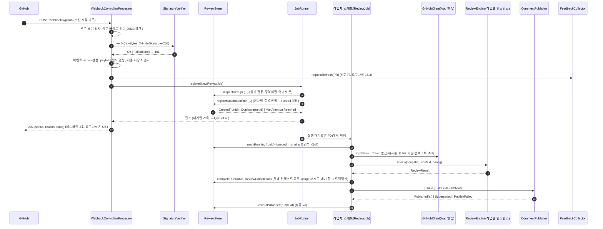
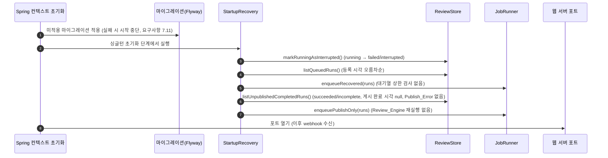
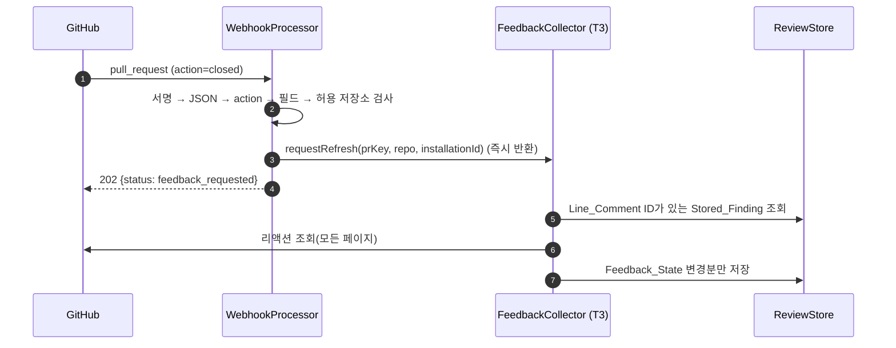
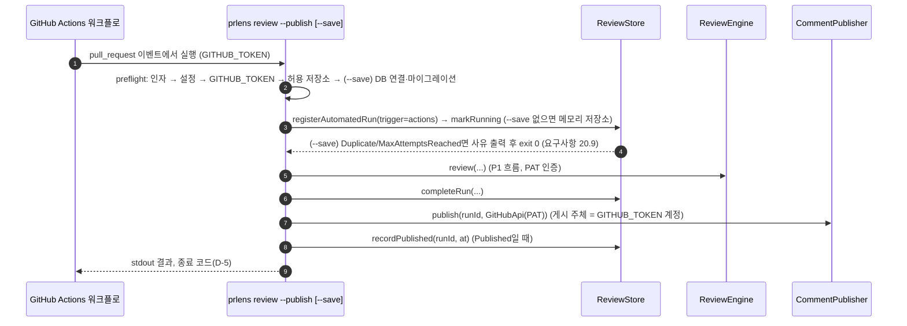
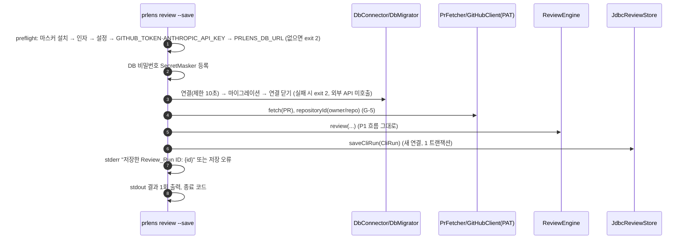
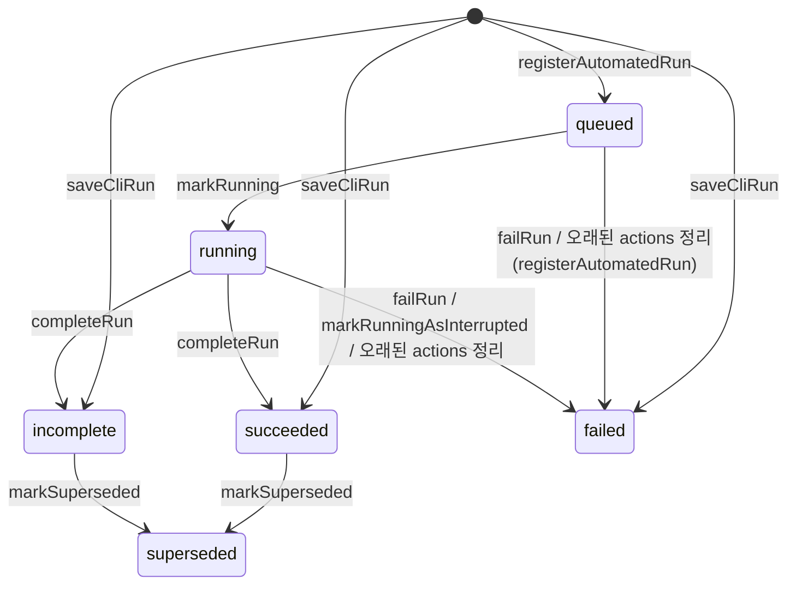

# Design Document: PR Lens P2 자동화·저장

## Overview

PR Lens P2는 GitHub App webhook으로 리뷰를 자동 실행하고(T1), 결과를 DB에 저장하고(T2), PR에 요약·라인 코멘트를 게시하고 채택/기각을 모읍니다(T3). 이 문서는 [requirements.md](requirements.md)의 요구사항 1~20을 구현하는 설계이며, 요구사항 문구를 반복하지 않고 "어떻게"만 다룹니다.

설계 목표는 세 가지입니다.

1. **P1 재사용, 엔진 무수정**: P1 설계([../pr-lens-p1-cli/design.md](../pr-lens-p1-cli/design.md))의 패키지(`model`, `github`, `pullrequest`, `context`, `review`, `llm`, `codec`, `config`, `support`)와 공유 타입(`PullRequestSnapshot`, `ReviewContext`, `ReviewResult`, `Finding`, `Usage`, `Configuration`)을 그대로 씁니다. `ReviewEngine` 소스는 바꾸지 않고(요구사항 16.4), P1이 열어 둔 확장 지점만 구현합니다.
   - `GitHubCredentials`: PAT 대신 Installation_Token을 내는 `InstallationCredentials` 구현을 `github/`에 추가합니다.
   - `ReviewListener`: 모드·Chunk 진행을 stderr 대신 서버 로그(Review_Run ID 포함)로 남기는 `JobReviewListener`를 구현합니다.
   - `RetryListener`(`support`): 재시도 로그를 서버 로그로 보내고 대기 시간 합(ms)을 집계하는 `JobRetryListener`를 구현합니다(요구사항 4.10, 17.3). P1 `onRetry`가 주는 대기 시간은 `Duration`이므로 `toMillis()`를 더합니다.
   - `Sleeper`(`support`): 작업 제한 시간을 넘지 않게 자는 `DeadlineSleeper`를 구현합니다(요구사항 4.7).
   - `ReviewEngine`은 생성자로 `LlmClient`와 `ReviewListener`를 받으므로, Review_Job마다 작업 전용 데코레이터와 리스너로 새 인스턴스를 만듭니다(엔진은 상태가 없어 생성 비용이 작음).
2. **서버 단일 인스턴스, DB가 진실의 원천**: 실행 대기열은 프로세스 안에 두되 `queued` 상태를 DB에 먼저 저장해 재시작 후 복구합니다(D-4). 중복 방지는 DB의 원자적 제약으로 보장합니다(요구사항 5.3).
3. **트랙 병렬화**: 월요일에 기능 리드 A가 패키지 경계와 `ReviewStore` 인터페이스를 먼저 머지합니다. T1은 `ReviewStore` 메모리 구현(요구사항 16.6)과 가짜 `GitHubClient`로 webhook부터 게시 요청까지를 DB 없이 개발·테스트합니다.

### 작업 환경 확인 결과

- 이 저장소(`claude-team-prlen`)에는 스타터(`backend/`, `web/`)가 있고 P1 구현 코드는 아직 없습니다. 기본 패키지는 P1과 같이 `com.prlens`입니다(P1 작업 1.1에서 변경).
- 패키지 구조는 [ADR 0003](../../adr/0003-role-based-flat-packages.md), 에러 형식과 API 경로는 [ADR 0008](../../adr/0008-keep-api-conventions.md)을 따릅니다. Standard_Error_Response는 `ErrorResponse { code, message, details }`이고 조회 API 경로는 `/api/v1/`로 시작합니다.
- P1 설계가 이 설계의 전제를 명시합니다(P1 설계 "공유 경계"): `RetryExecutor(RetryPolicy, Sleeper, RetryListener)`, `HttpGitHubClient(HttpClient, GitHubCredentials, RetryExecutor)`, `RetryingLlmClient(LlmClient, RetryExecutor)`의 생성자 주입, `PrFetcher.fetch(RepoRef, int)`, sealed가 아닌 `PrLensException`, 공개 함수 `CostCalculator.estimate(LlmUsage, ModelPricing)`. P1 구현이 다르면 T1 조립 코드(`JobScope`)만 고칩니다.
- 스타터의 `common` 패키지는 이 스펙에서 정리합니다(제안, ADR 0003의 미결 항목). `ErrorResponse`(Spring에 의존하지 않는 record)는 `support`로, `ApiExceptionHandler`와 `TimeConfig`(`Clock` 빈)는 `server`로 옮깁니다. `webhook`과 `query`가 `server`에 의존하지 않고도 에러 본문을 만들 수 있게 하려는 것입니다. `@SpringBootApplication` 클래스(`PrLensServerApplication`)는 `server`로 옮기지 않고 루트 패키지 `com.prlens`에 둡니다("서버 실행").
- 개발 PC에 Docker가 없을 수 있습니다(2026-10-04 기준 없음). Docker가 필요한 테스트는 태그로 나눠 기본 `test`에서 빼고 Linux CI에서만 돌립니다("패키지 경계 검사"와 Testing Strategy).

### 결정 대기 항목에 대한 권고

아래는 권고일 뿐이며 모든 항목의 상태는 아직 **결정 대기**입니다.

| ID | 권고 | 근거 | 상태 |
|---|---|---|---|
| D-1 채택/기각 수집 | 요구사항 15의 리액션 방식 그대로 | 리액션 webhook이 없어 PR 이벤트와 `feedback sync`로 폴링하는 방식이 추가 인프라 없이 가능합니다 | 결정 대기 (T3) |
| D-2 DB·테스트 | PostgreSQL + Flyway + Testcontainers, H2 미사용 | 중복 방지에 부분 유일 인덱스(`WHERE status <> 'failed'`)를 씁니다. H2는 방언 차이로 이 제약의 원자성 테스트를 믿기 어렵습니다. 빠른 테스트는 메모리 구현이 담당합니다. **spike**: Spring Boot 4의 Flyway 자동 설정 모듈 이름 | 결정 대기 (ADR-0006) |
| D-3 draft PR | draft도 리뷰(제안값 유지) | 요구사항 1.13. 1주 도그푸딩의 PR당 비용(요구사항 8)을 보고 재검토합니다 | 결정 대기 (T1) |
| D-4 비동기 방식 | 프로세스 안 작업자 풀 + DB `queued` 상태 | 단일 서버·로컬 운영(D-8)에 외부 큐는 운영 부담만 늘립니다. 한계: 다중 인스턴스는 지원하지 않습니다(상태 전이는 조건부 갱신이라 중복 실행은 막지만 대기열 상한과 PR별 게시 직렬화가 프로세스 단위) | 결정 대기 (T1) |
| D-5 CLI 종료 코드 | 제안값 4와 우선순위 그대로 | P1 종료 코드와 겹치지 않고 "결과는 나왔으나 부수 작업 실패"를 구분합니다 | 결정 대기 (T2·T3) |
| D-6 CLI 단독 실행의 허용 목록 | 미적용 | P1 호환(요구사항 20.4는 `--publish`에만 적용) | 결정 대기 |
| D-7 Finding_Fingerprint | 제안 구성 그대로, 필드 구분자는 `\u0000` | 구분자가 필드 값에 나올 수 없어야 충돌이 생기지 않습니다. 상세는 T3 절 | 결정 대기 (T3) |
| D-8 Query_API 노출 | `127.0.0.1` 바인딩 + smee.io 클라이언트 | 인증이 범위 밖입니다(요구사항 10.11~10.12의 경고로 보완) | 결정 대기 |
| D-9 `superseded`의 Active_Run 포함 | 포함 유지 | 비용 우선. force-push 복귀 한계는 설치 문서에 적습니다 | 결정 대기 (T1) |
| D-10 채택률 분모 | 저장만 하고 집계 기준은 P3에서 확정 | 요구사항 7.7, 13.3이 원자료를 모두 남깁니다 | 결정 대기 (T3·지표 담당) |
| D-11 허용 판정 기준 | 이름 기준 유지 | 요구사항 3.8. 전환 비용을 줄이려고 거부 로그에 저장소 ID도 함께 남깁니다 | 결정 대기 |
| D-12 Publish_Error 개수 | 하나 유지 | 스키마 단순화. 덮어쓰인 앞 단계 오류는 서버 로그에 남깁니다 | 결정 대기 (T2·T3) |

## Architecture

### 패키지 배치 (`backend/src/main/java/com/prlens/`)

P1 배치(P1 설계 "패키지 배치")에 아래를 더합니다.

| 패키지 | 트랙 | 주요 클래스 | 관련 요구사항 |
|---|---|---|---|
| `webhook` | T1 | `WebhookController`, `WebhookProcessor`, `BoundedBodyReader`, `SignatureVerifier`, `PullRequestPayloadParser`, `JobRunner`, `ReviewJob`, `JobScope`, `JobReviewListener`, `StartupRecovery` | 1~5, 17.4 |
| `github` (확장) | T1 | `AppJwtSigner`, `InstallationTokenProvider`, `InstallationCredentials`, `RefreshableCredentials`, `GitHubClientFactory` (게시·리액션 메서드는 T3가 추가) | 6 |
| `store` | T2 | `ReviewStore`(인터페이스), `ReviewRun`, `StoredFinding`, `DedupeKey`, `RegisterOutcome` / `store.db`(DB 구현) / `store.memory`(메모리 구현) | 5.1, 5.3, 7~9, 16.6 |
| `query` | T2 | `QueryController`, 조회 DTO | 10 |
| `publish` | T3 | `CommentPublisher`, `FeedbackCollector` | 11~15 |
| `server` | 리드 A | 빈 조립, `ServerStartupValidator`, `ApiExceptionHandler`(스타터 `common.error`에서 이동), `TimeConfig` | 3.4, 6.8, 10.11, 18.6, 19.5 |
| `execution` | 리드 A (인터페이스 선머지), T1 구현 | `DeadlineSleeper`, `JobRetryListener`, `UsageAccumulator`, `UsageRecordingLlmClient`, `CancellableLlmClient`, `JobTimeoutException`, `RunErrorKinds` | 4.5, 4.7, 4.10, 8.2, 8.3 |
| `support` (확장) | 리드 A | `SecretRegistry`, `CancellationToken`, `ErrorResponse`(스타터 `common.error`에서 이동) | 4.7, 18 |
| `cli` (확장) | T2·T3·리드 | `--save`(`SaveFlow`), `--publish`(`PublishFlow`), `feedback sync`(`FeedbackSyncCommand`), `server`(`ServerCommand`), `P2ExitCodes` | 9, 15.4, 20 |
| `config` (확장) | 리드·T1 | `AutomationSettings`, `LoadedConfiguration`, `AllowedRepositories` | 3, 19 |

- `query`와 `server`는 조회 컨트롤러와 Spring 조립 코드를 `store`와 `webhook` 밖에 두어 16.2의 의존 규칙을 단순하게 유지하려고 둡니다(요구사항 16.1).
- `execution`은 서버(`webhook`)와 CLI(`--save`, `--publish`)가 함께 쓰는 작업 범위 도구입니다. `llm`에 두면 "`review`·`llm` 패키지는 수정하지 않는다"(요구사항 16.4)에 걸리고, `webhook`에 두면 `cli`가 `webhook`에 의존하게 되고, `support`에 두면 `llm → support` 방향과 순환이 생깁니다. 그래서 따로 둡니다.
- `AllowedRepositories`는 webhook 서버와 CLI `--publish`(요구사항 20.4)가 함께 쓰므로 `webhook`이 아니라 `config`에 둡니다. `cli`가 `webhook`에 의존하지 않게 하려는 것입니다.
- `CancellationToken`은 `github`의 `HttpGitHubClient`도 받아야 하므로 `execution`이 아니라 `support`에 둡니다(`execution`이 `github`의 예외 타입을 알기 때문에, 반대 방향 의존이 생기면 순환이 됩니다).
- `ReviewRun`, `StoredFinding`은 `store` 루트(인터페이스와 같은 패키지)의 불변 `record`입니다(요구사항 16.5). DB 구현은 `store.db`에만 둡니다.

### 의존 규칙 (ArchUnit, CI에서 강제)

| 규칙 | 근거 |
|---|---|
| `webhook..`, `publish..`는 `store.db..`, `store.memory..`, `java.sql..`, DB 접근 라이브러리(D-2 확정 후 패키지 지정)에 의존하지 않는다 | 요구사항 16.2 |
| `publish..`는 `java.net.http..`, `github.HttpGitHubClient`에 의존하지 않고 `github`의 인터페이스로만 GitHub를 호출한다 | 요구사항 16.3 |
| `review..`, `llm..`, `model..`는 P2 패키지(`webhook`, `store`, `publish`, `query`, `server`, `execution`)에 의존하지 않는다 | 요구사항 16.4 (엔진 무수정) |
| `store..`는 `webhook..`, `publish..`, `github..`에 의존하지 않는다 | 저장 계층 독립 |
| `webhook..`은 `publish`의 인터페이스(`CommentPublisher`, `FeedbackCollector`)와 결과 타입 `PublishResult`에만 의존한다 | T1·T3 병렬 작업 |
| `publish..`는 `github.GitHubClient`·`github.HttpGitHubClient`·`github.GitHubClientFactory`가 아니라 `github.PublishGitHubClient`, `github.PublishGitHubClientProvider`와 `github`의 레코드·예외에만 의존한다 | 요구사항 16.3 (T3가 작업 22.7에서 추가) |
| `execution..`은 `llm`, `support`, `model`과, 예외를 분류하는 데 필요한 `github`·`review`의 예외 타입, 비용 계산에 쓰는 `review.CostCalculator`에만 의존한다. `webhook`, `cli`, `store`, `publish`에는 의존하지 않는다 | 서버와 CLI 공용 |
| Spring 애너테이션은 루트 패키지의 `PrLensServerApplication`, `server`, `webhook`(컨트롤러·설정), `query`, `store.db`와 `cli`의 조립 코드에만 둔다 | P1 규칙("`cli` 조립 코드에만")을 이 규칙으로 **교체**한다. 추가가 아니다 |

P2 PR 체크리스트에는 "`review`·`llm` 패키지 diff 없음" 항목을 둡니다(요구사항 16.4). 대상 클래스가 아직 없는 규칙은 `allowEmptyShould(true)`로 둡니다. ArchUnit은 기본값에서 대상이 없는 규칙을 실패 처리합니다(`docs/spikes/2026-10-04-build-stack.md`에서 확인).

### 구성 요소

```mermaid
flowchart LR
  GH[(GitHub)] -- webhook --> WC
  subgraph webhook["webhook (T1)"]
    WC[WebhookController] --> WP[WebhookProcessor]
    WP --> SV[SignatureVerifier]
    WP --> AR[AllowedRepositories]
    WP --> JR[JobRunner]
    JR --> RJ[ReviewJob / JobScope]
    SR[StartupRecovery] --> JR
  end
  subgraph githubpkg["github (P1 + T1 확장)"]
    GCF[GitHubClientFactory] --> HGC[HttpGitHubClient]
    HGC --> IC[InstallationCredentials]
    IC --> ITP[InstallationTokenProvider] --> JWT[AppJwtSigner]
  end
  subgraph p1["P1 (무수정 재사용)"]
    PRF[PrFetcher] --> CTX[ContextCollector] --> ENG[ReviewEngine] --> LLM[LlmClient]
  end
  subgraph store["store (T2)"]
    RS[ReviewStore 인터페이스]
    DB[(PostgreSQL)]
  end
  subgraph publish["publish (T3)"]
    CP[CommentPublisher]
    FC[FeedbackCollector]
  end
  Q["query: QueryController (T2)"] --> RS
  CLI[cli: --save / --publish / feedback sync] --> RS & CP & ENG
  WP --> RS
  WP --> FC
  RJ --> GCF & PRF & ENG & RS & CP
  CP --> RS & GCF
  FC --> RS & GCF
  RS -. store.db .-> DB
  HGC --> GH
  LLM --> CL[(Claude API)]
```

### webhook → 검증 → 중복 판정 → 등록 → 실행 → 저장 → 게시



### 재시작 복구



- 복구를 포트가 열리기 전에 끝내야 새 webhook과 복구 작업의 순서가 뒤섞이지 않습니다. GitHub는 실패한 전달을 자동으로 다시 보내지 않으므로([Handling failed webhook deliveries](https://docs.github.com/en/webhooks/using-webhooks/handling-failed-webhook-deliveries)) "복구 중 503" 방식은 이벤트를 잃게 되어 쓰지 않습니다. **spike**: Spring Boot 4에서 싱글턴 초기화(`SmartInitializingSingleton`)가 내장 웹 서버 커넥터 시작보다 먼저 끝나는지 확인합니다.
- `interrupted`는 `failed`이므로 복구가 새 Review_Job을 만들지 않고, 재전송이나 새 head SHA가 올 때만 요구사항 5.4에 따라 재시도됩니다(요구사항 4.15).

### `closed` → 채택/기각 갱신



`FeedbackCollector`의 실행기, 같은 PR 요청 합치기, 리액션 판정은 T3 절에서 정의합니다.

### GitHub Actions 대체 경로 (`--publish`)



webhook 경로와 같은 `CommentPublisher`를 쓰므로 게시 규칙(요구사항 11~14)은 한 구현으로 만족합니다. CLI 쪽 세부(`--save` 없이 `--publish`만 쓸 때의 게시 대상 모델 등)는 T2·T3 절에서 정의합니다.

### 공통: 서버의 비밀정보 치환

App_Private_Key는 여러 줄이라 P1의 "줄 단위 버퍼 마스킹" 전제(비밀값에 줄바꿈 없음)가 맞지 않습니다. 서버는 로그 이벤트 단위(메시지 + 치환한 스택 전체)로 `SecretMasker`를 적용하는 로그 인코더를 쓰고, 오류 응답·DB 오류 메시지·코멘트 본문은 만들 때 치환합니다. 상세는 공통 절 "비밀정보"에서 정의합니다.

## Components and Interfaces

### T1 webhook (요구사항 1~6)

#### 요청 처리 순서와 응답

`WebhookController`는 `HttpServletRequest`를 직접 받아 원문 바이트를 읽고(Spring 메시지 변환기를 거치지 않음), 처리는 순수 로직에 가까운 `WebhookProcessor.handle(WebhookRequest)`에 맡깁니다. `WebhookRequest`는 `(receivedAt, headers, byte[] body)`이고 수신 시각은 컨트롤러 진입 시점에 `Clock`으로 찍습니다.

| 순서 | 판정 | 응답 | 본문 | 로그 | 요구사항 |
|---|---|---|---|---|---|
| 1 | `Content-Length` > 상한, 또는 읽는 중 상한 초과 | 413 | `ErrorResponse`(`PAYLOAD_TOO_LARGE`) | delivery ID | 1.3 |
| 2 | 서명 실패(4종) | 401 | 종류와 무관한 고정 `ErrorResponse`(`INVALID_SIGNATURE`) | delivery ID(없으면 `없음`), 실패 종류, 수신 시각만 | 2.4, 2.5 |
| 3 | `X-GitHub-Event` = `ping` | 200 | `{"status":"pong"}` | | 1.4 |
| 3 | `ping`, `pull_request` 외 이벤트 | 202 | `{"status":"ignored","reason":"event_ignored"}` | | 1.5 |
| 4 | JSON 해석 실패 | 400 | `ErrorResponse`(`MALFORMED_REQUEST`) | delivery ID, 해석 실패 | 1.7 |
| 5 | `action`이 Target_Action, `closed` 외(없음 포함) | 202 | `ignored`, `action_ignored` | | 1.5 |
| 6 | Required_Fields 누락, head SHA 형식 오류 | 400 | `ErrorResponse`(`INVALID_INPUT`, `details`에 필드 이름 전부) | delivery ID, 필드 이름 | 1.8 |
| 7 | `owner/repo` 불허 | 202 | `ignored`, `repository_not_allowed` | 저장소 이름, 저장소 ID, delivery ID | 3.2 |
| 8 | `closed` | 202 | `{"status":"feedback_requested"}` | | 1.6, 15.3 |
| 9 | 중복 (Active_Run 있음) | 202 | `ignored`, `duplicate`, 기존 `runId` | | 5.2, 5.9 |
| 9 | 최대 시도 횟수 도달 | 202 | `ignored`, `max_attempts_reached` | | 5.5 |
| 10 | 대기열 가득 | 503 | `ErrorResponse`(`QUEUE_FULL`) | delivery ID, 대기열 크기 | 4.13 |
| 9~10 | Review_Store 오류 | 503 | `ErrorResponse`(`STORE_UNAVAILABLE`) | delivery ID, 치환한 오류 메시지 | 1.12 |
| 10 | 등록 성공 | 202 | `{"status":"queued","runId":…}` | | 1.9~1.11 |
| 어디서나 | 처리되지 않은 예외 | 500 | `ErrorResponse`(`INTERNAL_ERROR`, 스택·클래스 이름 없음) | 치환한 스택 | 18.6 |

- 202 본문은 `WebhookAck(status, reason, runId)` 한 형식으로 통일합니다. `reason` 값은 Glossary의 Ack_Reason, `status` 값은 `ignored`, `feedback_requested`, `queued`, `pong`입니다.
- 오류 본문은 모두 `ErrorResponse { code, message, details }`입니다(ADR 0002, 0008). `code`는 스타터에 있던 값(`MALFORMED_REQUEST`, `INVALID_INPUT`, `NOT_FOUND`, `INTERNAL_ERROR`)을 그대로 쓰고 `PAYLOAD_TOO_LARGE`, `INVALID_SIGNATURE`, `QUEUE_FULL`, `STORE_UNAVAILABLE`을 더합니다. `message`에는 고정 문구만 넣고 내부 오류 메시지는 넣지 않습니다.
- **JSON 해석 위치**: 요구사항 1.2는 "이벤트·action 판정 → payload 필드 검증(1.7~1.8)" 순서이지만 `action`은 본문에 있으므로 해석이 먼저 필요합니다. 해석에 실패하면 action을 판정할 수 없어 400 외 결과가 없으므로 관찰 가능한 순서 차이는 없습니다.
- Required_Fields의 JSON 경로(제안): `repository.id`, `repository.full_name`, `pull_request.number`, `pull_request.head.sha`, `pull_request.base.sha`, `installation.id`. `pull_request.title`은 필수가 아니며 없으면 빈 문자열로 저장합니다. `pull_request.draft`는 읽지 않습니다(요구사항 1.13, D-3). `full_name`은 P1 요구사항 1.3의 문자 규칙으로 `owner/repo` 형식을 검사합니다.
- head SHA는 `^[0-9a-fA-F]{40}$` 검사 후 소문자로 바꿔 Dedupe_Key를 만듭니다(요구사항 5.7). base SHA도 같은 규칙으로 검사합니다.
- Target_Action이 7번을 통과하면 `FeedbackCollector.requestRefresh`(즉시 반환)를 먼저 호출하고 9~10번으로 갑니다(요구사항 15.3).
- 응답 시간(요구사항 1.10): 동기 경로의 I/O는 본문 읽기와 DB 트랜잭션 둘(읽기 전용 `inspectDedupe`, 이어서 `registerAutomatedRun`)입니다. 문장별 제한만으로는 합계를 보장할 수 없으므로 요청 전체에 데드라인 3초를 둡니다. GitHub의 10초 제한([Best practices for using webhooks](https://docs.github.com/en/webhooks/using-webhooks/best-practices-for-using-webhooks))과 요구사항의 5초 안에 들어옵니다.
  - DB: 커넥션 획득 제한 1초(풀 `connectionTimeout`), 트랜잭션 안에서 `SET LOCAL lock_timeout = '1s'`와 `statement_timeout = '1s'`. 트랜잭션 전체가 남은 데드라인을 넘으면 되돌리고 Review_Store 오류(503)로 처리합니다.
  - 본문 읽기: 읽기 제한 2초(컨테이너의 연결 읽기 제한 시간). 넘으면 연결을 끊습니다.
  - 집행 방법: 요청 스레드가 수신 시각 + 3초를 데드라인으로 들고, DB 문장을 보내기 전마다 남은 시간을 확인해 그 값(최대 1초)으로 `statement_timeout`을 다시 설정합니다. 남은 시간이 없으면 트랜잭션을 되돌리고 503입니다. 마지막 검사는 커밋 직전에 합니다. **커밋이 끝난 뒤에는 데드라인을 넘겼더라도 항상 202를 응답합니다**(Review_Run이 남았는데 503을 보내는 일이 없게). 본문 읽기는 읽기 호출마다 남은 시간을 확인합니다. 컨테이너의 읽기 제한이 호출별인지 합계인지는 spike 3에서 확인합니다.
  - 데드라인을 넘겨 503을 응답한 요청은 Review_Run을 남기지 않습니다. GitHub는 자동으로 다시 보내지 않으므로 사람이 재전송해야 합니다(요구사항 결정 대기 D-14).
- `config.AllowedRepositories`는 시작 시 설정 목록을 `Locale.ROOT` 소문자 집합으로 만들고 `contains(fullName.toLowerCase(Locale.ROOT))`로 판정합니다(요구사항 3.1, 3.7, 3.9). 빈 집합이면 항상 거부하고, 시작 경고는 `ServerStartupValidator`가 남깁니다(요구사항 3.4).

#### BoundedBodyReader (요구사항 1.3)

- 상한은 25MB(GitHub payload 상한 기준)이며 `25 × 1024 × 1024` 바이트로 가정합니다.
- `Content-Length`가 있고 상한을 넘으면 본문을 읽지 않고 413을 보냅니다. 없거나(chunked) 작게 표시되면 상한 + 1바이트까지만 읽고, 넘으면 읽기를 멈추고 413을 보냅니다.
- **spike**: 413 응답 후 컨테이너(Tomcat 가정)가 남은 본문을 읽어 버리는 설정(`max-swallow-size`)과 연결 종료 동작, 컨테이너 자체 요청 크기 상한이 25MB보다 작지 않은지 확인합니다. GitHub App webhook의 content type이 JSON으로 고정되는지도 확인합니다(폼 인코딩이면 원문 바이트 서명 검증은 같지만 해석 단계가 달라짐).
- 서명 검증에는 본문 전체가 필요하므로 검증 전에 최대 25MB를 메모리에 올립니다. 동시에 받을 수 있는 요청 수는 컨테이너의 요청 스레드 수로 제한되고, 서버는 기본적으로 `127.0.0.1`에만 바인딩합니다(D-8). 외부에 노출할 때는 이 메모리 사용을 다시 검토합니다.

#### SignatureVerifier (요구사항 2)

```java
public final class SignatureVerifier {
  public SignatureVerifier(byte[] webhookSecret) { ... }      // GITHUB_WEBHOOK_SECRET의 UTF-8 바이트
  public Verification verify(byte[] rawBody, /*@Nullable*/ String signatureHeader);
}
public sealed interface Verification {
  record Ok() implements Verification {}
  record Failed(FailureKind kind) implements Verification {}
}
public enum FailureKind { HEADER_MISSING, PREFIX_MISSING, MALFORMED, MISMATCH }
```

1. 헤더가 없으면 `HEADER_MISSING`(SHA-1 `X-Hub-Signature`만 있어도 같음).
2. `sha256=`으로 시작하지 않으면 `PREFIX_MISSING`.
3. 나머지가 정확히 64자이고 모두 16진수(대소문자 무시)가 아니면 `MALFORMED`. 통과하면 32바이트로 디코딩합니다.
4. 원문 바이트에 `HmacSHA256`을 계산합니다. `Mac`은 스레드 안전하지 않으므로 호출마다 만들거나 `ThreadLocal`로 둡니다.
5. `MessageDigest.isEqual(expected, provided)`로 비교합니다. 두 배열은 항상 32바이트이고 이 메서드는 길이가 같으면 내용과 무관하게 전체를 비교하므로 요구사항 2.2의 상수 시간 조건을 만족합니다. 다르면 `MISMATCH`.

- 입력은 항상 `byte[]` 원문이며 문자열 변환이나 JSON 재직렬화를 거치지 않습니다(요구사항 2.1). 서명 검증을 통과하기 전에는 JSON 파서를 부르지 않습니다(요구사항 2.6).
- 401 본문은 실패 종류를 드러내지 않는 상수이고, 로그에는 서명 헤더 값과 본문을 남기지 않습니다(요구사항 18.4).

#### Job_Runner (요구사항 4, 5, 17.4)

**등록 (중복 판정 포함)**

```java
public final class JobRunner {
  public RegisterResult register(NewReviewJob job);           // webhook 요청 스레드에서 호출
  void enqueueRecovered(List<ReviewRun> queued);              // StartupRecovery 전용
  void enqueuePublishOnly(List<ReviewRun> completed);
}
public record NewReviewJob(DedupeKey key, RepoRef repo, String title, String baseSha,
                           long installationId, /*@Nullable*/ String deliveryId, Instant receivedAt) {}
public sealed interface RegisterResult {
  record Queued(long runId) implements RegisterResult {}
  record Duplicate(long existingRunId) implements RegisterResult {}
  record MaxAttemptsReached() implements RegisterResult {}
  record QueueFull(int waiting) implements RegisterResult {}
}
```

`register`는 아래 순서로 동작하며, 사용하는 `ReviewStore` 메서드는 T2 절에서 정의합니다.

1. `ReviewStore.inspectDedupe(key, maxAttempts, staleAfter)`(읽기 전용)로 먼저 판정합니다. Active_Run이 있으면 `Duplicate`, 한도 도달이면 `MaxAttemptsReached`를 반환합니다. 중복 요청이 대기열 용량을 차지하지 않고, 중복 판정을 등록보다 먼저 하는 요구사항 1.2 순서가 대기열이 가득 찬 경우에도 지켜집니다. `inspectDedupe`는 행을 바꾸지 않지만, 작업 제한 시간보다 오래된 `actions`의 `queued`/`running`은 Active_Run으로 치지 않습니다(요구사항 20.10). 그런 행이 있는 요청은 3번으로 넘어가고, 거기서 `registerAutomatedRun`이 그 행을 `failed`로 바꿉니다.
2. 등록할 수 있는 요청이면 대기 수 카운터(`AtomicInteger waiting`)를 `waiting < Queue_Capacity`일 때만 1 올립니다(CAS 반복). 올리지 못했으면(가득 참) `QueueFull`을 반환합니다. Review_Run은 남지 않습니다(요구사항 4.13).
3. 올렸으면 `ReviewStore.registerAutomatedRun(newRun, maxAttempts, staleAfter)`를 호출합니다. 이 메서드는 한 트랜잭션에서 (a) 같은 Dedupe_Key의 Active_Run 조회, (b) `failed` 수와 최대 시도 횟수 비교, (c) 시도 번호 = 기존 최대 + 1(없으면 1)로 `queued` Review_Run 삽입을 수행하고, 동시 삽입은 저장소 수준 제약(부분 유일 인덱스, D-2)으로 하나만 성공시킵니다. 결과는 `Created(runId)`, `Duplicate(existingRunId)`, `MaxAttemptsReached`입니다(요구사항 5.1~5.5, 5.10, 5.11). 1번과 3번 사이에 다른 요청이 먼저 등록했을 수 있으므로 최종 판정은 이 트랜잭션이 합니다.
4. `Created`이면 `ReviewJob`을 실행기에 넣고 `Queued`를 반환합니다. 그 외 결과나 예외면 카운터를 1 내립니다. 예외는 `StoreUnavailableException`으로 감싸 503으로 이어집니다(요구사항 1.12). 삽입이 실패한 경우 트랜잭션이 되돌려지므로 Review_Run이 남지 않습니다.

- `Run_Trigger`는 `webhook`이고 delivery ID는 헤더 값 또는 null입니다(요구사항 1.11). 저장하는 시각은 webhook 수신 시각(`receivedAt`)과 등록 시각입니다(요구사항 4.1).
- `cli` Review_Run은 이 경로를 쓰지 않으므로 중복 판정에서 자연히 빠집니다(요구사항 5.8). 제외 조건 자체는 T2의 쿼리가 보장합니다.

**실행기와 용량**

- `ThreadPoolExecutor(core = max = 작업자 수, LinkedBlockingQueue 무제한)`를 씁니다. FIFO 큐가 등록 순서를 보장하고(요구사항 4.6), 용량은 위 카운터가 관리합니다(요구사항 4.12). 작업이 작업자에게 넘어가 실행을 시작하는 순간 카운터를 1 내립니다.
- 복구 작업(`enqueueRecovered`, `enqueuePublishOnly`)은 카운터를 올리되 상한 검사를 하지 않습니다. 설정을 줄인 뒤 재시작해도 이미 저장된 `queued` Review_Run을 버리지 않기 위함이며, 이 경우 대기 수가 상한 아래로 내려갈 때까지 새 등록은 `QueueFull`이 됩니다.
- 작업 본문은 `try/catch (Throwable)`로 감싸 한 작업의 예외가 작업자 스레드나 다른 작업에 번지지 않게 하고(요구사항 4.9), 예외는 치환 후 로그에 남기고 Review_Run을 `failed`(`internal`)로 기록합니다. 요청 스레드와 작업자 스레드 풀은 분리되어 있습니다.

**ReviewJob 실행 순서** (요구사항 4.2~4.5, 4.10, 4.11)

1. `ReviewStore.markRunning(runId, now)`: `queued → running` 조건부 갱신입니다. 갱신된 행이 없으면(이미 다른 상태) 아무것도 하지 않고 끝냅니다. 복구와 중복 제출이 겹쳐도 한 번만 실행됩니다.
2. `JobScope`를 만듭니다: 제한 시각(`runningAt + 작업 제한 시간`)과 `execution` 패키지의 `CancellationToken`, `JobRetryListener`(대기 합 집계), `DeadlineSleeper`, `UsageAccumulator`.
3. `GitHubClientFactory.forInstallation(installationId, cancellationToken, retryExecutor)`로 작업 전용 `GitHubClient`를 만들고(공유 `HttpClient`, `InstallationCredentials`, 작업 전용 `RetryExecutor(policy, DeadlineSleeper, JobRetryListener)`, 작업의 `CancellationToken`), P1 `PrFetcher.fetch(repo, number)` → `ContextCollector.collect(snapshot, config)`를 실행합니다. 팩토리는 `webhook.JobScope`를 받지 않습니다(`github`가 `webhook`에 의존하지 않게). 두 구성 요소에 넘기는 `WarningSink`는 경고를 Review_Run ID와 함께 서버 로그로 보냅니다.
4. 작업 전용 `LlmClient` 체인 `RetryingLlmClient(UsageRecordingLlmClient(CancellableLlmClient(공유 AnthropicLlmClient)))`와 `JobReviewListener`로 `new ReviewEngine(...)`을 만들어 `review(snapshot, context, config)`를 호출합니다. `UsageRecordingLlmClient`가 재시도 안쪽에 있어 재시도한 호출의 응답 usage도 모두 합해집니다(요구사항 8.2).
5. 결과를 받으면 `ReviewStore.completeRun(runId, ReviewCompletion(result, contextFiles, baseSha, retryWaitMs, reviewedAt))`으로 `succeeded`/`incomplete`, 리뷰 완료·종료 시각, 가져온 base SHA(G-2)를 한 트랜잭션에 저장합니다. 추정 비용이 비용 상한을 넘으면 경고 로그를 남깁니다(요구사항 8.4). 저장이 실패하면 치환한 오류를 로그에 남기고, 제한 시간 타이머를 취소한 뒤 `running`인 채로 끝냅니다(요구사항 7.15). 타이머를 취소하지 않으면 나중에 `failRun(timeout)`과 실패 코멘트가 나가서 7.15의 "다음 시작 시 `interrupted`"와 어긋납니다.
6. `CommentPublisher.publish(runId, gitHubClient)`를 호출합니다(PR별 직렬화는 T3 책임, 요구사항 14.3). `Published(at)`이면 `recordPublished(runId, at)`로 게시 완료 시각을 저장합니다(요구사항 4.11). 이어서 요구사항 17.1 방식의 소요 시간(수신→게시 완료 − 재시도 대기 합)이 120초를 넘으면 단계별 시간을 담은 경고를 남깁니다(요구사항 17.4).
7. ReviewResult를 만들지 못하면 예외를 Run_Error_Kind로 바꿔 `ReviewStore.failRun(runId, RunFailure(kind, maskedMessage, usage, retryWaitMs, endedAt))`을 호출하고 실패 게시를 요청합니다(요구사항 4.5). usage는 `UsageAccumulator` 합이며, 응답이 없으면 0입니다(요구사항 8.3).

Run_Error_Kind(요구사항 Glossary)와 P1 예외의 대응. 서버(`ReviewJob`)와 CLI(`--save`, `--publish`)가 같은 표를 쓰므로 `execution.RunErrorKinds.of(Throwable)` 한 곳에 두고 선머지(작업 2.7)에서 먼저 만듭니다:

| P1·P2 예외 | Run_Error_Kind |
|---|---|
| `GitHubAuthException`, `GitHubApiException(401)`, Installation_Token 발급 실패 | `github_auth` |
| `GitHubApiException(403/404)`, GitHub의 `NonRetryableApiException` | `github_api` |
| Claude의 `NonRetryableApiException` | `llm_api` |
| `RetriesExhaustedException` | 마지막이 상태 코드면 `github_api` 또는 `llm_api`, 네트워크 오류면 `network` |
| `RetryAfterTooLongException` | `retry_after_too_long` |
| `AllChunksFailedException` | `all_chunks_failed` |
| `JobTimeoutException`, 취소 토큰이 표시된 채 끝남 | `timeout` |
| 가져온 head SHA가 Dedupe_Key와 다름 (G-1) | `head_moved` |
| 그 밖의 예외 | `internal` |

게시만 하는 복구 작업(요구사항 4.14)은 1~5단계를 건너뛰고, 저장된 installation ID로 `GitHubClient`를 만들어 6단계만 실행합니다.

**제한 시간과 취소** (요구사항 4.7)

- `JobScope`는 종료 상태를 원자적으로 하나만 정합니다: `AtomicReference<Phase>`가 `RUNNING → FINISHING`(작업자가 결과든 실패든 기록하려 할 때) 또는 `RUNNING → CANCELLED`(타이머) 중 먼저 성공한 CAS 하나만 받아들입니다. 작업자는 `completeRun`뿐 아니라 `failRun`을 부르기 전에도 이 CAS를 거칩니다.
  - 작업자가 `FINISHING`을 얻으면 타이머는 아무것도 하지 않습니다.
  - 타이머가 `CANCELLED`를 얻으면 **타이머 쪽이** `failRun(timeout)`과 실패 게시 요청을 수행합니다. 작업자는 CAS에 실패한 것을 보고 결과나 예외를 버리고 끝냅니다. 실패 기록과 실패 게시가 한 번만 나가고, 진행 중 호출을 끊지 못해 작업자가 늦게 돌아와도 Review_Run이 `running`으로 남지 않습니다.
  - 호출을 끊지 못하면(spike 4, G-10) 그 작업자 스레드는 호출이 끝날 때까지 묶입니다. 각 호출의 제한 시간(GitHub 30초, Claude 180초)이 상한입니다.
- `ScheduledExecutorService`가 제한 시각에 `scope.cancel(TIMEOUT)`을 실행합니다. CAS에 성공했을 때만 (a) 토큰 표시, (b) 진행 중 호출에 등록된 중단 훅 실행, (c) 작업자 스레드 인터럽트 순서로 취소합니다. 작업이 먼저 끝나면 예약을 취소합니다.
- `CancellableLlmClient`와 작업 전용 `HttpGitHubClient`(생성자로 받은 `support.CancellationToken`)는 호출 전에 토큰을 확인하고, 호출 중에는 중단 훅을 등록합니다. CLI는 `CancellationToken.NONE`을 넘깁니다. Claude 호출을 끊으려고 `llm.AnthropicLlmClient`를 고치는 것은 요구사항 16.4("`review`·`llm` 무수정")에 걸리므로 하지 않습니다. spike 4에서 데코레이터만으로 끊을 수 없으면 G-10(응답 폐기)을 적용합니다. `DeadlineSleeper`는 `min(대기, 남은 시간)`만 자고 제한 시각에 이르면 `JobTimeoutException`을 던집니다. 그래서 재시도 대기 시간도 제한 시간에 포함됩니다.
- `JobRetryListener`가 받는 대기 시간은 정책이 계산한 값입니다(P1 `RetryListener`). `DeadlineSleeper`가 제한 시각 때문에 더 짧게 잔 경우 합이 실제보다 클 수 있지만, 그 Review_Run은 `timeout`으로 끝나므로 응답 시간 측정(요구사항 17.1) 대상이 아닙니다.
- P1 엔진은 분할 모드에서 Chunk 실패를 `chunk_failed`로 흡수하고 계속할 수 있습니다. 그래서 `ReviewJob`은 엔진이 결과를 반환하더라도 `FINISHING` CAS에 실패하면(이미 `CANCELLED`) 그 결과를 버리고 `failed`/`timeout`으로 기록합니다. 기록하는 usage는 그때까지 받은 응답의 합입니다(요구사항 8.2).
- **spike**: 진행 중 HTTP 호출을 실제로 끊는 방법. GitHub 쪽은 `HttpClient.sendAsync`가 돌려준 `CompletableFuture`를 `cancel(true)` 했을 때 JDK 17에서 교환이 중단되는지, Claude 쪽은 Anthropic Java SDK의 비동기 클라이언트 취소나 하부 HTTP 호출 취소를 쓸 수 있는지 확인합니다. 끊을 수 없으면 응답을 버리고 스레드를 풀어 주는 방식으로 대신하고, 이 차이를 요구사항 공백으로 올립니다.

**재시작 복구** (요구사항 4.8, 4.14, 4.15): 위 "재시작 복구" 시퀀스와 같습니다. 필요한 `ReviewStore` 메서드는 `markRunningAsInterrupted(now)`, `listQueuedRuns()`(등록 시각 오름차순), `listUnpublishedCompletedRuns()`이며 T2 절에서 정의합니다.

**T1이 쓰는 `ReviewStore` 메서드 (T2 절에서 정의)**

| 메서드 | 용도 | 요구사항 |
|---|---|---|
| `registerAutomatedRun(NewRun, int maxAttempts, Duration staleAfter) → RegisterOutcome` | 원자적 중복 판정 + `queued` 삽입 + `pull_request` 행 갱신 | 4.1, 5.1~5.5, 5.10, 5.11, 7.5 |
| `inspectDedupe(DedupeKey, int maxAttempts, Duration staleAfter) → DedupeStatus` | 등록 전의 읽기 전용 판정(매 요청). 대기열이 가득 찬 경우에도 중복이면 `duplicate`로 응답하게 함 | 1.2, 4.13, 20.10 |
| `markRunning(runId, Instant) → boolean` | `queued → running` 조건부 갱신 | 4.2 |
| `completeRun(...)`, `failRun(...)`, `recordPublished(...)` | 결과·실패·게시 완료 저장 | 4.4, 4.5, 4.7, 4.11, 7.13 |
| `markRunningAsInterrupted`, `listQueuedRuns`, `listUnpublishedCompletedRuns` | 재시작 복구 | 4.8, 4.14 |

#### GitHub App 인증 (요구사항 6)

```java
public final class AppJwtSigner {                    // GITHUB_APP_ID, GITHUB_APP_PRIVATE_KEY
  public String sign(Instant now);                   // RS256, iat = now − 60s, exp = now + 9m, iss = GITHUB_APP_ID 값
}
public final class InstallationTokenProvider {
  public InstallationToken tokenFor(long installationId);            // 캐시 또는 발급
  public void invalidate(long installationId, String rejectedToken); // 401 받은 토큰만 무효화
}
public record InstallationToken(String value, Instant expiresAt) {}

public interface RefreshableCredentials extends GitHubCredentials {  // github 패키지, P2 추가
  void invalidate(String rejectedAuthorizationHeader);
}
public final class InstallationCredentials implements RefreshableCredentials { ... } // installationId에 묶임
```

- **JWT**: GitHub 문서 기준으로 `exp`는 현재부터 10분 이내여야 하고, 시계 차이에 대비해 `iat`를 과거로 당기는 것이 권장됩니다([Generating a JWT for a GitHub App](https://docs.github.com/en/apps/creating-github-apps/authenticating-with-a-github-app/generating-a-json-web-token-jwt-for-a-github-app)). `iat − 60초`, `exp + 9분`이면 전체 유효 기간이 10분 이하입니다(요구사항 6.1). JWT는 발급 요청마다 새로 만들고 저장하지 않습니다.
  - `iss`에는 App ID도 쓸 수 있지만 GitHub는 client ID를 권장합니다(스펙 검토 05번, 문서 요약 기준). `GITHUB_APP_ID`에 어느 값을 넣을지는 설치 문서에 적고, 둘 다 동작하는지 App 등록 때 확인합니다.
- **개인 키**: 환경변수 값의 `\n` 이스케이프를 실제 줄바꿈으로 바꾼 뒤 PEM을 해석합니다. 시작 시 `ServerStartupValidator`가 한 번 해석해 PEM 형식 오류를 요구사항 6.8의 시작 오류로 보냅니다. **spike**: GitHub가 내려주는 키의 PEM 종류(PKCS#1 `RSA PRIVATE KEY`로 알려져 있으나 확인 필요)와, JDK `KeyFactory`(PKCS#8만 지원)로 부족할 때 쓸 라이브러리(BouncyCastle `bcpkix` 등)와 JWT 라이브러리 선택.
- **발급**: `POST /app/installations/{installation_id}/access_tokens`(Bearer JWT) 응답의 토큰과 만료 시각을 씁니다. 발급 호출은 P1 `RetryExecutor`를 거칩니다(요구사항 6.6). **spike**: 응답 필드 이름(`token`, `expires_at`)과 발급 토큰의 기본 유효 기간을 실제 응답으로 확인합니다([Generating an installation access token](https://docs.github.com/en/apps/creating-github-apps/authenticating-with-a-github-app/generating-an-installation-access-token-for-a-github-app)).
- **캐시**: `ConcurrentHashMap<Long, InstallationToken>`에 installation ID별로 보관합니다. `tokenFor`는 `expiresAt − now ≥ 5분`이면 캐시를 돌려주고, 아니면 installation ID별 잠금 안에서 다시 확인한 뒤 발급합니다(요구사항 6.2, 6.3). 잠금 덕분에 동시에 만료된 여러 작업이 토큰을 한 번만 발급받습니다. 시각은 주입한 `Clock`으로 계산해 테스트에서 만료를 흉내 냅니다.
- **401 한 번 재발급**: P1 `HttpGitHubClient`에 다음 처리를 추가합니다. 자격 증명이 `RefreshableCredentials`이고 응답이 401이면, 요청에 쓴 헤더 값으로 `invalidate`를 부르고 새 헤더로 한 번만 다시 보냅니다. 다시 401이면 추가 발급 없이 `GitHubAuthException`(`github`, P1 `GitHubApiException`의 하위 타입, P2 추가)을 던집니다(요구사항 6.4, 6.5). `invalidate`는 캐시의 토큰이 거부된 토큰과 같을 때만 지우므로, 여러 작업이 같은 토큰으로 동시에 401을 받아도 새 토큰을 한 번만 발급합니다. 이 처리는 재시도 루프 바깥(401은 P1에서 재시도 대상 아님)에서 동작하고, P1 PAT 자격 증명은 `RefreshableCredentials`가 아니므로 P1 동작(P1 요구사항 1.11)은 그대로입니다. PAT 경로(`--publish`)의 401은 P1 `GitHubApiException(401)`이고 이것도 `github_auth`로 매핑합니다.
- **실패 기록**: 발급이 재시도 후에도 실패하거나 `GitHubAuthException`이 나오면 `ReviewJob`이 오류 종류 `github_auth`로 기록합니다(요구사항 6.6). 이 경우 `CommentPublisher`는 코멘트를 시도하지 않고 Publish_Error만 기록합니다(요구사항 6.7, T3).
- **시작 검증**: `GITHUB_APP_ID`, `GITHUB_APP_PRIVATE_KEY`, `GITHUB_WEBHOOK_SECRET`과 서버가 쓰는 `ANTHROPIC_API_KEY`, `PRLENS_DB_URL`의 누락·빈 값·공백 값·PEM 오류를 모두 모아 값 없이 이름만 출력하고 0이 아닌 코드로 종료합니다(요구사항 6.8).
- 로그: 요청의 `Authorization` 헤더를 남기지 않고, JWT와 Installation_Token은 발급 즉시 `SecretMasker`에 등록합니다(요구사항 18.2, 18.4).

#### T1 요구사항 공백 (검토 요청)

- **G-1 head SHA 기준 조회**: 요구사항 4.3은 Dedupe_Key의 head SHA로 리뷰하라고 하지만, P1 `PrFetcher`는 PR의 **현재** 메타데이터와 파일 목록을 가져옵니다. 가져온 head SHA가 Dedupe_Key와 다르면(그 사이 커밋 추가) Claude 호출 전에 `failed`, 오류 종류 `head_moved`로 기록하기를 제안합니다. 새 head는 자기 `synchronize` 이벤트로 리뷰되고, 요구사항 14.5에 따라 실패 코멘트도 게시되지 않습니다. 다만 이 실패는 요구사항 5.5의 시도 횟수에 포함됩니다.
- **G-2 base SHA**: 가져온 base SHA가 payload와 다르면(기준 브랜치 이동) P1 흐름은 가져온 값을 씁니다. 저장도 가져온 값으로 하고(`ReviewCompletion.baseSha`로 `completeRun`이 `base_sha`를 갱신) 차이는 경고 로그로 남깁니다. 요구사항 4.3에 반영했습니다.
- **G-3 installation ID 저장**: 재시작 복구(요구사항 4.8의 `queued` 재실행, 4.14의 게시만 하기)에는 installation ID가 필요하지만 요구사항 7.6의 `review_run` 필드에 없습니다. `review_run`에 installation ID(비밀정보 아님)를 추가하기를 제안하며, T2 절에서 반영합니다.

### T2 store·query (요구사항 7~10)

#### ReviewStore 인터페이스 (`store`, 월요일 선머지)

```java
public interface ReviewStore {
  // ---- 자동 실행: 등록과 상태 전이 (T1, actions 경로) ----
  RegisterOutcome registerAutomatedRun(NewRun run, int maxAttempts, Duration staleAfter); // 원자적 중복 판정 + queued 삽입. staleAfter보다 오래된 actions의 queued/running은 먼저 failed로 바꿈
  DedupeStatus inspectDedupe(DedupeKey key, int maxAttempts, Duration staleAfter); // 읽기 전용. 오래된 actions 실행은 Active로 치지 않음
  boolean markRunning(long runId, Instant at);                         // queued → running
  boolean completeRun(long runId, ReviewCompletion completion);        // running → succeeded/incomplete
  boolean failRun(long runId, RunFailure failure);                     // queued/running → failed
  int markRunningAsInterrupted(Instant at);                            // webhook의 running → failed/interrupted
  List<ReviewRun> listQueuedRuns();                                    // webhook, 등록 시각·ID 오름차순
  List<ReviewRun> listUnpublishedCompletedRuns();                      // webhook, 요구사항 4.14 조건

  // ---- CLI --save (T2) ----
  long saveCliRun(CliRun run);                                         // Review_Run + Finding 한 번에 삽입

  // ---- 게시 기록 (T3) ----
  boolean recordPublished(long runId, Instant at);
  boolean markSuperseded(long runId, Instant at);                      // succeeded/incomplete → superseded
  void recordSummaryComment(long runId, long commentId);
  void recordPublishError(long runId, PublishError error);             // 하나만 유지, 덮어씀 (D-12)
  void recordFindingOutcomes(long runId, List<FindingOutcome> outcomes); // Publish_Outcome + Line_Comment ID

  // ---- 채택/기각 (T3) ----
  List<StoredFinding> listFeedbackTargets(PrKey pr);                   // Line_Comment ID 있는 것만
  int updateFeedback(PrKey pr, long lineCommentId, FeedbackState state, Instant at); // 바뀐 행 수

  // ---- 조회 (T3 게시, Query_API) ----
  Optional<ReviewRun> findRun(long runId);                             // ReviewResult(Finding 포함)까지 복원
  List<StoredFinding> findFindings(long runId);                        // 순번 오름차순
  Optional<PrKey> findPullRequest(String owner, String repo, int number);
  Page<RepositorySummary> listRepositories(int limit);
  Optional<Page<PullRequestSummary>> listPullRequests(String owner, String repo, int limit); // 저장소 없음 → empty
  Optional<Page<RunSummary>> listRuns(String owner, String repo, int number, int limit);     // PR 없음 → empty
  Optional<Page<StoredFinding>> listFindings(long runId, int limit);                         // Run 없음 → empty
}
public record Page<T>(List<T> items, long total) {}                    // items.size() ≤ limit
public record RepositorySummary(String owner, String name, long pullRequestCount) {}
public record PullRequestSummary(int number, String title, long lastRunId, RunStatus lastRunStatus,
                                 Instant lastRegisteredAt, Map<Severity, Long> findingCounts) {}  // 네 심각도 모두, 0 포함
public record RunSummary(ReviewRun run) {}                             // Finding 없이 실행 정보만 (result.findings는 빈 목록)
```

- 모든 메서드는 실패 시 `StoreException`(런타임, 아래 "DB 오류 치환")만 던집니다. `boolean`/`int` 반환은 조건부 갱신의 결과이며, `false`는 오류가 아니라 "상태가 이미 달라짐"입니다. 호출자는 로그만 남깁니다.
- 상태 전이 가드: `markRunning`은 `queued`, `completeRun`은 `running`, `failRun`은 `queued`·`running`, `markSuperseded`는 `succeeded`·`incomplete`이면서 게시 완료 시각 null, `recordPublished`는 `succeeded`·`incomplete`일 때만 갱신합니다. 종료 시각은 `completeRun`, `failRun`, `markSuperseded`, `markRunningAsInterrupted`가 기록합니다(Glossary의 종료 시각 정의). `recordPublished`의 가드에 `failed`가 없어서 실패 코멘트를 게시해도 게시 완료 시각이 남지 않습니다. 넣을지는 요구사항 결정 대기 D-13에서 정합니다.
- `recordFindingOutcomes`는 `publish_outcome`, `line_comment_id`를 바꾸고 라인 판정과 Summary_Only 사유는 건드리지 않습니다(요구사항 7.8). `line_comment_posted`·`line_comment_reused`·`duplicate_in_run`이면 Line_Comment ID 필수, 그 외는 null이어야 하며 어기면 `IllegalArgumentException`입니다(두 구현 공통 검사 + DB CHECK). `line_comment_reused`로 기록하는 행에는 같은 PR에서 그 Line_Comment ID를 가진 기존 Stored_Finding의 Feedback_State와 갱신 시각을 복사합니다(요구사항 15.6). 복사하지 않으면 다음 수집 전까지 같은 코멘트의 두 행이 다른 상태를 갖습니다.
- `updateFeedback`은 같은 PR에서 해당 Line_Comment ID를 가진 모든 Stored_Finding 중 값이 다른 행만 새 값·갱신 시각으로 바꿉니다(요구사항 15.5, 15.6). 값이 같은 행의 갱신 시각은 그대로입니다.
- `limit`은 Query_API가 100을 넘깁니다(요구사항 10.5). 저장소 계층은 상한을 모르며, `total`은 잘라내기 전 개수입니다.
- 복구용 목록과 `markRunningAsInterrupted`는 Run_Trigger `webhook`만 다룹니다(아래 G-7).

#### 저장 레코드 (불변, 요구사항 16.5)

```java
public record DedupeKey(long repositoryId, int prNumber, String headSha) {}   // headSha: ^[0-9a-f]{40}$ 아니면 생성 거부
public record PrKey(long repositoryId, int prNumber) {}

public record NewRun(DedupeKey key, RepoRef repo, String title, String baseSha, RunTrigger trigger, // WEBHOOK | ACTIONS
                    String model, String effort,                               // 등록 시점 Configuration 값 (model NOT NULL)
                    /*@Nullable*/ Long installationId, /*@Nullable*/ String deliveryId,
                    /*@Nullable*/ Instant receivedAt, Instant registeredAt) {}
  // 불변식: trigger == WEBHOOK ⇔ installationId != null, trigger == CLI 거부

public sealed interface RegisterOutcome {
  record Created(long runId, int attempt) implements RegisterOutcome {}
  record Duplicate(long existingRunId) implements RegisterOutcome {}
  record MaxAttemptsReached(int failedCount) implements RegisterOutcome {}
}
public sealed interface DedupeStatus {
  record Active(long existingRunId) implements DedupeStatus {}
  record MaxAttemptsReached(int failedCount) implements DedupeStatus {}
  record Registrable(int nextAttempt) implements DedupeStatus {}
}

public record ReviewCompletion(ReviewResult result, List<ContextFileRef> contextFiles, String baseSha, // 가져온 base SHA (G-2)
                               long retryWaitMs, Instant reviewedAt) {}        // reviewedAt = 종료 시각
public record RunFailure(String errorKind, String maskedMessage, Usage usage,
                         long retryWaitMs, Instant endedAt) {}
public record CliRun(RepoRef repo, long repositoryId, int prNumber, String title, String headSha, String baseSha,
                     String model, String effort,
                     Instant registeredAt, /*@Nullable*/ Instant runningAt,
                     /*@Nullable*/ ReviewCompletion completion, /*@Nullable*/ RunFailure failure) {}
  // 불변식: completion과 failure 중 정확히 하나

public record ContextFileRef(String path, ContextSource source) {}              // 내용 없음 (요구사항 7.9)
public record RunTimestamps(/*@Nullable*/ Instant receivedAt, Instant registeredAt, /*@Nullable*/ Instant runningAt,
                            /*@Nullable*/ Instant reviewedAt, /*@Nullable*/ Instant publishedAt,
                            /*@Nullable*/ Instant endedAt) {}
public record RunError(String kind, String maskedMessage) {}
public record PublishError(String kind, /*@Nullable*/ Integer githubStatus) {}

public record ReviewRun(
    long id, PrKey pr, RepoRef repo, String title, String headSha, String baseSha,
    RunTrigger trigger, RunStatus status, int attempt,
    /*@Nullable*/ String deliveryId, /*@Nullable*/ Long installationId,
    /*@Nullable*/ ReviewResult result,          // succeeded·incomplete·superseded에서만 non-null, Finding 포함
    List<ContextFileRef> contextFiles, Usage usage, /*@Nullable*/ String effort,
    RunTimestamps timestamps, long retryWaitMs,
    /*@Nullable*/ RunError error, /*@Nullable*/ PublishError publishError,
    /*@Nullable*/ Long summaryCommentId) {}

public record StoredFinding(
    long runId, int index, Finding finding, String fingerprint,
    /*@Nullable*/ Long lineCommentId, PublishOutcome publishOutcome,
    FeedbackState feedbackState, /*@Nullable*/ Instant feedbackUpdatedAt) {}
public record FindingOutcome(int index, PublishOutcome outcome, /*@Nullable*/ Long lineCommentId) {}
```

- 목록 필드는 생성자에서 `List.copyOf`로 복사합니다(P1 요구사항 17.4~17.8과 같은 방식).
- `ReviewRun.result`의 `status`(`complete`/`incomplete`)는 Run_Status와 별도로 저장합니다. `superseded`가 되면 Run_Status만으로는 원래 완전성을 알 수 없기 때문입니다(요구사항 14.2, 7.16).
- `Usage`는 P1 타입을 그대로 쓰고 모든 Review_Run에 있습니다. `queued`·`running`인 동안은 토큰 0, 비용 null, 모델 이름은 등록할 때 받은 `NewRun.model`입니다. effort는 `Usage`에 없어 `NewRun.effort`(CLI는 `CliRun.effort`)로 받아 따로 저장합니다(요구사항 7.6).
- Finding_Fingerprint는 `store.FindingFingerprint.of(Finding)`(순수 함수, D-7)로 저장 시 계산합니다. `publish`가 계산하면 `store`가 `publish`에 의존하게 되므로 `store`에 둡니다. 구성 상세는 T3 절에서 정의합니다.
- 시각은 두 구현 모두 저장 경계에서 마이크로초로 자릅니다(`Instant.truncatedTo(MICROS)`). PostgreSQL `timestamptz` 정밀도가 마이크로초라, 자르지 않으면 round-trip(요구사항 7.16)과 모델 비교(요구사항 16.9)가 나노초 차이로 깨집니다.

#### DDL 초안 (PostgreSQL, `V1__init.sql`)

```sql
CREATE TABLE repository (
  id          BIGINT PRIMARY KEY,                       -- GitHub 저장소 숫자 ID (요구사항 7.2)
  owner       TEXT NOT NULL,
  name        TEXT NOT NULL,
  updated_at  TIMESTAMPTZ NOT NULL
);
CREATE INDEX ix_repository_lower_name ON repository (lower(owner), lower(name));  -- 대소문자 무시 조회·정렬

CREATE TABLE pull_request (
  id             BIGINT GENERATED ALWAYS AS IDENTITY PRIMARY KEY,
  repository_id  BIGINT NOT NULL REFERENCES repository (id),
  number         INTEGER NOT NULL CHECK (number >= 1),
  title          TEXT NOT NULL,
  last_head_sha  CHAR(40) NOT NULL CHECK (last_head_sha ~ '^[0-9a-f]{40}$'),
  UNIQUE (repository_id, number)                        -- 요구사항 7.4
);

CREATE TABLE review_run (
  id                  BIGINT GENERATED ALWAYS AS IDENTITY PRIMARY KEY,   -- 1..2^63−1
  pull_request_id     BIGINT NOT NULL REFERENCES pull_request (id),
  head_sha            CHAR(40) NOT NULL CHECK (head_sha ~ '^[0-9a-f]{40}$'),
  base_sha            CHAR(40) NOT NULL CHECK (base_sha ~ '^[0-9a-f]{40}$'),
  run_trigger         TEXT NOT NULL CHECK (run_trigger IN ('webhook','cli','actions')),
  status              TEXT NOT NULL CHECK (status IN ('queued','running','succeeded','incomplete','failed','superseded')),
  attempt             INTEGER NOT NULL CHECK (attempt >= 1),
  delivery_id         TEXT,
  installation_id     BIGINT,                                            -- G-3
  -- ReviewResult (결과가 있을 때)
  result_status       TEXT CHECK (result_status IN ('complete','incomplete')),
  review_mode         TEXT CHECK (review_mode IN ('no_target','single','split','summary_only')),
  changed_line_count  INTEGER CHECK (changed_line_count >= 0),
  size_limit          INTEGER,
  chunk_count         INTEGER,
  incomplete_reasons  JSONB NOT NULL DEFAULT '[]',
  incomplete_details  JSONB,
  summary             TEXT,
  excluded_files      JSONB NOT NULL DEFAULT '[]',
  excluded_file_details JSONB NOT NULL DEFAULT '[]',                      -- [{"path","reason"}] (P1 excludedFileDetails)
  context_files       JSONB NOT NULL DEFAULT '[]',                        -- [{"path","source"}]
  -- usage·비용 (요구사항 8)
  model               TEXT NOT NULL,
  effort              TEXT,
  input_tokens        BIGINT NOT NULL DEFAULT 0 CHECK (input_tokens >= 0),
  output_tokens       BIGINT NOT NULL DEFAULT 0 CHECK (output_tokens >= 0),
  cache_write_tokens  BIGINT NOT NULL DEFAULT 0 CHECK (cache_write_tokens >= 0),
  cache_read_tokens   BIGINT NOT NULL DEFAULT 0 CHECK (cache_read_tokens >= 0),
  estimated_cost_usd  NUMERIC CHECK (estimated_cost_usd >= 0),           -- 정밀도 제한 없음 = scale 보존
  -- 단계별 시각 (UTC)
  received_at         TIMESTAMPTZ,
  registered_at       TIMESTAMPTZ NOT NULL,
  running_at          TIMESTAMPTZ,
  reviewed_at         TIMESTAMPTZ,
  published_at        TIMESTAMPTZ,
  ended_at            TIMESTAMPTZ,
  retry_wait_ms       BIGINT NOT NULL DEFAULT 0 CHECK (retry_wait_ms >= 0),
  -- 오류·게시
  error_kind          TEXT CHECK (error_kind ~ '^[a-z_]{1,64}$'),
  error_message       TEXT,
  publish_error_kind  TEXT CHECK (publish_error_kind ~ '^[a-z_]{1,64}$'),
  publish_error_status INTEGER CHECK (publish_error_status BETWEEN 100 AND 599),
  summary_comment_id  BIGINT,
  CHECK ((run_trigger = 'webhook') = (installation_id IS NOT NULL)),
  CHECK (run_trigger <> 'cli' OR (attempt = 1 AND delivery_id IS NULL AND received_at IS NULL)),
  CHECK ((status IN ('succeeded','incomplete','superseded'))
         = (result_status IS NOT NULL AND review_mode IS NOT NULL AND summary IS NOT NULL)),
  CHECK ((status = 'failed') = (error_kind IS NOT NULL)),
  CHECK ((status IN ('queued','running')) = (ended_at IS NULL)),
  CHECK (publish_error_status IS NULL OR publish_error_kind IS NOT NULL),
  CHECK (jsonb_typeof(incomplete_reasons) = 'array' AND jsonb_typeof(excluded_files) = 'array'
         AND jsonb_typeof(excluded_file_details) = 'array' AND jsonb_typeof(context_files) = 'array')
);
-- 요구사항 5.1, 5.3, 5.11: Dedupe_Key마다 Active_Run 하나 (pull_request_id ↔ (저장소 ID, PR 번호)는 1:1)
CREATE UNIQUE INDEX ux_review_run_active ON review_run (pull_request_id, head_sha)
  WHERE run_trigger IN ('webhook','actions') AND status <> 'failed';
CREATE UNIQUE INDEX ux_review_run_attempt ON review_run (pull_request_id, head_sha, attempt)
  WHERE run_trigger IN ('webhook','actions');
CREATE INDEX ix_review_run_pr_order ON review_run (pull_request_id, registered_at DESC, attempt DESC, id DESC);
CREATE INDEX ix_review_run_recovery ON review_run (status, registered_at, id)
  WHERE run_trigger = 'webhook' AND status IN ('queued','running','succeeded','incomplete');

CREATE TABLE finding (
  review_run_id        BIGINT NOT NULL REFERENCES review_run (id),
  ordinal              INTEGER NOT NULL CHECK (ordinal >= 0),
  file                 TEXT NOT NULL,
  line                 INTEGER CHECK (line >= 1),
  severity             TEXT NOT NULL CHECK (severity IN ('blocker','major','minor','nit')),
  category             TEXT NOT NULL CHECK (category IN ('correctness','security','convention','test','design')),
  message              TEXT NOT NULL,
  suggestion           TEXT,
  basis_type           TEXT NOT NULL CHECK (basis_type IN ('rule','spec','general')),
  basis_ref            TEXT,
  demotion_original_type TEXT CHECK (demotion_original_type IN ('rule','spec','general')),
  demotion_original_ref  TEXT,
  verdict              TEXT NOT NULL CHECK (verdict IN ('inline_eligible','summary_only')),
  summary_only_reason  TEXT CHECK (summary_only_reason IN ('line_missing','out_of_range','not_target_file')),
  fingerprint          CHAR(64) NOT NULL CHECK (fingerprint ~ '^[0-9a-f]{64}$'),
  line_comment_id      BIGINT,
  publish_outcome      TEXT NOT NULL DEFAULT 'not_published' CHECK (publish_outcome IN
    ('not_published','line_comment_posted','line_comment_reused','summary_listed',
     'below_threshold','duplicate_in_run','github_rejected','inline_disabled')),
  feedback_state       TEXT NOT NULL DEFAULT 'none' CHECK (feedback_state IN ('adopted','rejected','conflicted','none')),
  feedback_updated_at  TIMESTAMPTZ,
  PRIMARY KEY (review_run_id, ordinal),
  CHECK ((verdict = 'summary_only') = (summary_only_reason IS NOT NULL)),
  CHECK (demotion_original_ref IS NULL OR demotion_original_type IS NOT NULL),
  CHECK ((publish_outcome IN ('line_comment_posted','line_comment_reused','duplicate_in_run'))
         = (line_comment_id IS NOT NULL))
);
CREATE INDEX ix_finding_line_comment ON finding (line_comment_id) WHERE line_comment_id IS NOT NULL;
```

설계 판단:

- **`repository.id` = GitHub 저장소 ID**: 요구사항 7.2의 유일 키를 그대로 기본 키로 써서 Dedupe_Key의 저장소 ID와 FK가 같은 값이 됩니다. 이름 변경은 `ON CONFLICT (id) DO UPDATE SET owner, name, updated_at`으로 반영합니다(요구사항 7.3).
- **목록형 필드는 JSONB**(컨텍스트 파일 목록, `excludedFiles`, Incomplete_Reason, 불완전 상세): 항상 Review_Run과 한 덩어리로 읽고 쓰며, 경로로 검색하거나 조인하는 조회가 요구사항 10에 없습니다. 자식 테이블보다 `completeRun`이 한 행 갱신으로 끝나고, JSONB 배열은 순서를 보존해 round-trip(요구사항 7.16)에 문제가 없습니다. `excluded_files`, `excluded_file_details`, `incomplete_reasons`, `incomplete_details`는 P1 Result_Codec이 쓰는 JSON 형식 그대로 저장합니다. P1 `ResultCodec`은 `ReviewResult` 전체를 직렬화하므로, 전체를 직렬화한 트리에서 이 네 필드의 노드를 꺼내 저장하고 읽을 때는 다시 끼워 역직렬화합니다(작업 16.2. `ResultCodec`에 부분 직렬화 함수를 따로 만들지 않음)(P1 설계 "ReviewResult JSON 형식". 원본 응답 발췌는 `incomplete_details.chunks[].rawResponseExcerpt`에 있음). 컨텍스트 파일 목록은 Result_Codec에 없으므로 이 스펙이 형식을 정합니다: `[{"path": "...", "source": "claude_md"}]`, `source`는 `ContextSource` 이름의 소문자입니다. P3에서 "어떤 규칙 파일이 많이 쓰였나" 같은 집계가 생기면 `jsonb_array_elements` 또는 자식 테이블 이전(V2)으로 대응합니다.
- **열거형은 소문자 snake_case TEXT + CHECK**: Result_Codec의 JSON 값과 같은 문자열이라 조회 DTO 변환이 단순합니다(요구사항 10.10). PostgreSQL `ENUM` 타입은 값 추가에 `ALTER TYPE`이 필요하고 트랜잭션 제약이 있어 쓰지 않습니다. 오류 종류와 게시 오류 종류는 요구사항이 전체 목록을 정하지 않아 형식만 검사합니다.
- **finding은 Review_Run별 순번을 기본 키로**: 요구사항 7.7의 "Review_Run 안의 순번"이 곧 식별자입니다. Finding 단독 ID가 필요한 API가 없습니다.
- `summary_only` 등 P1 불변식을 CHECK로 한 번 더 막아, 저장 코드 버그가 조용히 잘못된 행을 남기지 않게 합니다.

#### 시도 번호와 동시성 (`registerAutomatedRun`, 요구사항 5.1~5.5, 5.10)

한 트랜잭션(READ COMMITTED, `SET LOCAL lock_timeout = '1s'`, `SET LOCAL statement_timeout = '1s'`)에서 아래를 수행합니다. 문장이 대여섯 개이고 2번에서 행 잠금을 기다릴 수 있으므로, 호출자(webhook)가 요청 전체 데드라인 3초를 넘기면 트랜잭션을 되돌립니다("요청 처리 순서와 응답"의 응답 시간).

1. `repository` upsert(요구사항 7.3).
2. `INSERT INTO pull_request ... ON CONFLICT (repository_id, number) DO NOTHING` 후 `SELECT id, ... FROM pull_request WHERE ... FOR UPDATE`. **이 행 잠금이 같은 PR의 등록을 직렬화**합니다. Dedupe_Key는 PR을 포함하므로 같은 Dedupe_Key의 동시 요청은 여기서 줄을 섭니다. READ COMMITTED에서는 잠금을 얻은 뒤의 다음 문장이 앞 트랜잭션의 커밋 결과를 봅니다.
   - 이어서 중단된 Actions 실행을 정리합니다: 같은 Dedupe_Key에서 `run_trigger = 'actions'`이고 `status IN ('queued','running')`이며 `registered_at < now − staleAfter`인 행을 `failed`, `error_kind = 'interrupted'`로 바꿉니다(요구사항 20.10). `staleAfter`는 작업 제한 시간입니다. `webhook` 행은 건드리지 않습니다(서버 재시작 복구가 다룸).
3. `SELECT id FROM review_run WHERE pull_request_id = ? AND head_sha = ? AND run_trigger IN ('webhook','actions') AND status <> 'failed'` → 있으면 `Duplicate(id)`로 커밋(행 변경 없음).
4. `SELECT count(*) FILTER (WHERE status = 'failed'), coalesce(max(attempt), 0)`(같은 조건, `cli` 제외, 요구사항 5.8) → `failed ≥ maxAttempts`이면 `MaxAttemptsReached`.
5. `INSERT ... attempt = max + 1, status = 'queued'`, 이어서 `pull_request`의 `title`, `last_head_sha` 갱신(요구사항 7.5). `Duplicate`·`MaxAttemptsReached`에서는 갱신하지 않습니다(Review_Run을 만들지 않았으므로).

- 부분 유일 인덱스는 2번의 잠금이 우회되는 경우(예: 수동 SQL, 향후 코드 변경)의 안전망입니다. `23505`(`ux_review_run_active` 위반)를 받으면 트랜잭션을 되돌리고 새 트랜잭션에서 3번만 다시 실행해 `Duplicate(id)`를 반환합니다. 두 번째도 실패하면 `StoreException`입니다.
- 되돌린 삽입도 IDENTITY 값을 소비하므로 DB의 Review_Run ID에는 빈 번호가 생길 수 있습니다. 모델 기반 비교(요구사항 16.9)는 ID 값이 아니라 "생성 순서로 맺은 ID 대응표"로 비교합니다.
- `inspectDedupe`는 3~4번과 같은 조회를 잠금 없이 별도의 읽기 전용 트랜잭션으로 수행합니다. 3번의 Active_Run 조건에 "`actions`이고 `queued`/`running`이며 `registered_at < now − staleAfter`인 행은 제외"를 더합니다. 매 요청에서 등록 전에 부르므로 약간의 경합이 있을 수 있고, 최종 판정은 `registerAutomatedRun`의 잠금 안에서 합니다.

#### 트랜잭션 경계

| 메서드 | 트랜잭션 안에서 하는 일 |
|---|---|
| `registerAutomatedRun` | 위 1~5 |
| `completeRun` | `review_run` 조건부 갱신(결과·usage·시각) + `finding` 전부 삽입. 갱신 행 0이면 되돌림 후 `false` (요구사항 7.13) |
| `failRun` | `review_run` 조건부 갱신만 |
| `saveCliRun` | `repository`·`pull_request` upsert(제목·head 갱신) + `review_run` 삽입 + `finding` 전부 삽입 |
| `recordFindingOutcomes` | 해당 Review_Run의 `finding` 여러 행 갱신 (게시 결과 일부만 남지 않게) |
| `updateFeedback` | 같은 Line_Comment ID 행들의 조건부 갱신 (요구사항 15.6) |
| `markRunningAsInterrupted` | 한 문장 `UPDATE ... WHERE status = 'running' AND run_trigger = 'webhook'` |
| 조회 메서드 | 읽기 전용 트랜잭션. 목록과 `total`은 한 문장(`count(*) OVER ()`)으로 같은 스냅샷에서 계산 |

구현은 JDBC + Spring `JdbcClient`/`TransactionTemplate`을 제안합니다(D-2 결정 대기). JPA는 불변 `record`, 부분 유일 인덱스, 조건부 갱신을 모두 직접 SQL로 다뤄야 해서 이점이 적습니다. `JdbcClient`는 Spring 컨텍스트 없이 `DataSource`만으로 만들 수 있어, Spring 컨텍스트를 띄우지 않는 CLI(P1 D-1)에서도 같은 `store.db` 코드를 씁니다. 그래서 `@Transactional`은 쓰지 않습니다.

#### 마이그레이션 (Flyway, 요구사항 7.10~7.12)

```
backend/src/main/resources/db/migration/
  V1__init.sql          -- 위 DDL
  V2__...sql            -- 이후 변경 (적용된 파일은 수정 금지, validateOnMigrate 기본값 유지)
```

- 서버와 CLI가 같은 `store.db.DbMigrator`(Flyway API 직접 호출: `Flyway.configure().dataSource(ds).locations("classpath:db/migration").load().migrate()`)를 씁니다. 서버는 Spring Boot의 Flyway 자동 설정을 끄고 이 빈을 `StartupRecovery`보다 먼저 실행합니다. 두 경로의 동작이 같아지고, D-2의 "자동 설정 모듈 이름" spike가 필요 없어집니다.
- 의존성: `flyway-core`, `flyway-database-postgresql`(Flyway 10부터 DB별 모듈 분리), `postgresql` JDBC 드라이버. 버전은 Spring Boot BOM 관리 버전으로 고정합니다.
- PostgreSQL은 DDL도 트랜잭션 안에서 되돌리므로 실패한 마이그레이션은 Flyway가 되돌립니다(요구사항 7.11). 오류 출력에는 실패 버전과 치환한 메시지를 담습니다. **spike**: Flyway 예외/`MigrateResult`에서 실패 버전을 얻는 API, 서버와 CLI가 동시에 migrate할 때 Flyway의 PostgreSQL advisory lock 동작.

#### DB 오류 치환 (요구사항 7.14, 10.14, 18.2)

- `StoreException(StoreErrorKind kind, String maskedMessage)`: `kind`는 `CONNECTION`, `TIMEOUT`, `MIGRATION`, `CONSTRAINT`, `OTHER`. `store.db`는 `SQLException`·`DataAccessException`·Flyway 예외를 잡아 SQLState와 메시지를 `SecretMasker`로 치환한 문자열만 담고, **원인 예외를 붙이지 않습니다**(드라이버 메시지·스택에 접속 URL이 들어갈 수 있음). 원래 예외는 `store.db` 안에서 마스킹 로그 인코더를 거쳐 debug 수준으로만 남깁니다.
- `SecretMasker`에는 시작 시 `PRLENS_DB_PASSWORD`와 `PRLENS_DB_URL`에서 뽑은 비밀번호(`password=` 쿼리 파라미터, `user:pass@` 형식 모두)를 등록합니다. 연결을 시도하기 전에 등록해야 연결 오류 메시지도 치환됩니다.
- 치환한 메시지를 `error_message` 컬럼에 저장할 때도 같은 치환을 거칩니다(요구사항 18.2).

#### 메모리 구현 (`store.memory.InMemoryReviewStore`, 요구사항 16.6, 16.9)

- 상태: `Map<Long, RepoRow>`, `Map<PrKey, PrRow>`, `TreeMap<Long, RunRow>`, `Map<Long, List<FindingRow>>`, `long nextRunId = 1`. 행 타입은 불변 `record`이고 갱신은 새 레코드로 교체합니다.
- 동시성: 인스턴스 하나에 `ReentrantLock` 하나를 두고 **모든 공개 메서드 전체를 잠금 안에서** 실행합니다. 연산이 선형화되므로 `registerAutomatedRun`이 DB 구현의 PR 행 잠금과 같은 결과(Dedupe_Key마다 하나, 나머지는 `Duplicate(기존 ID)`)를 냅니다. 처리량은 테스트용이라 문제 되지 않습니다.
- DB 구현과 맞추는 규칙: 같은 상태 전이 가드, 같은 CHECK 검사(위반 시 `StoreException(CONSTRAINT)`), 같은 정렬 비교자(아래 SQL의 `ORDER BY`와 같은 키·같은 마지막 동점 키 `id`), `toLowerCase(Locale.ROOT)` 비교(owner/repo는 P1 요구사항 1.3 문자 규칙상 ASCII라 PostgreSQL `lower()`와 결과가 같음), 시각 마이크로초 절삭.
- 테스트 전용 훅: `failNextCall(StoreErrorKind)`로 저장 오류를 흉내 내 요구사항 1.12, 7.15, 9.5를 DB 없이 검사합니다.
- 운영 코드에서도 CLI `--publish`(DB 없음)에 쓰입니다(아래). 그래서 `src/main`에 둡니다.

#### CLI `--save` (요구사항 9, 7.12, D-5)



- preflight에서 연 연결은 마이그레이션 후 바로 닫고, 저장할 때 새로 연결합니다. 리뷰가 몇 분 걸리는 동안 유휴 연결이 끊기는 문제를 피합니다. CLI는 풀 없이 `DriverManager` 기반 단일 `DataSource`를 씁니다.
- 저장 값: Run_Trigger `cli`, 시도 번호 1, delivery ID·webhook 수신 시각 null, 등록 시각 = CLI 시작 시각, 실행 시작 = preflight 통과 시각, 리뷰 완료·종료 = 결과 생성 시각(요구사항 9.1). `--publish` 없이는 게시 완료 시각 null이고 Publish_Outcome은 `not_published`입니다.
- 결과 생성 실패(요구사항 9.9): PR 스냅샷을 받은 뒤의 실패면 `CliRun(failure = RunFailure(...))`로 저장합니다. usage는 T1과 같은 `UsageRecordingLlmClient` 합입니다(CLI 조립에도 데코레이터를 끼움). 스냅샷 전 실패는 G-6.
- `--save` 없이 실행하면 `DbConnector`를 만들지 않습니다(요구사항 9.6). `PRLENS_DB_USER`/`PASSWORD`는 없어도 되며(드라이버 기본값), 값이 있으면 그대로 넘깁니다.

| 상황 | stdout | stderr | 종료 코드 |
|---|---|---|---|
| `PRLENS_DB_URL` 없음·빈 값·공백 | 비어 있음 | 필요한 환경변수 이름 | 2 |
| DB 연결 실패 / 마이그레이션 실패 | 비어 있음 | 치환한 연결 오류 / 실패 버전 + 치환한 오류 | 2 |
| 결과 생성 실패 | 비어 있음 | P1 오류 + 저장한 Review_Run ID(저장 실패면 저장 오류도) | 2 |
| 결과 생성, 저장 성공 | 결과 | Review_Run ID | P1 규칙(1/3/0, 요구사항 9.7) |
| 결과 생성, 저장 실패 | 결과 | 치환한 저장 오류 | `blocker` 있으면 1, 아니면 4 (D-5 우선순위 2 → 1 → 4 → 3 → 0) |

- `ExitCodeResolver`(P1)는 수정하지 않고 `cli`에 `P2ExitCodes.resolve(p1Code, sideEffectFailed)`를 둡니다: `p1Code ∈ {2, 1}`이면 그대로, `sideEffectFailed`면 4, 아니면 `p1Code`. `--publish`·`feedback sync` 실패도 같은 함수로 합칩니다(T3).
- **`--publish` 단독(요구사항 20.1)**: `CommentPublisher`가 Review_Run ID로 저장소를 읽는 구조를 유지하려고, DB가 없으면 CLI 안에서 `InMemoryReviewStore`에 `registerAutomatedRun(trigger = actions)` → `markRunning` → `completeRun`으로 임시 Review_Run을 만들어 게시합니다. 프로세스 종료와 함께 사라지며 중복 판정 효과는 없습니다. `--publish --save`는 같은 순서를 `JdbcReviewStore`로 수행하고, `registerAutomatedRun`은 PR 스냅샷을 받은 뒤·Claude 호출 전에 합니다(요구사항 20.3, 20.9). T3 절에서 확정합니다.

#### Query_API (`query.QueryController`, 요구사항 10)

| 메서드·경로 | 응답 | 정렬 |
|---|---|---|
| `GET /api/v1/repositories` | `Page<RepositoryDto>` | `lower(owner), lower(name)` 오름차순, 동점 `id` |
| `GET /api/v1/repositories/{owner}/{repo}/pulls` | `Page<PullRequestDto>` | 마지막 Review_Run 등록 시각 내림차순, PR 번호 내림차순 |
| `GET /api/v1/repositories/{owner}/{repo}/pulls/{number}/runs` | `Page<RunDto>` | 등록 시각 내림차순, 시도 번호 내림차순, 동점 `id` 내림차순 |
| `GET /api/v1/runs/{runId}/findings` | `Page<FindingDto>` | 순번 오름차순 |

응답 JSON (필드 이름은 camelCase, 열거형은 소문자 snake_case로 P1 Result_Codec과 같음, 요구사항 10.10):

```json
// 목록 공통 봉투
{ "items": [ ... ], "total": 137 }

// RepositoryDto
{ "owner": "ys-study", "name": "pr-lens", "pullRequestCount": 12 }

// PullRequestDto — findingCounts는 마지막 Review_Run의 모든 Stored_Finding (하한 무관)
{ "number": 42, "title": "…",
  "lastRun": { "id": 318, "runStatus": "succeeded", "registeredAt": "2025-01-01T09:00:00.123456Z" },
  "findingCounts": { "blocker": 0, "major": 2, "minor": 3, "nit": 1 } }

// RunDto — status/stats/incompleteReasons/usage는 Result_Codec과 같은 이름·형식, 결과 없으면 status·stats null
{ "id": 318, "headSha": "…40자…", "trigger": "webhook", "runStatus": "succeeded", "attempt": 1,
  "status": "complete", "incompleteReasons": [],
  "stats": { "mode": "single", "changedLineCount": 120, "sizeLimit": 400, "chunkCount": 1 },
  "usage": { "inputTokens": 21000, "outputTokens": 3100, "cacheWriteTokens": 0, "cacheReadTokens": 9000,
             "model": "claude-opus-5-5", "estimatedCostUsd": 0.1478 },
  "effort": "medium", "errorKind": null,
  "publishError": null,                      // 또는 { "kind": "github_api", "githubStatus": 502 }
  "timestamps": { "receivedAt": "…", "registeredAt": "…", "startedAt": "…",
                  "reviewedAt": "…", "publishedAt": null, "endedAt": "…" } }

// FindingDto — Result_Codec의 finding 객체 전체 + P2 필드
{ "index": 0, "file": "…", "line": 42, "severity": "major", "category": "convention",
  "message": "…", "suggestion": null, "basis": { "type": "general", "ref": null },
  "demotion": null, "verdict": "inline_eligible", "summaryOnlyReason": null,
  "fingerprint": "…64자…", "lineCommentId": 1234567890, "publishOutcome": "line_comment_posted",
  "feedbackState": "none", "feedbackUpdatedAt": null }
```

- Run_Status는 `runStatus`, ReviewResult 완전성은 Result_Codec 이름 그대로 `status`입니다. 시각은 ISO-8601 UTC(`Z`)입니다. ID는 JSON 숫자이며 OpenAPI에 `format: int64`로 적습니다(P3 JS 클라이언트는 2^53 초과 시 주의, 현재 값 범위에서는 문제없음).
- `errorKind`는 `failed`일 때만 Run_Error_Kind 값이고 그 외에는 null입니다. 오류 메시지는 내보내지 않습니다. `timestamps.startedAt`은 `RunTimestamps.runningAt`입니다.
- web은 P3 전까지 이 API를 쓰지 않으므로 DTO를 추가할 때 `web/src/lib/api/types.ts`를 함께 고치지 않습니다(루트 `CLAUDE.md`의 P3 전 예외). P3가 OpenAPI 문서에서 타입을 만듭니다.
- 열거형 문자열은 Result_Codec과 같은 변환 함수(`name().toLowerCase(Locale.ROOT)`)를 씁니다. DTO는 문자열 필드를 가진 `record`이고, 테스트에서 `FindingDto` JSON의 P1 필드 부분이 `ResultCodec`이 같은 Finding을 직렬화한 객체와 키·값이 같은지 비교합니다.
- `findingCounts`와 PR 목록 SQL(스케치):

```sql
SELECT pr.number, pr.title, lr.id, lr.status, lr.registered_at,
       c.blocker, c.major, c.minor, c.nit, count(*) OVER () AS total
FROM pull_request pr
JOIN LATERAL (SELECT id, status, registered_at FROM review_run r
              WHERE r.pull_request_id = pr.id
              ORDER BY registered_at DESC, attempt DESC, id DESC LIMIT 1) lr ON true
CROSS JOIN LATERAL (SELECT count(*) FILTER (WHERE severity = 'blocker') AS blocker, ...
                    FROM finding f WHERE f.review_run_id = lr.id) c
WHERE pr.repository_id = :repositoryId
ORDER BY lr.registered_at DESC, pr.number DESC
LIMIT :limit
```

  `pull_request` 행은 Review_Run과 함께만 생기므로 `JOIN LATERAL`에서 빠지는 PR은 없습니다. 도그푸딩 규모에서는 이 쿼리로 충분하고, P3에서 느려지면 `pull_request.last_registered_at` 비정규화를 검토합니다.
- 저장소 조회: `WHERE lower(owner) = lower(:owner) AND lower(name) = lower(:repo)`. 결과가 둘 이상이면 G-9 규칙을 따릅니다.
- **경로 변수 검증**(요구사항 10.8): 컨트롤러가 경로 변수를 `String`으로 받아 직접 검사하고, 잘못된 이름을 모두 모아 400을 반환합니다. `owner`·`repo`는 `pullrequest.RepoNames.isValidOwner`/`isValidRepo`를 씁니다(P1 `PullRequestUrl`의 정규식에서 문자 규칙을 함수로 뽑은 것. 작업 2.3에서 추출하고 `PullRequestUrl`도 같은 함수를 쓰게 함), `number`는 `^[0-9]+$`이고 1 이상(정수 범위를 넘는 양수는 존재할 수 없는 PR이므로 404), `runId`는 `^[0-9]+$`이고 1..`Long.MAX_VALUE`(범위 밖은 400).
- **오류 응답**: `ErrorResponse { code, message, details }`입니다(ADR 0002, 0008). 400은 `code` `INVALID_INPUT`, `details`에 잘못된 경로 변수 이름(`["owner", "number"]`). 404는 `code` `NOT_FOUND`, `details`에 없는 대상 종류(`repository`, `pull_request`, `review_run`). 500(`StoreException`)은 `code` `INTERNAL_ERROR`, `message`에 고정 문구 "저장소 조회 오류"만 담아 DB 메시지를 내보내지 않습니다(요구사항 10.14). `query` 패키지 전용 `@RestControllerAdvice`가 `query`의 예외를 맡고, 그 밖의 예외는 `server`의 `ApiExceptionHandler`가 맡습니다. 조회 쿼리 제한 시간은 5초입니다.
- **저장소 규칙과 다른 점**(ADR 0008의 미결 항목, 요구사항 결정 대기 D-16): 목록은 `page`·`size` 없이 앞 100개와 전체 수만 반환하고, 경로 변수는 Bean Validation 대신 직접 검사하고, `query`의 예외는 전역 핸들러가 아니라 `query` 전용 advice가 매핑합니다(전역 핸들러보다 우선순위를 높게 둠). 잘못된 이름을 모두 모아 한 번에 알려 주려는 것입니다.
- 목록은 `limit = 100`으로 호출합니다. Stored_Finding 0개(`failed` 포함)면 `{"items": [], "total": 0}`(요구사항 10.13)이고, Review_Run이 없을 때만 404입니다.

#### OpenAPI 문서와 CI 계약 검사 (요구사항 10.9)

- `docs/api/openapi.yaml`(OpenAPI 3.1)을 손으로 작성해 계약의 원본으로 둡니다(3주차에 P3에게 먼저 넘기는 것이 목적이라 코드 생성보다 문서 우선). 네 엔드포인트, 경로 변수 패턴, 위 DTO 스키마(`additionalProperties: false`, nullable 필드 명시), 400/404/500 `ErrorResponse` 스키마와 `code` 값 목록을 담습니다. Run_Error_Kind, Publish_Error_Kind 값 목록(요구사항 Glossary)도 열거형으로 적습니다.
- CI 검사(제안, **도구 결정 대기**):
  1. 문서 자체 검증: 테스트에서 OpenAPI 파서로 `openapi.yaml`을 읽어 오류가 없는지 확인.
  2. 응답 검증: Testcontainers PostgreSQL + `MockMvc` 통합 테스트에서 모든 엔드포인트의 200/400/404/500 응답을 OpenAPI 응답 스키마로 검증. 후보는 `swagger-request-validator`(MockMvc 모듈), 또는 `components.schemas`를 JSON Schema로 뽑아 `networknt/json-schema-validator`로 검사.
  3. 누락 검사: Spring `RequestMappingHandlerMapping`의 `/api/v1/**` 경로 집합과 문서의 `paths` 집합이 같은지 비교.
- **spike**: 후보 도구의 OpenAPI 3.1 지원과, Jackson 2 의존성이 Spring Boot 4의 Jackson 3와 테스트 클래스패스에서 함께 동작하는지.

#### 바인딩 주소와 시작 경고 (요구사항 10.11, 10.12)

- `server.address`를 Configuration의 서버 바인딩 주소로 설정합니다(webhook과 Query_API가 같은 포트).
- `ServerStartupValidator`가 시작 로그에 항상 "Query_API는 인증 없이 동작합니다" 경고를 남기고, `InetAddress.getByName(address).isLoopbackAddress()`가 거짓이면(`0.0.0.0` 포함) "인증 없이 외부에 노출됩니다" 경고를 추가합니다.

#### 비용과 usage 저장 규칙 (요구사항 8)

| 종료 상태 | 토큰 수 | 추정 비용 | 출처 |
|---|---|---|---|
| `succeeded`, `incomplete` | `ReviewResult.usage` | `usage.estimatedCostUsd` (가격 모름 → null) | P1 `CostCalculator` (요구사항 8.1) |
| `superseded` | 변경 없음(`completeRun` 때 값 유지) | 변경 없음 | `markSuperseded`는 usage를 건드리지 않음 |
| `failed`, 응답 1개 이상 | `execution.UsageAccumulator` 합(재시도 포함, 응답 없이 중단된 호출 제외) | 응답마다 P1 `CostCalculator.estimate(LlmUsage, ModelPricing)`로 계산해 넷째 자리로 반올림한 값을 더함 (가격 모름 → null) | 요구사항 8.2. P1 분할 모드가 Chunk별로 반올림한 값을 더하는 것과 같은 방식이라 넷째 자리가 어긋나지 않음 |
| `failed`, 응답 0개 | 0 | 0 (null 아님) | 요구사항 8.3 |

- 비용은 `NUMERIC`(정밀도 제한 없음)으로 저장해 `BigDecimal`의 값과 scale을 그대로 돌려받습니다. JSON 출력은 Result_Codec과 같이 숫자로 씁니다.
- 비용 상한 초과 경고는 저장 계층이 아니라 Job_Runner(로그)와 Comment_Publisher(코멘트)가 판단합니다(요구사항 8.4). 저장 계층은 판단용 값을 따로 저장하지 않습니다.
- 성공 종료(`succeeded`, `incomplete`)에서 저장하는 `ReviewResult.usage`는 받은 응답의 usage 합과 같습니다. P1 엔진은 응답을 받은 모든 호출의 usage를 결과에 더하고(P1 요구사항 20.1, 20.10. 스키마 위반·거부 응답 포함), 오류로 끝난 호출에는 usage가 없기 때문입니다. Property 10은 이 등식에 기대어 두 경로를 한 속성으로 검사합니다.

#### T2 요구사항 공백 (검토 요청)

- **G-4 NUL 문자**: PostgreSQL `TEXT`/`JSONB`는 U+0000을 저장할 수 없습니다. 요구사항 7.17의 문자 목록에는 없지만 LLM 응답 문자열에 들어올 수 있습니다. 제안: 두 구현 모두 저장 시 U+0000을 U+FFFD로 바꾸고 경고 로그를 남김. round-trip 속성의 생성기는 U+0000을 제외합니다.
- **G-5 CLI의 저장소 ID**: P1 `PullRequestSnapshot`에는 GitHub 저장소 숫자 ID가 없습니다. `--save`·`--publish --save`에서 `PublishGitHubClient`(T3 절)의 `repositoryId(RepoRef)`(`GET /repos/{owner}/{repo}`의 `id`)로 한 번 더 호출하기를 제안합니다. P1 `PrFetcher`는 수정하지 않습니다.
- **G-6 스냅샷 전 실패의 저장**: 요구사항 9.9는 결과를 못 만들면 `failed`를 저장하라고 하지만, PR 조회 자체가 실패하면(404, 인증 오류) 저장소 ID와 head SHA가 없어 `review_run` 행을 만들 수 없습니다. 제안: 이 경우 저장하지 않고 stderr에 "저장하지 않음(PR 정보 없음)"을 출력, 종료 코드 2.
- **G-7 `actions` Review_Run의 고아 상태**: Actions의 CLI가 `queued`/`running`에서 죽으면 그 Review_Run이 Active_Run으로 남아 같은 Dedupe_Key가 다시 리뷰되지 않습니다. 서버 복구가 이를 `interrupted`로 바꾸면 실행 중인 다른 CLI의 작업을 망가뜨릴 수 있어, 복구는 `webhook`만 다룹니다. 대신 `registerAutomatedRun`이 작업 제한 시간보다 오래된 `actions`의 `queued`/`running`을 `failed`/`interrupted`로 바꾼 뒤 중복을 판정합니다(요구사항 20.10). 수동 SQL이 필요 없고, `--save`에서 `completeRun`이 실패해 `running`이 남은 경우도 같은 방식으로 풀립니다.
- **G-8 요구사항 8.5와 100개 상한**: Review_Run 목록은 최대 100개만 반환하므로(요구사항 10.5) Review_Run이 100개를 넘는 PR에서는 목록의 비용 합이 저장된 합과 다릅니다. 속성은 Review_Run 100개 이하인 PR로 한정하기를 제안합니다.
- **G-9 대소문자 무시 이름 충돌**: 저장소 이름 변경·이전 뒤 새 저장소가 옛 이름을 쓰면, 서로 다른 저장소 ID의 두 행이 같은 `lower(owner/name)`을 가질 수 있습니다. 제안: 조회는 `updated_at`이 가장 최근인 행을 쓰고, 유일 인덱스는 두지 않기.

### T3 publish (요구사항 11~15)

#### GitHub 호출 인터페이스 (`github`, T3 추가)

P1 `GitHubClient`는 그대로 두고 게시·리액션용 인터페이스를 따로 추가합니다. `HttpGitHubClient`가 둘 다 구현하고, `GitHubClientFactory`는 둘을 합친 `GitHubApi`를 반환합니다.

```java
public interface PublishGitHubClient {
  GitHubPrincipal principal();                                                       // 게시 주체, 클라이언트별 캐시
  String headSha(RepoRef repo, int number);                                          // GET /repos/{o}/{r}/pulls/{n} → head.sha
  long repositoryId(RepoRef repo);                                                   // GET /repos/{o}/{r} → id (G-5)
  GitHubPage<ReviewCommentRef> listReviewComments(RepoRef repo, int number, int page);  // GET .../pulls/{n}/comments
  CreatedReview createReview(RepoRef repo, int number, ReviewDraft draft);           // POST .../pulls/{n}/reviews
  GitHubPage<ReviewCommentRef> listReviewCommentsOfReview(RepoRef repo, int number, long reviewId, int page); // GET .../reviews/{id}/comments
  GitHubPage<IssueCommentRef> listIssueComments(RepoRef repo, int number, int page);    // GET .../issues/{n}/comments
  long createIssueComment(RepoRef repo, int number, String body);                    // POST .../issues/{n}/comments
  void updateIssueComment(RepoRef repo, long commentId, String body);                // PATCH .../issues/comments/{id}
  GitHubPage<ReactionRef> listReviewCommentReactions(RepoRef repo, long commentId, int page); // GET .../pulls/comments/{id}/reactions
}
public interface GitHubApi extends GitHubClient, PublishGitHubClient {}

public record GitHubPage<T>(List<T> items, boolean hasNext) {}         // per_page=100, hasNext = Link 헤더 rel="next"
public record GitHubPrincipal(/*@Nullable*/ Long id, String login) {              // id가 있으면 숫자 ID로, 없으면 login(대소문자 무시)으로 비교
  boolean isAuthor(AuthorRef a) { ... }
}
public record AuthorRef(/*@Nullable*/ Long id, /*@Nullable*/ String login) {}       // GitHub 응답의 user.id, user.login. 탈퇴 사용자는 둘 다 null
public record ReviewCommentRef(long id, AuthorRef author, String body) {}
public record IssueCommentRef(long id, AuthorRef author, Instant createdAt, String body) {}
public record ReactionRef(AuthorRef user, String content) {}
public record ReviewDraft(String commitId, String body, List<DraftComment> comments) {}  // event=COMMENT 고정
public record DraftComment(String path, int line, String body) {}                        // side=RIGHT 고정
public record CreatedReview(long reviewId) {}
// 422는 P1 NonRetryableApiException의 하위 타입으로 응답 본문(치환 후, 최대 8KB)을 보존한다
public final class GitHubUnprocessableException extends NonRetryableApiException { public String maskedBody(); }
```

- **분리 이유**: P1 `GitHubClient`에 메서드를 더하면 P1 가짜 구현과 `PrFetcher` 테스트가 모두 바뀌고, T1(`HttpGitHubClient` 401 처리)과 같은 파일에서 충돌합니다. 별도 인터페이스면 `review`·`pullrequest`·P1 인터페이스가 그대로이고, ArchUnit으로 "`publish..`는 `github.PublishGitHubClient`와 레코드만 쓴다"를 강제할 수 있습니다(최소 권한). T1 코드는 `GitHubApi`를 P1 `GitHubClient`로 넘기므로 영향이 없습니다.
- 조회 메서드(GET)와 `updateIssueComment`(PATCH, 같은 본문으로 다시 보내도 결과가 같음)는 P1 `RetryExecutor`(재시도 규칙 P1 요구사항 21)를 그대로 거칩니다. 모든 메서드는 `Authorization` 헤더를 로그에 남기지 않습니다(요구사항 18.4). 페이지 순회는 `hasNext`가 거짓일 때까지이며 호출자(`publish`)의 `GitHubPages.readAll(fn)` 헬퍼가 담당합니다.
- **생성 메서드(`createIssueComment`, `createReview`)는 다시 보내도 안전할 때만 재시도합니다**(요구사항 11.15). GitHub가 요청을 처리한 뒤 응답만 잃어버리면, 같은 POST를 다시 보내는 순간 코멘트가 둘이 됩니다.
  - rate limit 응답(P1 요구사항 21.9~21.11)과 그 밖의 429는 GitHub가 요청을 처리하지 않은 것이므로 P1 규칙대로 기다렸다가 다시 보냅니다.
  - 5xx, 연결 실패, 제한 시간 초과는 처리 여부를 알 수 없습니다. `HttpGitHubClient`는 다시 보내지 않고 `PostOutcomeUnknownException`(`github`, P2 추가)을 던집니다. `publish`가 마커를 다시 조회해 코멘트가 이미 있으면 성공으로 처리하고, 없을 때만 한 번 더 보냅니다. 두 번째도 같은 방식으로 실패하면 게시 오류로 기록합니다.
- 이전 Review_Run의 Line_Comment를 수정·삭제하는 메서드는 인터페이스에 두지 않습니다(요구사항 12.7을 구조로 보장).
- 참고: [Create a review for a pull request](https://docs.github.com/en/rest/pulls/reviews#create-a-review-for-a-pull-request), [List review comments on a pull request](https://docs.github.com/en/rest/pulls/comments#list-review-comments-on-a-pull-request), [Issue comments](https://docs.github.com/en/rest/issues/comments), [Reactions for a pull request review comment](https://docs.github.com/en/rest/reactions/reactions#list-reactions-for-a-pull-request-review-comment).

#### 게시 주체 식별 (요구사항 11.1, 12.4, 15.2)

| 경로 | 방식 | 결과 |
|---|---|---|
| PR_Lens_Server (App) | 처음 필요할 때 `GET /app`(JWT 인증) → `slug`, 이어서 `GET /users/{slug}[bot]` → `id`. 프로세스 전체 캐시 | `GitHubPrincipal(id, "{slug}[bot]")` |
| CLI (`--publish`, `feedback sync`) | `GET /user` → `id`, `login`. 403이고 `GITHUB_ACTIONS=true`이면 | 토큰 계정의 `(id, login)` / `(null, "github-actions[bot]")` |

- `HttpGitHubClient`는 생성자로 받은 `PrincipalResolver`(`github`의 인터페이스. 구현은 `AppPrincipalResolver`, `TokenPrincipalResolver`)에 위임합니다. 생성자는 `HttpGitHubClient(HttpClient, GitHubCredentials, RetryExecutor, PrincipalResolver, CancellationToken)`가 되고, P1 조립 코드는 `TokenPrincipalResolver`와 `CancellationToken.NONE`을 넘깁니다. 이 생성자 형태는 선머지(작업 2.6)에서 먼저 고정합니다.
- 작성자 비교는 **숫자 사용자 ID를 기본으로** 합니다. Summary 하나 유지(요구사항 11.1), Line_Comment 재사용(12.4), 리액션 제외(15.2)가 모두 이 비교에 달려 있어서, login 형식 가정(`{slug}[bot]`)이 틀리면 실행마다 Summary가 새로 생기기 때문입니다. ID를 얻지 못한 경우에만 login(대소문자 무시)으로 비교합니다.
- CLI는 PR 조회 뒤·Claude 호출 전에 주체를 확인하고, 실패하면 결과 생성 전 실패(종료 코드 2)로 끝냅니다. 비용을 쓰기 전에 게시 불가를 알기 위함입니다.
- **spike 10 (T3 구현 전에 끝냄)**: (a) App이 쓴 코멘트의 `user.id`와 `user.login`, (b) `GET /users/{slug}[bot]`로 그 ID를 얻을 수 있는지, (c) Installation_Token과 Actions `GITHUB_TOKEN`으로 `GET /user`가 403인지. 비교 기준이 바뀌어도 `GitHubPrincipal.isAuthor`만 고칩니다.

#### CommentPublisher (`publish`)

```java
public interface CommentPublisher {
  PublishResult publish(long runId, PublishGitHubClient github);
}
public sealed interface PublishResult {
  record Published(Instant at) implements PublishResult {}                  // 호출자가 recordPublished(runId, at)
  record Superseded(String currentHeadSha) implements PublishResult {}      // 요구사항 14.2
  record StaleFailure(String currentHeadSha) implements PublishResult {}    // failed + head 변경, 게시 안 함 (14.5)
  record PublishFailed(PublishError error, boolean summaryPosted) implements PublishResult {}
  record NotPublishable(RunStatus status) implements PublishResult {}      // queued·running·이미 superseded
}
public final class DefaultCommentPublisher implements CommentPublisher {
  public DefaultCommentPublisher(ReviewStore store, PublishSettings settings, SecretRegistry secrets,
                                 PrPublishLocks locks, Clock clock) { ... }
}
public record PublishSettings(Severity threshold, boolean lineComments, BigDecimal maxCostUsdPerReview) {}
```

`publish` 순서:

1. `store.findRun(runId)`(Finding 포함)로 Review_Run을 읽고 `locks.run(run.pr(), () -> …)` 안에서 나머지를 실행합니다. 잠금 안에서 `findRun`을 한 번 더 읽어 대기 중 바뀐 상태를 반영합니다.
2. 상태가 `failed`이고 오류 종류가 `github_auth`이면 GitHub를 호출하지 않고 `recordPublishError(github_auth, null)` → `PublishFailed`(요구사항 6.7). `queued`·`running`·`superseded`면 `NotPublishable`.
3. `github.headSha(...)`를 `toLowerCase(Locale.ROOT)` 한 뒤 `^[0-9a-f]{40}$`를 검사합니다. 조회가 재시도 후에도 실패하거나 형식이 틀리면 `recordPublishError` → `PublishFailed`(요구사항 14.6).
4. head가 다르면 `succeeded`·`incomplete`는 `markSuperseded(runId, now)` → `Superseded`, `failed`는 아무것도 바꾸지 않고 `StaleFailure`(요구사항 14.2, 14.5). ReviewResult·usage·Stored_Finding은 건드리지 않습니다.
5. `principal = github.principal()`.
6. `succeeded`·`incomplete`: `PublishPlanner.plan(findings, threshold, lineComments)`(순수 함수) → Line_Comment 단계 → Summary 단계. `failed`: Summary 단계(실패 본문)만.
7. `OutcomeResolver.resolve(plan, lineResult, summaryPosted)`(순수 함수)로 모든 Stored_Finding의 `FindingOutcome`을 만들어 `recordFindingOutcomes` 한 번(1 트랜잭션)으로 저장합니다. Summary가 성공하면 `recordSummaryComment`.
8. 이번 호출에서 기록한 Publish_Error가 없으면 `Published(now)`, 있으면 `PublishFailed(마지막 오류, summaryPosted)`. 이미 기록된 Publish_Error를 덮어쓸 때는 앞 오류를 서버 로그에 남깁니다(D-12).

- 저장이 게시 뒤에 실패하면(`StoreException`) 치환한 오류를 로그에 남기고 `PublishFailed(PublishError("store", null), summaryPosted)`를 반환합니다. 게시 완료 시각과 Publish_Error가 비어 있으므로 다음 시작 때 게시만 다시 하고(요구사항 4.14), 마커 재사용으로 중복 코멘트가 생기지 않습니다(요구사항 11.14, 12.14).
- 게시 오류 종류(제안): `github_auth`(401·재발급 실패), `github_api`(그 외 HTTP 오류, 상태 코드 기록), `network`, `retry_after_too_long`, `store`(DB 기록 실패, 상태 코드 null).
- 작업 제한 시간(요구사항 4.7)은 `completeRun` 성공 시 예약을 취소하므로 게시 단계에는 적용되지 않고, P1 재시도 규칙의 제한만 받습니다.

**PR별 직렬화 (`PrPublishLocks`, 요구사항 14.3)**

- `ConcurrentHashMap<PrKey, Holder>`, `Holder = (ReentrantLock(fair = true), int users)`. `run(pr, body)`는 `compute`로 `users`를 올리고 `lock()` → `body` → `unlock()` → `compute`로 `users`를 내려 0이면 항목을 지웁니다. 공정 잠금은 대기 스레드에 `lock()` 호출 순서대로 잠금을 넘기므로 도착 순서가 지켜지고, 다른 PR은 다른 잠금이라 병렬입니다.
- 대기하는 동안 작업자 스레드가 막히지만 같은 PR 게시는 수 초 단위이고 잠금이 하나뿐이라 교착이 없습니다. CLI는 프로세스당 게시가 한 번이라 같은 클래스를 그대로 씁니다(프로세스 간 직렬화 없음, 요구사항 14.7).

#### Finding_Fingerprint (`store.FindingFingerprint`, D-7)

```
fields = [ RepoPaths.normalize(file),        // P1 model.RepoPaths (이미 정규화된 값이면 그대로)
           category의 JSON 값 (예: "convention"),
           basis.ref ?? "",                  // 강등 후 최종 basis 기준
           message.strip() ]                 // 유니코드 공백 기준 앞뒤 제거
각 field의 U+0000 → U+FFFD (G-4와 같은 치환)
fingerprint = lowerHex(SHA-256(UTF-8(join("\u0000", fields))))   // 64자
```

- 필드 안에 U+0000이 남지 않으므로 구분자로 경계가 모호해지지 않습니다. G-4 치환과 같은 규칙이라 저장된 값으로 다시 계산해도 같은 지문이 나옵니다.
- `line`, `severity`, `suggestion`은 넣지 않습니다(줄 이동·심각도 조정 시 같은 지적으로 취급).

#### PublishPlanner와 Publish_Outcome (요구사항 11.3, 11.12, 12.1, 12.5, 12.10~12.13, 13)

`PublishPlanner.plan`은 Stored_Finding마다 역할을 정합니다. `publish.SeverityOrder.rank(Severity)`(순수 함수. P1 `model.Severity`에 메서드를 더하지 않음)는 `blocker 3 > major 2 > minor 1 > nit 0`이고 Publishable_Finding은 `rank ≥ threshold.rank`인 Finding을 원래 순번 순서로 걸러낸 부분 목록입니다(요구사항 13.5, 13.6).

| 조건 (위에서부터 첫 일치) | 역할 | 최종 Publish_Outcome | Line_Comment ID |
|---|---|---|---|
| 하한 미만 | `BELOW_THRESHOLD` | `below_threshold` | null |
| Summary_Only | `SUMMARY_ONLY` | Summary 성공 `summary_listed`, 실패 `not_published` | null |
| Inline_Eligible, 라인 코멘트 꺼짐 | `INLINE_DISABLED` | `inline_disabled` | null |
| Inline_Eligible, 같은 지문 중 최소 순번 | `INLINE_LEAD` | 기존 마커 있음 `line_comment_reused` / 새로 게시 `line_comment_posted` / 422로 제외 `github_rejected` / 422 외 실패 `not_published`(G-11) | 기존 ID / 새 ID / null / null |
| Inline_Eligible, 같은 지문의 나머지 | `INLINE_DUPLICATE(lead)` | lead에 ID가 있으면 `duplicate_in_run`, lead가 `github_rejected`면 `github_rejected`, 그 외 lead와 같음 | lead ID / null |
| `failed`·`superseded` Review_Run | 계획 없음 | 기존 값 유지(`not_published`) | 유지 |

- 같은 지문 묶음은 Inline_Eligible Publishable_Finding 안에서만 만듭니다. 지문에 줄이 없어 Summary_Only와 Inline_Eligible이 같은 지문을 가질 수 있는데, Summary_Only는 각각 목록에 올립니다(요구사항 12.5의 대상은 게시 대상인 Line_Comment).
- **라인 밖 지적 목록**: 순번 오름차순으로 `SUMMARY_ONLY` + Publish_Outcome이 `github_rejected` 또는 `inline_disabled`인 Stored_Finding. 사유 칸에는 Summary_Only 사유(`line_missing` 등) 또는 Publish_Outcome 값을 씁니다(요구사항 11.3, 12.10, 19.3).
- Summary의 심각도별 수는 하한과 무관하게 Review_Run의 모든 Stored_Finding으로 세고(Query_API와 같은 기준), 하한 미만 수는 0이어도 씁니다(요구사항 13.2).

#### Line_Comment 단계 (요구사항 12)

1. 라인 코멘트 꺼짐이거나 `INLINE_LEAD`가 0개면 PR 리뷰를 만들지 않습니다(요구사항 12.12, 12.13, 19.3).
2. 기존 마커 조회: `listReviewComments`를 모든 페이지 읽고, `principal.isAuthor(author)`이면서 본문이 `^<!-- prlens:finding:([0-9a-f]{64}) -->`로 시작하는 코멘트만 `지문 → 가장 작은 코멘트 ID` 맵으로 만듭니다. 조회 실패는 422 외 실패와 같이 처리합니다(아래 5).
3. 맵에 있는 lead는 `reused`, 나머지 lead로 `ReviewDraft(commitId = run.headSha, body = "PR Lens 라인 코멘트 N건 · 요약은 대화 탭", comments = [(file, line, 본문)])`를 만들어 `createReview` 한 번으로 보냅니다(event `COMMENT`, side `RIGHT`, 요구사항 12.1, 12.2). `COMMENT` 이벤트는 본문이 필요해 짧은 고정 문구를 넣습니다.
4. 성공하면 `listReviewCommentsOfReview(reviewId)`를 모든 페이지 읽어 본문 마커의 지문으로 새 코멘트 ID를 대응시킵니다(생성 응답에는 코멘트 ID가 없음). 이 조회가 재시도 후에도 실패하면 2번의 `listReviewComments`로 마커를 다시 찾아 대응시키고, 그것도 실패하면 게시 오류를 기록하고 해당 lead를 `not_published`로 둡니다. 코멘트는 이미 PR에 있으므로 다음 게시 때 마커로 재사용됩니다. 대응되지 않은 lead가 있으면 경고 로그를 남기고 `not_published`로 둡니다.
   - `createReview`가 `PostOutcomeUnknownException`으로 끝나면 2번의 마커 조회를 다시 해서, 이번 초안의 지문이 PR에 생겼는지 확인합니다. 생겼으면 성공으로 보고 ID를 대응시키고, 없으면 한 번만 다시 보냅니다(요구사항 11.15).
5. **422** (`GitHubUnprocessableException`):
   - `RejectionParser.identify(maskedBody, draft)`로 거부 원인 코멘트를 찾습니다. 규칙(가설): 본문 JSON의 `errors[]` 항목마다 초안 코멘트 중 `path`와 `line`이 항목 문자열에 모두 나타나는 것이 정확히 하나면 그 코멘트를 원인으로 봅니다. 대응되지 않는 항목이 하나라도 있거나 식별 결과가 비면 "식별 불가"입니다.
   - 식별되면 원인을 빼고 한 번만 다시 보냅니다(남은 코멘트가 0개면 보내지 않음). 다시 422이거나 식별 불가이면 이번 리뷰의 모든 초안 코멘트를 `github_rejected`로 둡니다(요구사항 12.8~12.10). 다시 보낸 요청이 422 외 오류로 실패하면 뺀 코멘트는 `github_rejected`, 나머지는 6번으로 처리합니다.
   - **spike**: GitHub 422 본문의 실제 형식. 알려진 형태는 `{"message":"Unprocessable Entity","errors":["Line could not be resolved"]}`처럼 코멘트 위치를 담지 않는 경우가 많아, 실제로는 대부분 "식별 불가"가 될 수 있습니다. P1 라인 판정이 diff 범위를 이미 검사하므로 422 자체는 드물다고 봅니다. 한 리뷰의 코멘트 수 상한도 함께 확인합니다.
6. **422 외 실패**(재시도 후): `recordPublishError(kind, status)`, 새로 게시하려던 lead는 Line_Comment ID null·`not_published`, Summary 단계를 계속합니다(요구사항 12.11). 재사용한 lead는 그대로 `line_comment_reused`입니다.

Line_Comment 본문 (마커는 항상 첫 줄):

```markdown
<!-- prlens:finding:{fingerprint} -->
**{severity}** · {category}

{message}

**제안**: {suggestion}              ← 있을 때
**근거**: `{basis.type}` `{basis.ref}`   ← ref 없으면 종류만

<sub>👍 채택 · 👎 기각 리액션을 남겨 주세요 (PR Lens)</sub>
```

#### Summary_Comment 본문 (요구사항 11.3~11.5, 11.7, 8.4)

```markdown
<!-- prlens:summary -->
> ⚠️ 불완전한 리뷰입니다: `chunk_failed`, `files_truncated`      ← incomplete일 때 (요구사항 11.4)
> 💸 추정 비용 $0.62가 상한 $0.50을 넘었습니다                   ← 초과일 때 (failed 포함)

### PR Lens 리뷰 · `abc1234` · incomplete

#### 요약
{summary}
> PR을 나누세요: 변경 812줄, 기준 1200줄(3×Size_Limit)            ← summary_only 모드 (요구사항 11.5)

#### 지적 수
| blocker | major | minor | nit |
|---|---|---|---|
| 0 | 2 | 3 | 1 |

하한(`minor`) 미만이라 게시하지 않은 지적: 1건
라인 코멘트 게시 실패로 표시하지 못한 지적: 2건                 ← 422 외 실패가 있을 때 (요구사항 12.11)

#### 라인 밖 지적 (3)
1. `src/a.ts:120` **major** · {message} — 근거: `rule` `.claude/rules/x.md` — 사유: `out_of_range`
2. …
_…외 12건 생략_                                                  ← 길이 제한으로 뺐을 때

<sub>제외 파일 4 · 컨텍스트 파일 7 · 토큰 입력 21000 / 출력 3100 / 캐시 쓰기 0 / 캐시 읽기 9000 · 추정 비용 $0.1478</sub>
```

- 불완전 경고를 마커 바로 다음(본문 첫 부분)에 둡니다. 추정 비용이 null이면 "알 수 없음(가격 정보 없음)"으로 쓰고 비용 초과는 판정하지 않습니다.
- `failed` 본문: 마커, (비용 초과 표시), 제목 `` ### PR Lens 리뷰 · `abc1234` · 실패 ``, "오류 종류: `llm_api`", "이 커밋의 리뷰를 만들지 못했습니다. 이전 리뷰 결과는 표시하지 않습니다." 만 담습니다(요구사항 11.7). 오류 메시지는 넣지 않습니다(치환해도 내부 정보라 공개 저장소에 노출할 이유가 없음).
- 줄바꿈은 `\n` 고정, 숫자는 `Locale.ROOT`로 씁니다. 렌더러는 `SummaryRenderer.render(SummaryView, int keptItems, /*@Nullable*/ Integer summaryCut)` 순수 함수입니다.

**LLM 텍스트 처리** (`UntrustedText.sanitize`): `summary`, `message`, `suggestion`, `basis.ref`, 파일 경로는 신뢰하지 않는 입력으로 봅니다. GitHub는 렌더링 때 스크립트·스타일 등 위험한 HTML을 직접 제거하므로 XSS 방어는 GitHub에 맡기고, 우리 쪽 위험 세 가지만 최소한으로 막습니다. 코드 블록 안 내용(`List<String>`)을 망가뜨리는 전면 HTML 이스케이프는 하지 않습니다.

| 위험 | 처리 |
|---|---|
| `@사용자`·`@org/team` 멘션으로 알림 스팸 | 앞이 영숫자가 아닌 `@` 뒤에 영숫자·`-`가 오면 `@` 다음에 U+200B(보이지 않는 폭 없는 공백) 삽입 |
| 마커 위조(`<!-- prlens:` 문자열로 마커 조회 교란) | `<!--`를 `<\u200B!--`로 바꿔 HTML 주석 시작을 깨뜨림 |
| 레이아웃 붕괴(닫히지 않은 코드 펜스가 이후 구역을 삼킴) | 필드마다 줄 머리 ```` ``` ```` 개수가 홀수면 끝에 닫는 펜스 추가. 목록 항목의 `message`는 줄바꿈을 공백으로 바꿔 한 줄로 |

- 적용 순서: 필드마다 `SecretRegistry` 치환(요구사항 11.10) → `sanitize` → 조립 → 길이 제한 → 최종 본문 전체에 한 번 더 치환(안전망). 필드 단계에서 이미 치환했으므로 잘라낸 경계에 비밀값 일부가 남지 않습니다.

**65,536자 제한** (요구사항 11.8): 길이는 `String.length()`(UTF-16 단위)로 셉니다. 코드 포인트 수 이상이라 GitHub가 어떤 단위로 세든 보수적입니다(**spike**: GitHub의 실제 단위).

1. 전체를 렌더링해 65,536 이하면 끝.
2. 라인 밖 지적 n개 중 앞에서 k개만 남기고 "외 n−k건 생략"을 붙인 길이는 k에 대해 단조 증가하므로, 이진 탐색으로 한도 이하인 최대 k를 찾습니다(순번이 큰 항목부터 빠짐).
3. k = 0에서도 넘으면 `summary`를 자릅니다: `cut = summary.length() − 초과분 − 잘림 표시 길이`에서 서로게이트 쌍을 나누지 않게 조정하고, 펜스 닫기와 잘림 표시 "…(요약이 길어 잘렸습니다)"를 붙여 다시 렌더링합니다. 펜스 추가로 여전히 넘으면 초과분만큼 더 줄여 반복합니다(최대 3회, 매회 줄어듦).
4. 나머지 구역은 개수·짧은 코드 값뿐이라 합이 수백 자 수준이므로 3번 뒤에는 항상 한도 이하입니다. Line_Comment 본문도 같은 한도로 `message`·`suggestion`을 자릅니다.

**upsert** (요구사항 11.1, 11.2, 11.6, 11.14): `listIssueComments`를 모든 페이지 읽어 `principal.isAuthor(author)`이고 본문에 Summary_Marker를 포함한 코멘트 중 `createdAt`이 가장 이른 것(같으면 ID가 작은 것)을 고릅니다. 있으면 `updateIssueComment`, 없으면 `createIssueComment`이고, 수정이 404(그 사이 삭제)면 한 번 새로 만듭니다. 생성이 `PostOutcomeUnknownException`으로 끝나면 마커를 다시 조회해 코멘트가 생겼으면 그것을 쓰고, 없을 때만 한 번 더 만듭니다(요구사항 11.15). 이전 Summary_Comment ID를 믿지 않고 매번 마커로 찾아서, 저장이 실패했거나 사람이 지웠어도 PR당 하나가 유지됩니다. 재시도 후 실패는 `recordPublishError`입니다(요구사항 11.9).

#### FeedbackCollector (`publish`, 요구사항 15)

D-1 결정 전까지 리액션 방식입니다(요구사항 15.1).

```java
public interface FeedbackCollector {
  void requestRefresh(PrKey pr, RepoRef repo, long installationId);   // 즉시 반환 (webhook 스레드)
}
public final class FeedbackSync {                                     // 동기 핵심, 서버·CLI 공용
  public FeedbackReport sync(PrKey pr, RepoRef repo, PublishGitHubClient github);
}
public record FeedbackReport(Map<FeedbackState, Integer> counts, int changedRows, List<FailedLookup> failures) {}
public record FailedLookup(long lineCommentId, String errorKind, /*@Nullable*/ Integer status) {}
public interface PublishGitHubClientProvider { PublishGitHubClient forInstallation(long installationId); } // github, 팩토리가 구현
```

**`FeedbackState` 판정** (`FeedbackRules.decide(List<ReactionRef>, GitHubPrincipal)`, 순수 함수): 게시 주체의 리액션과 `content`가 `+1`·`-1`이 아닌 리액션을 뺀 뒤 `+1` 존재 여부 p, `-1` 존재 여부 m으로 `p∧¬m → adopted`, `¬p∧m → rejected`, `p∧m → conflicted`, 그 외 `none`입니다(요구사항 15.2, 15.13). 사용자 정보가 없는(탈퇴 사용자) 리액션은 게시 주체가 아니므로 셉니다.

**sync 순서**

1. `store.listFeedbackTargets(pr)`에서 서로 다른 Line_Comment ID를 오름차순으로 뽑습니다(`reused`·`duplicate_in_run`이 같은 ID를 공유, 요구사항 15.6).
2. ID마다 `listReviewCommentReactions`를 모든 페이지 읽고 `decide` → `store.updateFeedback(pr, id, state, now)`. 저장 계층이 값이 다른 행만 바꾸므로 두 번째 실행은 갱신 시각을 바꾸지 않습니다(요구사항 15.5, 15.14).
3. 404이거나 재시도 후 다른 오류면 그 ID의 행은 건드리지 않고 `FailedLookup`에 담아 로그(CLI는 stderr)에 Line_Comment ID와 오류 종류를 남기고 다음 ID로 갑니다(요구사항 15.7).
4. `StoreException`은 남은 ID 처리를 멈추고 그대로 던집니다(DB가 안 되면 계속해도 저장할 수 없음).
5. 끝나면 `listFeedbackTargets`를 다시 읽어 상태별 개수(네 상태 모두, 0 포함)를 셉니다. Line_Comment ID가 없는 Stored_Finding은 항상 `none`이고 PLAYBOOK 수기 기록 대상이라 개수에 넣지 않습니다(요구사항 15.8).

**비동기 실행과 합치기** (`AsyncFeedbackCollector`, 요구사항 15.3)

- 작업자 1개인 전용 `ThreadPoolExecutor`(Review_Job 작업자와 분리)를 씁니다. GitHub 호출량을 낮게 유지하려고 병렬로 돌리지 않습니다.
- `ConcurrentHashMap<PrKey, State>`, `State ∈ {PENDING, RUNNING, RUNNING_DIRTY}`로 같은 PR 요청을 합칩니다. 항목이 없으면 `PENDING`을 넣고 제출, `PENDING`이면 아무것도 하지 않음, `RUNNING`이면 `RUNNING_DIRTY`로 표시합니다. 실행이 끝나면 `RUNNING_DIRTY`는 `PENDING`으로 바꿔 다시 제출하고, 아니면 항목을 지웁니다. 모든 전이는 `compute` 안에서 해 경합이 없습니다. 실행 중에 온 요청도 최소 한 번은 반영됩니다.
- 대기 PR 수 상한은 1,000개로 두고, 넘으면 요청을 버리고 경고 로그를 남깁니다. 채택 수집은 최선 노력이고 `feedback sync`로 언제든 다시 맞출 수 있습니다.
- 수집 시점의 한계: 갱신은 PR 이벤트가 올 때만 일어납니다. 마지막 push 뒤에 누른 리액션은 PR이 닫힐 때, 닫힌 뒤에 누른 리액션은 `feedback sync`를 실행할 때 반영됩니다. 설치 문서에 적습니다.
- 작업 안의 모든 예외는 잡아서 치환 로그만 남깁니다(요구사항 4.9와 같은 격리).

**`prlens feedback sync <PR URL>`** (요구사항 15.4, 15.9~15.12)

1. 인자(P1 `PullRequestUrl`) → 설정 → `PRLENS_DB_URL`(없음·빈 값·공백이면 exit 2) → `GITHUB_TOKEN`(같은 규칙, exit 2) → DB 연결·마이그레이션(exit 2) → `store.findPullRequest(owner, repo, number)`가 비면 "저장되지 않은 PR" exit 2. 여기까지 GitHub API를 호출하지 않습니다.
2. PAT로 `GitHubApi`를 만들어 `principal()` 확인(실패 exit 2) → `FeedbackSync.sync`.
3. stderr에 `adopted N, rejected N, conflicted N, none N`과 실패한 조회 목록을 씁니다. stdout은 비워 둡니다.
4. 종료 코드: 실패 조회 없음 0, 일부 실패 4, sync 중 `StoreException`도 4(제안, D-5의 "부수 작업 일부 실패"로 분류). `P2ExitCodes.resolve(0, failed)`로 계산합니다.

#### T3 요구사항 공백 (검토 요청)

번호는 "요구사항 공백 요약"이 spike 4 실패용으로 G-10을 남겨 두었으므로 G-11부터 씁니다.

- **G-11 422 외 실패의 Publish_Outcome**: 요구사항 12.11은 Line_Comment ID를 null로 두라고만 하고 Publish_Outcome 값을 정하지 않습니다. 이 Finding은 라인 밖 목록(요구사항 11.3의 정의)에도 들어가지 않아 PR에서 보이지 않습니다. 제안: `not_published`로 두고 Summary에 "라인 코멘트 게시 실패로 N건을 표시하지 못했습니다" 한 줄을 추가.
- **G-12 `feedback sync`의 게시 주체 제외**: 요구사항 15.2는 "게시 주체"의 리액션을 빼는데, `feedback sync`를 개인 PAT로 실행하면 게시 주체가 실행한 사람이 되어 그 사람의 👍/👎가 빠지고, App 봇의 리액션(원래 없음)은 빠지지 않습니다. 제안: 제외 대상을 "해당 Line_Comment의 작성자"로 바꾸기(리액션 조회 전 `ReviewCommentRef.author` 사용). 채택률을 왜곡하므로 요구사항 결정 대기 D-18로 올렸습니다. 결정 전까지는 요구사항 문구대로 구현하고 설치 문서에 "`feedback sync`는 App 설치 토큰 또는 리액션을 누르지 않은 계정의 토큰으로 실행"을 적습니다.
- **G-13 재사용 Line_Comment의 outdated 표시**: head가 바뀐 뒤 새 Review_Run이 같은 지문을 재사용하면 기존 코멘트가 옛 커밋 줄에 "outdated"로 남습니다. 요구사항 12.4·12.7대로이며 한계로 설치 문서에 적습니다.

### 공통 (요구사항 16~20)

#### 패키지 경계 검사 (요구사항 16.1~16.4)

- 위 "의존 규칙" 표를 `backend/src/test/java/com/prlens/ArchitectureTest.java`(ArchUnit, `ImportOption.DoNotIncludeTests`)로 강제합니다. Docker가 필요 없는 테스트라 기본 `./gradlew test`에 포함되고 Stop hook과 CI 모두에서 실패합니다. P1의 Spring 애너테이션 규칙은 이 표의 규칙으로 교체합니다.
- **Docker가 필요한 테스트의 분리**(제안, ADR-0006에서 확정): Testcontainers를 쓰는 테스트는 `@Tag("docker")`를 붙이고, `test` 태스크는 이 태그를 제외합니다. `dockerTest` 태스크가 이 태그만 실행하고 `check`가 `test`와 `dockerTest`를 모두 실행합니다. Stop hook과 Windows·macOS CI는 `test`만, Linux CI는 `check`를 돌립니다. 이 분리는 작업 1.3에서 먼저 합니다. Testcontainers 테스트가 먼저 머지되면 Docker가 없는 러너와 개발 PC에서 `test`가 실패하기 때문입니다.
- ArchUnit은 P1 작업 1.2에서 추가한 버전(`archunit-junit5` 1.5.1, JUnit 6.0.3에서 동작 확인)을 그대로 씁니다.
- PR 체크리스트(요구사항 16.4)를 보조하도록 CI에 `git diff --exit-code origin/main...HEAD -- backend/src/main/java/com/prlens/review backend/src/main/java/com/prlens/llm` 단계를 경고로 둡니다. 실패로 두지 않는 이유는 P1 버그 수정 PR도 같은 파이프라인을 쓰기 때문입니다.

#### 테스트 픽스처 (요구사항 16.6~16.8)

- 목록·위치·저장 형식(헤더 JSON + 원문 본문 바이트, 저장된 서명 사용)은 Testing Strategy "서명된 webhook 픽스처"를 따릅니다. 여기에 `missing_fields`의 필드별 변형, `bad_head_sha`, `crlf_unicode`(비 ASCII·CRLF 원문 바이트)를 더합니다. 값은 모두 가짜입니다(저장소 `prlens-test/sample`, ID `1000001`, installation `42`, 사용자 `octo-test`).
- **생성기**: `WebhookFixtureGenerator`(테스트 소스의 `main`, `backend/`에서 `./gradlew generateWebhookFixtures`. 서브프로젝트가 없으므로 `:backend:` 접두어를 붙이지 않음)가 본문 템플릿과 테스트 비밀값 `test-webhook-secret`으로 `X-Hub-Signature-256`, `X-GitHub-Event`, `X-GitHub-Delivery`를 계산해 픽스처 파일을 씁니다. 결과는 커밋하고 테스트는 저장된 서명을 그대로 씁니다(원문 바이트 보존 검사). CI는 생성기를 다시 돌려 커밋된 파일과 같은지 비교합니다. 헤더 변형(`sha1Only`, `withoutPrefix`, 대소문자 섞은 16진수)은 테스트 안에서 `WebhookFixtures.load(name).withHeader(...)`로 만듭니다.
- 가짜 GitHub: `FakeGitHubClient`(`testkit`, 메모리, `GitHubApi` 구현)가 이슈·리뷰 코멘트, 리액션, head SHA, 주체를 보관하고 422·404·5xx·페이지 경계(100개)를 주입할 수 있습니다. `InMemoryReviewStore`와 합쳐 webhook부터 게시까지 DB·네트워크 없이 실행합니다.
- 픽스처 폴더(`src/test/resources/fixtures/webhook/`)는 `.gitattributes`에 `-text`로 지정합니다. 저장소의 `* text=auto eol=lf` 규칙이 `crlf_unicode` 픽스처의 CRLF를 바꾸면 저장해 둔 서명이 맞지 않게 됩니다.

#### 응답 시간 측정 (요구사항 17)

- 측정 값은 `review_run`의 시각과 `retry_wait_ms`로 계산합니다. `published_at`은 Summary 단계가 끝난 시각이라 요구사항 17.1의 "Line_Comment와 Summary_Comment가 모두 끝난 시각"과 같습니다(Line_Comment 단계가 먼저).

```sql
SELECT id, changed_line_count,
       extract(epoch FROM published_at - received_at) * 1000 - retry_wait_ms AS measured_ms,
       extract(epoch FROM running_at - registered_at) * 1000  AS wait_ms,
       extract(epoch FROM reviewed_at - running_at) * 1000    AS review_ms,
       extract(epoch FROM published_at - reviewed_at) * 1000  AS publish_ms
FROM review_run WHERE run_trigger = 'webhook' AND published_at IS NOT NULL
ORDER BY registered_at DESC LIMIT 10;
```

- 120초 경고는 T1 `ReviewJob` 6단계에서 같은 식으로 계산하고 Review_Run ID, Changed_Line_Count, 세 구간(ms)을 남깁니다(요구사항 17.4).
- 절차(요구사항 17.1, 17.2): Testing Strategy의 "응답 시간 측정 절차"를 따릅니다(작업 26.6). 통과 여부는 그 절의 SQL(`elapsed_ms`)로 판정하고, 위 SQL은 구간별 원인을 볼 때 씁니다. 예산 가정: 수신·등록 1초 미만, GitHub 조회 5초, Claude 단일 호출 30~90초, 게시 API 5~7회 5초. **spike**: effort별 Claude 응답 시간이 90초를 넘는지 확인하고, 넘으면 400줄 PR의 effort 기본값을 조정합니다(ADR-0005). 300줄대 PR의 실측은 `medium` 18~29초, `high` 27~33초로 90초 안이었습니다([spike 2026-10-08](../../spikes/2026-10-08-llm-settings.md)).

#### 비밀정보 (요구사항 18)

**등록 (`support.SecretRegistry`)**: P1 `SecretMasker`는 고정 목록으로 만들어지므로, 실행 중 추가를 위해 불변 `SecretMasker`를 `volatile`로 들고 추가할 때마다 새 인스턴스로 바꾸는 복사-후-교체 레지스트리를 둡니다. 빈 값·공백 값은 등록하지 않습니다.

| 값 | 등록 형태 | 시점 |
|---|---|---|
| `GITHUB_WEBHOOK_SECRET`, `ANTHROPIC_API_KEY`, `PRLENS_DB_PASSWORD`, CLI `GITHUB_TOKEN` | 원래 값 | 시작 검증 직후 |
| `GITHUB_APP_PRIVATE_KEY` | 환경변수 원문(`\n` 이스케이프), 실제 `\n` 변환본, `\r\n` 변환본, PEM 본문의 base64 줄 각각(16자 이상) | 시작 검증 직후 |
| `PRLENS_DB_URL`의 비밀번호 | `user:pass@` userinfo와 `password=` 쿼리 값, 각각 원문과 URL 디코딩본 | DB 연결 전 |
| App JWT | 서명 직후 | `AppJwtSigner.sign` |
| Installation_Token | 발급 직후 | `InstallationTokenProvider`. 최근 10,000개까지 보관(넘으면 오래된 것부터 제거, 이미 만료된 값) |

- base64 줄 단위 등록 덕분에 키가 어떤 줄바꿈 형태로 찍히든, 또 줄 단위로 동작하는 P1 `MaskingPrintStream`을 거치든 키 본문이 남지 않습니다. PEM 머리글(`-----BEGIN …`)은 비밀이 아니라 등록하지 않습니다.
- `*`를 포함한 비밀값의 한계는 P1과 같습니다(P1 설계 "비밀정보 마스킹"). GitHub App 키·토큰·JWT 형식에는 `*`가 없습니다.

**적용 지점**

- 로그: Logback 인코더 `MaskingLayoutEncoder`가 이벤트 하나(메시지 + 전체 스택 문자열)를 먼저 문자열로 만든 뒤 현재 레지스트리로 치환하고 씁니다. 여러 줄 키가 한 이벤트 안에 있으면 통째로 치환됩니다. 모든 appender에 이 인코더만 씁니다. `System.out`/`System.err`도 P1 `MaskingPrintStream`으로 감쌉니다.
  - 로그 설정 파일은 둘입니다. CLI 실행(`review`, `feedback sync`)에는 P1 작업 18.2의 `logback.xml`(대상 `System.err`, WARN)이 쓰이고, 서버에는 `logback-server.xml`을 씁니다. Spring Boot는 클래스패스에 `logback.xml`이 있으면 그것을 먼저 쓰고 `logback-spring.xml`은 보지 않으므로, 서버 설정을 표준 이름이 아닌 `logback-server.xml`로 두고 `ServerCommand`가 `logging.config=classpath:logback-server.xml`을 지정합니다. 두 설정 모두 같은 `MaskingLayoutEncoder`를 씁니다.
  - P1 `MaskingPrintStream`은 고정된 `SecretMasker` 대신 `SecretRegistry`의 현재 마스커를 보도록 바꿉니다(P1 `support` 파일 수정). 실행 중에 등록되는 DB 비밀번호와 토큰도 치환되게 하려는 것입니다.
- 요청 로그에 본문·`X-Hub-Signature-256`·`Authorization`을 남기지 않습니다(요구사항 18.4). Spring·Tomcat 요청 로깅은 끄고, `HttpGitHubClient`의 요청 로그는 메서드·경로·상태만 씁니다.
- 오류 응답: `server`의 `ApiExceptionHandler`(스타터에 있던 전역 핸들러를 옮긴 것. 메모 관련 처리는 P1 작업 1.1에서 이미 제거)가 처리되지 않은 예외를 `ErrorResponse(INTERNAL_ERROR, "서버 내부 오류가 발생했습니다.", [])`와 500으로 바꾸고(클래스 이름·예외 메시지·스택 없음) 치환한 스택을 로그에 남깁니다(요구사항 18.6). 새 advice를 따로 만들지 않고 이 핸들러를 확장합니다. 필터 단계 예외가 가는 `/error`도 `server.error.include-stacktrace=never`, `include-message=never`, `include-exception=false`로 내부 정보를 내보내지 않게 하고 같은 `ErrorResponse` 형태로 응답하게 합니다. `message`에 넣는 문자열은 모두 레지스트리를 거칩니다.
- DB 오류 메시지·`error_message` 컬럼(T2), 코멘트 본문(T3)은 만들 때 치환합니다. 비밀값을 담는 컬럼은 없습니다(요구사항 18.5).

#### 설정 확장 (요구사항 19, 3.5~3.7, 13.4, 18.3)

P1 `.prlens.yml`(P1 설계 "설정 파일")에 아래 구역을 더합니다.

```yaml
repositories:
  allowed: ["ys-study/pr-lens"]   # 기본 [], 최대 1000, owner/repo (P1 요구사항 1.3 문자 규칙, 앞뒤 공백 없음)
jobs:
  workers: 2                      # 1..8
  timeoutSeconds: 600             # 60..1800
  maxAttempts: 3                  # 1..10
  queueCapacity: 100              # 1..1000
publish:
  severityThreshold: "minor"      # blocker|major|minor|nit, 소문자 정확히 일치
  lineComments: true
server:
  address: "127.0.0.1"            # IPv4/IPv6 리터럴
```

- **타입**: P1 `Configuration`(엔진 입력)은 바꾸지 않고 `config.AutomationSettings(allowedRepositories, severityThreshold, workers, jobTimeout, maxAttempts, lineComments, queueCapacity, bindAddress)`를 따로 두어 `ConfigLoader`가 `LoadedConfiguration(Configuration review, AutomationSettings automation)`을 반환합니다. `ReviewEngine`과 P1 호출부는 `review()`만 씁니다. 비용 상한은 P1 항목을 그대로 씁니다(요구사항 19.1). `ConfigLoader`의 반환형이 바뀌므로 P1의 호출부(`CliPipeline`)와 P1 Property 37 테스트를 작업 3.1에서 함께 고칩니다.
- **검증**(P1과 같이 모든 문제를 모아 한 번에 보고): 정수 항목은 YAML 정수 스칼라만(문자열 `"2"`, `2.0` 거부), 불리언은 `true`/`false` 리터럴만, `address`는 DNS 조회 없이 IP 리터럴만 허용합니다(설정 로드 중 네트워크 호출을 피하려는 제안). 허용 목록은 대소문자 무시로 중복을 제거해 처음 나온 표기를 남기고(요구사항 3.7), 제거 후 항목 수로 1,000 상한을 검사합니다.
- **비밀 항목 거부**(요구사항 18.3): 키 이름을 소문자로 바꾸고 `_`·`-`를 뺀 값이 `webhooksecret`, `secret`, `privatekey`, `appprivatekey`, `password`, `dbpassword`, `dburl`, `dbuser`이거나 `db`·`database` 구역이 있으면 값을 읽지 않고 "항목 경로 + 대신 쓸 환경변수(`GITHUB_WEBHOOK_SECRET`, `GITHUB_APP_PRIVATE_KEY`, `PRLENS_DB_*`)" 오류를 냅니다. P1의 토큰 키 거부 목록과 합칩니다. 서버는 0이 아닌 코드로, CLI는 외부 호출 전 코드 2로 종료합니다.
- `ConfigPrinter`는 P1 항목 뒤에 위 순서로 모든 P2 항목을 쓰고 문자열은 큰따옴표로 감쌉니다. 중복 제거 후 값을 쓰므로 round-trip(요구사항 19.6)은 중복 제거된 Configuration 기준으로 성립합니다.
- **한 번 읽기**(요구사항 19.5): 서버는 시작 시 P1과 같은 탐색 순서(`./.prlens.yml` → `~/.prlens.yml`)로 한 번 읽어 `LoadedConfiguration` 빈으로 등록하고 파일을 다시 보지 않습니다. `server.address`는 Spring `application.yml`이 아니라 `WebServerFactoryCustomizer`로 이 값을 넣어 설정의 원본을 하나로 둡니다.
- **서버 시작 순서**(`ServerStartupValidator`): 설정 검증 → 환경변수 검증(요구사항 6.8: `GITHUB_APP_ID`, `GITHUB_APP_PRIVATE_KEY`, `GITHUB_WEBHOOK_SECRET`, 그리고 서버가 쓰는 `ANTHROPIC_API_KEY`, `PRLENS_DB_URL`) → 비밀값 등록 → DB 연결·마이그레이션 → 경고(빈 허용 목록 3.4, 인증 없음 10.11~10.12) → 재시작 복구 → 포트 열기. 앞 두 단계는 각자 모든 문제를 모아 출력합니다.

#### 서버 실행

- **진입점**: 실행 jar의 시작 클래스는 P1의 CLI 진입점 `PrLensMain` 하나입니다(P1 작업 18.7의 `springBoot { mainClass }`). 서버는 서브커맨드 `prlens server`로 띄우고, 이 명령이 `SpringApplication.run(PrLensServerApplication.class)`를 호출합니다. 스타터의 `StarterApplication`은 이름만 `PrLensServerApplication`으로 바꾸고 루트 패키지 `com.prlens`에 그대로 둡니다. Spring Boot의 테스트(`@SpringBootTest`, `@WebMvcTest`)는 테스트 클래스의 패키지에서 위쪽으로 올라가며 설정 클래스를 찾으므로, 이 클래스가 `server`에 있으면 `webhook`과 `query`의 테스트가 설정을 찾지 못합니다. 루트에 두면 컴포넌트 스캔도 `com.prlens` 전체가 되어 `scanBasePackages`를 따로 지정할 필요가 없습니다. 루트 패키지에는 이 클래스 하나만 두고, 빈 조립과 설정 클래스는 `server`에 둡니다. `review`와 `feedback sync`는 지금처럼 Spring 없이 실행합니다.
- **포트**: 8080(스타터 기본값). 바꾸는 설정 항목은 두지 않았습니다. 필요하면 요구사항 19에 항목을 추가합니다.
- **DB 풀**: `spring-boot-starter-jdbc`의 HikariCP. 최대 풀 크기 = 작업자 수 + 4(webhook 요청, 조회 API, 채택 수집용). 커넥션 획득 제한은 webhook 요청 경로에서만 1초로 줄이고(응답 데드라인), 작업자의 결과 저장에는 기본값을 씁니다. 조회 요청이 풀을 채웠을 때 결과 저장이 1초 만에 실패해 Review_Run이 `running`으로 남는 일을 막으려는 것입니다. CLI는 풀 없이 단일 연결을 씁니다("CLI `--save`").
- **종료**: 종료 신호를 받으면 새 webhook을 받지 않고 진행 중인 Review_Job은 기다리지 않습니다. 실행 중이던 Review_Run은 다음 시작 때 `interrupted`가 되고(요구사항 4.8) 실패 코멘트는 게시하지 않습니다. 그래서 Summary_Comment가 이전 커밋 기준으로 남을 수 있습니다. 의도한 동작이며 설치 문서에 적습니다(다시 리뷰하려면 재전송, 요구사항 결정 대기 D-14).
- **로컬 인프라**: PostgreSQL은 저장소 루트의 `docker-compose.yml`로 띄웁니다(Testcontainers와 같은 메이저 버전). Docker가 없는 PC에서는 같은 메이저 버전의 PostgreSQL을 직접 설치해 `PRLENS_DB_URL`로 가리킵니다. 서버는 DB 없이는 시작하지 않으므로 둘 중 하나는 반드시 필요합니다. webhook은 smee.io 클라이언트가 `http://127.0.0.1:8080/webhooks/github`로 전달합니다. 준비는 작업 0.1입니다.
- **운영 서버는 한 대**: 중복 방지와 PR별 게시 직렬화는 "DB 하나, 서버 프로세스 하나"를 전제로 합니다(D-4의 한계). 팀원이 각자 서버와 DB를 같은 smee 채널에 붙이면 같은 이벤트를 각자 리뷰해 비용이 배로 들고 코멘트가 중복될 수 있습니다. 도그푸딩용 서버는 한 사람의 PC에서 한 대만 띄우고, 담당자와 DB 위치를 킥오프에서 정합니다(요구사항 결정 대기 D-8). 그 PC가 꺼진 동안의 이벤트는 재전송해야 합니다(D-14).

#### GitHub Actions 대체 경로 `--publish` (요구사항 20)

| 단계 | `--publish` | `--publish --save` |
|---|---|---|
| preflight | 마스커 설치 → 인자 → 설정 → `GITHUB_TOKEN`·`ANTHROPIC_API_KEY`(요구사항 20.7) → 허용 저장소(20.4, 외부 호출 없음) | 같음 + `PRLENS_DB_URL` → DB 연결·마이그레이션 |
| 저장소 | `InMemoryReviewStore`(프로세스 종료 시 소멸, 중복 판정 효과 없음) | `JdbcReviewStore` |
| PR 조회 | P1 `PrFetcher` + `repositoryId`(G-5) + `principal()` | 같음 |
| 등록 | `registerAutomatedRun(trigger = ACTIONS, staleAfter = 작업 제한 시간)` → `markRunning` | 같음. `Duplicate`면 기존 ID, `MaxAttemptsReached`면 사유를 stderr에 쓰고 Claude 호출 없이 exit 0 (20.3, 20.9) |
| 리뷰 | P1 흐름 → `completeRun` / 실패 시 `failRun` | 같음 |
| 게시 | `CommentPublisher.publish(runId, GitHubApi(PAT))`. `Published(at)`이면 `recordPublished(runId, at)` | 같음 |

- `NewRun`은 `installationId`, `deliveryId`, `receivedAt`이 모두 null입니다. 등록은 PR 조회 뒤(저장소 ID와 head SHA가 필요)·Claude 호출 전입니다.
- 명령마다 필요한 환경변수가 다릅니다. P1 preflight는 `GITHUB_TOKEN`과 `ANTHROPIC_API_KEY`를 둘 다 요구하지만 `feedback sync`에는 `ANTHROPIC_API_KEY`가 필요 없습니다. P1 `CliPipeline.preflight`를 명령별로 필요한 환경변수 목록을 받는 형태로 바꿉니다(작업 2.6).
- 결과 생성 실패도 `failRun` 후 실패 코멘트를 게시합니다(요구사항 20.1 → 11.7, `github_auth`면 6.7).
- `--save`에서 `completeRun`이 실패하면 stdout 결과와 치환한 저장 오류를 출력하고, 같은 결과를 임시 `InMemoryReviewStore`에 옮겨 게시는 계속합니다(저장과 게시는 독립된 부수 작업).
- **결과 처리**: `Published` → 부수 실패 없음. `Superseded` → stderr "게시하지 않음: PR head가 `{7자}`로 바뀌어 superseded" 후 실패로 치지 않음(20.8). `StaleFailure`도 같음. `PublishFailed` → stderr에 게시 오류(20.5). 종료 코드는 `P2ExitCodes.resolve(p1Code, 저장 실패 ∨ PublishFailed)`(D-5 우선순위 2 → 1 → 4 → 3 → 0)입니다.

워크플로 예시 (설치 문서에 실음, 요구사항 20.6):

```yaml
name: PR Lens
on:
  pull_request:
    types: [opened, synchronize, reopened]
permissions:
  contents: read
  pull-requests: write
concurrency:                       # 같은 PR의 실행을 직렬화 (요구사항 14.3의 Actions 쪽 보완)
  group: prlens-${{ github.event.pull_request.number }}
  cancel-in-progress: false
jobs:
  review:
    # fork PR은 GITHUB_TOKEN이 읽기 전용이고 저장소 비밀을 받지 못해 게시할 수 없으므로 건너뜀
    if: github.event.pull_request.head.repo.full_name == github.repository
    runs-on: ubuntu-latest
    timeout-minutes: 10                 # 작업 제한 시간(기본 600초)과 맞춤. 더 길면 요구사항 20.10의 정리와 어긋남
    steps:
      - uses: actions/checkout@v7          # .prlens.yml 읽기용 (버전은 도입 시점의 최신 메이저로, 커밋 SHA 고정 권장)
      - uses: actions/setup-java@v6
        with: { distribution: temurin, java-version: "17" }
      - run: ./gradlew bootJar              # 실행 jar (P1 작업 18.7의 산출물)
        working-directory: backend
      - run: java -jar backend/build/libs/prlens.jar review "${{ github.event.pull_request.html_url }}" --publish
        env:
          GITHUB_TOKEN: ${{ secrets.GITHUB_TOKEN }}
          ANTHROPIC_API_KEY: ${{ secrets.ANTHROPIC_API_KEY }}
```

- `pull_request_target`은 쓰지 않습니다. fork의 코드를 비밀값과 쓰기 토큰으로 실행하게 되어 위험합니다([Automatic token authentication](https://docs.github.com/en/actions/security-for-github-actions/security-guides/automatic-token-authentication)).
- `pull_request` 이벤트의 checkout은 PR 쪽 `.prlens.yml`을 읽으므로 같은 저장소 PR 작성자가 허용 목록·하한을 바꿀 수 있습니다. 같은 저장소 쓰기 권한자만 해당하는 한계로 문서에 적습니다.
- 산출물은 P1 작업 18.7을 따릅니다(실행 jar와 래퍼 스크립트). 스타터에는 `application` 플러그인이 없어 `installDist`가 없고 서브프로젝트도 없으므로 `:backend:installDist`를 쓰지 않습니다. jar 파일 이름은 `prlens.jar`입니다(P1 작업 18.7에서 `bootJar`의 `archiveFileName`으로 지정).
- 허용 목록의 기본값은 빈 목록이고, 빈 목록이면 `--publish`는 종료 코드 2로 끝납니다(요구사항 20.4). 워크플로를 쓰는 저장소의 `.prlens.yml`에 `repositories.allowed`로 그 저장소를 적어야 합니다. 설치 문서의 예시에 함께 싣습니다.
- 워크플로의 `timeout-minutes`는 작업 제한 시간 이하로 둡니다. 더 길면 실행 중인 Actions의 Review_Run이 다른 실행의 중복 판정에서 `interrupted`로 바뀌고, 원래 실행은 끝난 뒤 저장에 실패합니다.
- **spike 12**: PR의 이슈 코멘트 생성·수정이 `pull-requests: write`만으로 되는지. GitHub App 권한 표로는 가능하지만 Actions `GITHUB_TOKEN`에서 한 번 실행해 확인합니다(`issues: write`가 필요하면 권한 목록과 요구사항 6.9를 함께 고침).

#### 설치 문서에 적을 항목

App 권한(Pull requests 읽기·쓰기, Contents 읽기, Metadata 읽기, 요구사항 6.9), 게시 주체가 달라 Summary_Comment가 둘 생길 수 있는 제한(11.13), CLI와 서버 사이·head 조회와 게시 사이 직렬화 없음(14.7), Actions 워크플로 예시와 fork 제한(20.6), force-push 복귀 한계(D-9), 저장소 이름 변경 시 재시작(D-11), `feedback sync` 실행 계정(G-12), outdated 코멘트 재사용(G-13).

검토에서 추가한 항목:

- 준비 절차: GitHub App 등록(권한, `pull_request` 이벤트 구독, webhook URL과 secret, 개인 키 발급, 대상 저장소에 설치. `GITHUB_APP_ID`에 넣을 값이 App ID인지 client ID인지), smee.io 채널과 클라이언트 실행, 로컬 PostgreSQL(`docker compose up`), `prlens server` 실행 명령.
- 환경변수 목록: 서버는 `GITHUB_APP_ID`, `GITHUB_APP_PRIVATE_KEY`, `GITHUB_WEBHOOK_SECRET`, `ANTHROPIC_API_KEY`, `PRLENS_DB_URL`·`PRLENS_DB_USER`·`PRLENS_DB_PASSWORD`. Actions는 저장소 비밀 `ANTHROPIC_API_KEY`.
- 설정 원본이 경로마다 다름: 서버는 실행 디렉터리의 `.prlens.yml` 하나를 모든 저장소에 쓰고, Actions는 PR 쪽 `.prlens.yml`을 읽습니다. 제외 패턴, 허용 목록, 심각도 하한이 경로에 따라 달라질 수 있습니다.
- 이벤트가 유실됐을 때 재전송하는 방법(App 설정의 Recent Deliveries 또는 `gh api`). 503 응답, 서버 중단 중 이벤트, `interrupted`가 해당합니다. 재시작으로 끊긴 리뷰는 실패 코멘트 없이 Summary_Comment가 이전 커밋 기준으로 남습니다.
- 채택/기각 수집 시점의 한계(PR 이벤트가 올 때와 `feedback sync` 실행 때만 갱신).
- Actions 대체 경로에서는 결과가 DB에 저장되지 않음(요구사항 결정 대기 D-15). 워크플로를 쓰는 저장소의 `.prlens.yml`에 `repositories.allowed`가 필요함.
- 운영 서버는 한 대만 띄움(담당자, DB 위치). Docker가 없는 PC에서 PostgreSQL을 준비하는 방법.
- 설치 문서의 위치는 `docs/guide/prlens-setup.md`입니다.


## Data Models

P1 공유 타입(`RepoRef`, `PullRequestSnapshot`, `ReviewContext`, `ContextSource`, `ReviewResult`, `Finding`, `Usage`, `Configuration` 등, P1 설계 "Data Models")은 그대로 씁니다. P2가 추가하는 타입은 아래와 같고, 모두 불변 `record`/`enum`입니다.

| 타입 | 패키지 | 정의 위치 | 비고 |
|---|---|---|---|
| `RunTrigger { WEBHOOK, CLI, ACTIONS }` | `store` | Glossary Run_Trigger | DB 값 `webhook`/`cli`/`actions` |
| `RunStatus { QUEUED, RUNNING, SUCCEEDED, INCOMPLETE, FAILED, SUPERSEDED }` | `store` | Glossary Run_Status | `isActive() = this != FAILED` (D-9) |
| `PublishOutcome` (8개 값) | `store` | Glossary Publish_Outcome | 기본 `NOT_PUBLISHED` |
| `FeedbackState { ADOPTED, REJECTED, CONFLICTED, NONE }` | `store` | Glossary Feedback_State | 기본 `NONE` |
| `DedupeKey`, `PrKey`, `NewRun`, `CliRun`, `ReviewCompletion`, `RunFailure` | `store` | T2 "저장 레코드" | 쓰기 입력 |
| `RegisterOutcome`, `DedupeStatus` | `store` | T2 "저장 레코드" | sealed 결과 타입 |
| `ReviewRun`, `RunTimestamps`, `RunError`, `PublishError`, `ContextFileRef` | `store` | T2 "저장 레코드" | P1 `ReviewResult`·`Usage` 포함 |
| `StoredFinding`, `FindingOutcome` | `store` | T2 "저장 레코드" | P1 `Finding` 포함 |
| `Page<T>`, `RepositorySummary`, `PullRequestSummary`, `RunSummary` | `store` | T2 인터페이스 | 조회 결과 (DTO 변환은 `query`) |
| `StoreException`, `StoreErrorKind` | `store` | T2 "DB 오류 치환" | 치환한 메시지만 보유 |
| `RepositoryDto`, `PullRequestDto`, `RunDto`, `FindingDto` | `query` | T2 Query_API | JSON 형식은 `docs/api/openapi.yaml` |
| `WebhookRequest`, `WebhookAck`, `Verification`, `FailureKind` | `webhook` | T1 | |
| `NewReviewJob`, `RegisterResult` | `webhook` | T1 Job_Runner | `RegisterOutcome`을 감싸고 `QueueFull` 추가 |
| `InstallationToken` | `github` | T1 GitHub App 인증 | 저장하지 않음 (요구사항 18.5) |
| `GitHubAuthException` | `github` | T1 GitHub App 인증 | P1 `GitHubApiException`의 하위 타입. 재발급 뒤에도 401 |
| `PrincipalResolver`, `AuthorRef` | `github` | T3 게시 주체 식별 | `HttpGitHubClient` 생성자 인자 |
| `PostOutcomeUnknownException` | `github` | T3 GitHub 호출 인터페이스 | 생성 요청의 처리 여부를 알 수 없음 (요구사항 11.15) |
| `RepoNames` | `pullrequest` | T2 Query_API 경로 변수 검증 | P1 `PullRequestUrl`의 문자 규칙을 함수로 추출 |
| `PublishGitHubClient`, `GitHubApi`, `PublishGitHubClientProvider` | `github` | T3 GitHub 호출 인터페이스 | P1 `GitHubClient`는 무수정 |
| `GitHubPage<T>`, `GitHubPrincipal`, `ReviewCommentRef`, `IssueCommentRef`, `ReactionRef`, `ReviewDraft`, `DraftComment`, `CreatedReview` | `github` | T3 GitHub 호출 인터페이스 | GitHub 응답·요청 값 |
| `GitHubUnprocessableException` | `github` | T3 Line_Comment 단계 | 422, 치환한 응답 본문 보유. P1 `NonRetryableApiException`(`support`, final 아님)의 하위 타입 |
| `FindingFingerprint` | `store` | T3 Finding_Fingerprint | 순수 함수, 64자 소문자 16진수 |
| `PublishResult`, `PublishSettings` | `publish` | T3 CommentPublisher | sealed 결과 / 게시 설정 |
| `PublishPlan`, 역할(`BELOW_THRESHOLD` 등), `SeverityOrder` | `publish` | T3 PublishPlanner | 순수 함수 결과 / 심각도 순위 |
| `SummaryView` | `publish` | T3 Summary_Comment 본문 | `SummaryRenderer` 입력 |
| `FeedbackReport`, `FailedLookup` | `publish` | T3 FeedbackCollector | `feedback sync` 출력 근거 |
| `AutomationSettings`, `LoadedConfiguration` | `config` | 공통 설정 확장 | P1 `Configuration`은 무수정 |
| `SecretRegistry` | `support` | 공통 비밀정보 | 복사-후-교체 `SecretMasker` 보관 |
| `ErrorResponse` | `support` | 공통 오류 응답 | 스타터 `common.error`에서 이동 (ADR 0002) |
| `DeadlineSleeper`, `JobRetryListener`, `UsageAccumulator`, `UsageRecordingLlmClient`, `CancellableLlmClient`, `JobTimeoutException`, `RunErrorKinds` | `execution` | T1 Job_Runner | 서버와 CLI 공용. `JobTimeoutException`은 P1 `PrLensException`의 하위 타입 |
| `CancellationToken` | `support` | T1 제한 시간과 취소 | `HttpGitHubClient`와 `CancellableLlmClient`가 받음. `NONE` 제공 |
| `AllowedRepositories` | `config` | T1 요청 처리 | 서버와 CLI `--publish` 공용 |
| `P2ExitCodes` | `cli` | T2 CLI `--save` | 종료 코드 4 합성 (D-5) |

- 오류 종류(`RunError.kind`)와 게시 오류 종류(`PublishError.kind`)의 값 목록은 요구사항 Glossary(Run_Error_Kind, Publish_Error_Kind)에 있습니다. 설계 제안값이라 `enum` 대신 형식 검사된 문자열로 두고 DB도 형식만 검사합니다. 값이 확정되면 `enum`과 CHECK로 바꿉니다.
- 상태 전이(`RunStatus`):



- Configuration의 P2 항목(요구사항 19: Allowed_Repository_List, Severity_Threshold, 작업자 수, 작업 제한 시간, 최대 시도 횟수, 라인 코멘트 게시, Queue_Capacity, 서버 바인딩 주소)과 DB 접속 정보(환경변수 전용, Configuration에 넣지 않음)의 형태는 공통 절 "설정 확장"에서 정의합니다.

## Correctness Properties

*A property is a characteristic or behavior that should hold true across all valid executions of a system-essentially, a formal statement about what the system should do. Properties serve as the bridge between human-readable specifications and machine-verifiable correctness guarantees.*

요구사항의 FOR ALL 기준을 모두 담고, 같은 대상을 검사하는 기준은 하나로 합쳤습니다. 각 속성의 "제한"은 설계 공백(아래 "요구사항 공백 요약")에서 온 생성기 범위 제한입니다.

**T1 webhook (속성 1~8)**

### Property 1: 첫 결정 단계에서 응답

*For any* 본문을 이미 읽은 webhook 요청(서명 상태 4종과 정상, 이벤트, action, JSON 해석 가능 여부, Required_Fields 누락 조합, 허용 여부, 중복 상태, 대기열 상태를 무작위로 조합), `WebhookProcessor`의 응답은 "T1 요청 처리 순서와 응답" 표의 2번 행부터 조건이 처음 참이 되는 행의 응답과 같고, 그 행보다 뒤 단계의 의존성(JSON 파서, `AllowedRepositories`, `ReviewStore`, `FeedbackCollector`, `JobRunner`)은 호출되지 않으며, 서명 실패 응답 본문은 실패 종류와 관계없이 같다. 본문 크기 검사(1번 행, 413)는 `WebhookProcessor`가 `byte[]`를 받기 전에 `BoundedBodyReader`가 하므로 이 속성이 아니라 `BoundedBodyReader`의 예시 테스트로 검증한다.

**Validates: Requirements 1.2, 1.4, 1.5, 1.6, 1.7, 1.8, 2.4, 2.6, 3.2**

### Property 2: 서명 round-trip

*For any* 본문 바이트 B(빈 배열, 비 UTF-8 바이트 포함)와 비밀값 S, S로 계산한 HMAC-SHA256을 `sha256=` 뒤에 16진수로 붙이고 16진수 문자의 대소문자를 무작위로 바꾼 헤더는 `SignatureVerifier.verify(B, 헤더)`에서 `Ok`이다.

**Validates: Requirements 2.1, 2.3, 2.7**

### Property 3: 변조와 다른 비밀값 거부

*For any* 본문 B와 비밀값 S, B의 바이트를 하나 이상 바꾼 본문, 또는 S' ≠ S로 계산한 서명을 붙인 요청은 `Failed(MISMATCH)`이고, 접두어를 지우거나 16진수 부분을 64자가 아니게 만든 헤더는 각각 `PREFIX_MISSING`, `MALFORMED`이다.

**Validates: Requirements 2.4, 2.8**

### Property 4: 허용 저장소 판정은 소문자 비교 모델과 같다

*For any* `owner/repo` 문자열 R, Allowed_Repository_List L(빈 목록, 대소문자만 다른 중복 항목 포함), payload의 `private` 값 P, `AllowedRepositories(L).allows(R)`는 `L.stream().map(lower).anyMatch(lower(R)::equals)`와 같고 P에 따라 달라지지 않는다.

**Validates: Requirements 3.1, 3.3, 3.7, 3.8, 3.9**

### Property 5: Dedupe_Key마다 Active_Run 정확히 하나

*For any* Target_Action 요청 순서열(같은 Dedupe_Key의 반복·재전송, `opened`/`synchronize`/`reopened` 혼합, head SHA 대소문자 변형, 여러 스레드 동시 제출 포함, `failed` 없음), 처리 후 각 Dedupe_Key의 `webhook`·`actions` Active_Run 수는 정확히 1이고, 등록되지 않은 모든 요청은 `Duplicate`와 그 Active_Run의 ID를 받는다. `superseded`로 바뀐 Review_Run도 Active_Run으로 센다.

**Validates: Requirements 5.1, 5.2, 5.3, 5.6, 5.7, 5.9, 5.11, 5.12, 16.6**

### Property 6: 도착 순서와 무관한 Dedupe_Key 집합

*For any* Target_Action 요청 집합과 그 집합의 임의 순열, 두 순서로 각각 새 저장소에 처리한 뒤의 `webhook`·`actions` Review_Run의 Dedupe_Key 집합은 같다.

**Validates: Requirements 5.13**

### Property 7: 시도 번호와 최대 시도 횟수

*For any* 최대 시도 횟수 M(1~10)과 한 Dedupe_Key에 대한 "등록 → `failRun`(오류 종류 `timeout`, `interrupted` 포함)" 반복 순서열(사이사이 같은 PR의 `cli` Review_Run 저장 포함), k번째로 생성된 `webhook`·`actions` Review_Run의 시도 번호는 k이고, `failed` 수가 M에 이른 뒤의 등록은 `MaxAttemptsReached`이며 Review_Run을 만들지 않는다. `cli` Review_Run은 이 결과에 영향을 주지 않는다.

**Validates: Requirements 5.4, 5.5, 5.8, 5.10**

### Property 8: Installation_Token 재사용 판정

*For any* installation ID 집합, 토큰 만료 시각, 요청 시각 수열(주입한 `Clock`), `InstallationTokenProvider.tokenFor`가 새로 발급하는 경우는 정확히 해당 installation ID의 캐시가 없거나 남은 유효 시간이 5분 미만인 경우이며, 다른 installation ID의 캐시는 영향을 받지 않는다.

**Validates: Requirements 6.2, 6.3**

**T2 store·query (속성 9~14)**

### Property 9: 저장 round-trip

*For any* 유효한 ReviewResult(한글, 따옴표, 역슬래시, 줄바꿈, 이모지, 서로게이트 쌍 문자열 포함), 컨텍스트 파일 목록, usage(가격 모름으로 비용 null 포함), 단계별 시각, 재시도 대기 합, 저장한 뒤 `findRun`·`findFindings`로 다시 읽은 값은 Finding 순서, 추정 비용(값과 scale), 완전성 정보, 라인 판정, Summary_Only 사유, Demotion_Record, Publish_Outcome을 포함해 P1 요구사항 17.8의 값 동등성으로 원래 값과 같고, 이후 `recordFindingOutcomes`를 적용해도 라인 판정과 Summary_Only 사유는 바뀌지 않는다. 메모리 구현과 DB 구현에 각각 적용한다.

제한: 문자열 생성기는 U+0000을 제외한다(G-4). 시각은 마이크로초로 자른 값을 생성한다.

**Validates: Requirements 7.8, 7.16, 7.17, 17.3**

### Property 10: usage는 받은 응답의 합

*For any* 가짜 LlmClient 응답 수열(성공, 재시도 대상 오류 뒤 성공, 응답 전 중단, 모델 가격 있음/없음)과 종료 방식(`succeeded`, `incomplete`, `failed`), 저장된 네 토큰 수는 응답을 받은 모든 호출(재시도 포함)의 usage 합이고, 응답이 하나도 없으면 토큰 수와 추정 비용이 모두 0이며, 가격을 모르면 토큰 수는 합이고 추정 비용은 null이다.

성공 종료에서 저장하는 값은 `ReviewResult.usage`이고, 이것이 받은 응답의 합과 같다는 근거는 "비용과 usage 저장 규칙"에 있다(P1 요구사항 20.1, 20.10).

**Validates: Requirements 8.1, 8.2, 8.3**

### Property 11: 조회한 비용 합은 저장한 비용 합과 같다

*For any* PR과 그 PR의 Review_Run 집합(비용 null 포함), `GET /api/v1/repositories/{owner}/{repo}/pulls/{number}/runs`가 반환한 추정 비용의 합(null 제외)은 저장된 추정 비용의 합(null 제외)과 같고, 반환된 모든 토큰 수와 추정 비용은 null이거나 0 이상이다.

제한: PR당 Review_Run 수는 100개 이하로 생성한다(G-8).

**Validates: Requirements 8.5**

### Property 12: 목록 조회는 참조 정렬의 앞 100개와 전체 수

*For any* 저장 데이터(저장소, PR, Review_Run, 같은 등록 시각의 동점 포함)와 조회 경로의 `owner`·`repo` 대소문자 변형, 세 목록 엔드포인트의 `items`는 요구사항 10.1~10.3의 정렬 키(마지막 동점 키 `id`)로 참조 정렬한 목록의 앞 `min(100, n)`개와 같고 `total`은 n이다.

제한: 저장소 생성기는 소문자 `owner/name`이 서로 다른 저장소만 만든다. 이름 충돌(G-9)은 예시 테스트로 다룬다.

**Validates: Requirements 10.1, 10.2, 10.3, 10.5, 10.6**

### Property 13: Finding 조회 round-trip

*For any* 저장된 Review_Run(Stored_Finding 0개인 `failed` 포함, 100개 이하), `GET /api/v1/runs/{runId}/findings`의 `items`를 역직렬화한 목록은 저장한 Stored_Finding 목록과 순서와 필드가 같고, 각 항목의 P1 필드 부분은 `ResultCodec`이 같은 Finding을 직렬화한 JSON 객체와 키·값이 같다.

제한: U+0000 제외(G-4).

**Validates: Requirements 10.4, 10.10, 10.13, 10.15**

### Property 14: 메모리 구현과 DB 구현의 동등성

*For any* `ReviewStore` 연산 순서열(`registerAutomatedRun`의 같은 Dedupe_Key 반복, `markRunning`, `completeRun`, `failRun`, `markSuperseded`, `saveCliRun`, `recordPublished`, `recordFindingOutcomes`, `updateFeedback`, 요구사항 10의 조회 메서드), `InMemoryReviewStore`와 `JdbcReviewStore`에 같은 순서로 적용한 각 단계의 반환값은 같다. Review_Run ID는 값이 아니라 "생성 순서로 맺은 ID 대응표"로 비교하고, `Duplicate`의 기존 ID도 대응표로 비교한다.

**Validates: Requirements 5.3, 16.6, 16.9**

**T3 publish (속성 15~25)**

### Property 15: Publishable_Finding은 순서를 지킨 하한 이상 부분 목록

*For any* Finding 목록 F와 Severity_Threshold T, Publishable_Finding 목록은 F의 부분 목록이고 원래 순서를 유지하며 모든 항목의 심각도가 T 이상이고, F에서 빠진 항목은 정확히 심각도가 T 미만인 항목이며 그 Stored_Finding의 Publish_Outcome은 `below_threshold`이다.

**Validates: Requirements 13.1, 13.2, 13.5**

### Property 16: 하한을 올리면 게시 대상이 늘지 않는다

*For any* Finding 목록 F와 두 하한 T1 ≥ T2(`blocker` > `major` > `minor` > `nit`), T1의 Publishable_Finding 수는 T2의 Publishable_Finding 수 이하이다.

**Validates: Requirements 13.6**

### Property 17: Finding_Fingerprint는 줄 번호와 무관하고 필드 경계가 섞이지 않는다

*For any* 두 Finding A, B, `FindingFingerprint.of(A) == of(B)`는 정규화한 `file`, `category`, `basis.ref`(null은 빈 문자열), 앞뒤 공백을 제거한 `message` 네 값이 모두 같을 때와 같은 결과이며, `line`, `severity`, `suggestion`만 다른 두 Finding의 값은 같다. 결과는 항상 `^[0-9a-f]{64}$`이다. (SHA-256 충돌은 무시한다.)

제한: 필드 값에 구분자 U+0000을 넣지 않는다(G-4 치환 뒤 값이므로 실제로도 나오지 않음, D-7). 이 속성은 Glossary의 Finding_Fingerprint 정의를 검증한다.

**Validates: Requirements 12.4, 12.5**

### Property 18: 게시된 Line_Comment는 게시 대상 Finding에만 달린다

*For any* Review_Run(Finding_Fingerprint 중복 포함), Severity_Threshold, 라인 코멘트 게시 on/off, 가짜 GitHubClient의 기존 코멘트 상태, 게시 후 새로 만든 Line_Comment에 대응하는 Finding은 모두 Inline_Eligible이면서 Publishable_Finding이고 같은 Finding_Fingerprint 묶음에서 순번이 가장 작으며, 묶음의 나머지는 같은 Line_Comment ID와 `duplicate_in_run`을 가진다. 게시가 꺼져 있으면 PR 리뷰를 만들지 않고 Inline_Eligible Publishable_Finding은 모두 `inline_disabled`이다.

**Validates: Requirements 12.1, 12.5, 12.6, 12.13, 12.15, 19.3**

### Property 19: 같은 Review_Run을 다시 게시해도 Line_Comment는 늘지 않는다

*For any* Review_Run과 PR의 기존 게시 주체 Line_Comment 상태, 같은 Review_Run을 두 번 게시한 뒤의 게시 주체 Line_Comment 집합(ID와 본문)은 한 번 게시한 뒤의 집합과 같고, 두 번째 게시의 Stored_Finding은 `line_comment_reused`(또는 `duplicate_in_run`)와 첫 게시의 Line_Comment ID를 가지며, 이전 Line_Comment의 수정·삭제 호출은 없다.

**Validates: Requirements 12.4, 12.7, 12.14**

### Property 20: Summary_Comment는 PR마다 하나

*For any* 같은 PR에 대한 게시 요청 순서열(길이 1 이상, `succeeded`·`incomplete`·`failed` 혼합, 그중 Summary_Comment를 실제로 게시하는 요청이 하나 이상, 처리 전 게시 주체의 Summary_Marker 코멘트 0개 또는 1개, 다른 사용자가 만든 Summary_Marker 코멘트 포함), 처리 후 게시 주체가 작성하고 Summary_Marker를 가진 코멘트 수는 1이고 그 본문은 마지막으로 게시한 Review_Run을 렌더링한 본문과 같다. `github_auth` 실패나 head 변경처럼 게시하지 않는 요청만으로 이뤄진 순서열은 코멘트가 0개이므로 대상에서 뺀다. 생성 요청이 처리 여부를 알 수 없게 실패하는 경우(가짜 GitHub가 코멘트를 만든 뒤 오류를 돌려줌)도 생성기에 넣는다(요구사항 11.15).

**Validates: Requirements 11.1, 11.14, 11.15**

### Property 21: 코멘트 본문에 필수 항목이 들어간다

*For any* 게시 가능한 Review_Run(모드, 완전성, Incomplete_Reason, 비용 초과 여부 무작위), 렌더링한 Summary_Comment 본문은 Summary_Marker, head SHA 앞 7자, Run_Status, 네 심각도 개수, 하한 미만 개수(0 포함), 토큰 수와 추정 비용을 포함하고, `incomplete`이면 모든 Incomplete_Reason이 첫 부분에, 요약 전용 모드이면 Changed_Line_Count와 3×Size_Limit이, 비용 초과이면 추정 비용과 상한이 들어간다. 라인 밖 지적 목록은 Summary_Only Publishable_Finding과 `github_rejected`·`inline_disabled` Stored_Finding을 순번 오름차순으로 모은 목록이다. 렌더링한 Line_Comment 본문은 Finding_Marker, 심각도, 카테고리, 메시지, 리액션 안내와 값이 있을 때의 제안·근거를 포함한다.

**Validates: Requirements 8.4, 11.3, 11.4, 11.5, 12.3**

### Property 22: Summary_Comment 길이 상한

*For any* Review_Run(라인 밖 지적 수천 개, 매우 긴 `summary`, 여러 코드 포인트 문자 포함), 렌더링한 본문 길이는 65,536자 이하이다. 목록 항목을 뺐다면 빠진 항목은 순번이 가장 큰 쪽부터 연속이고 생략 개수 표시가 있으며, `summary`를 잘랐다면 목록 항목이 모두 빠진 상태이고 잘림 표시가 있다. 원래 본문이 상한 이하이면 아무것도 빼지 않는다.

**Validates: Requirements 11.8**

### Property 23: Summary_Comment는 현재 head 기준

*For any* 같은 PR의 Review_Run 완료 순서와 그 사이 PR head SHA 변경 수열(PR_Lens_Server 안에서만 게시, 가짜 GitHubClient에서 head 조회와 게시 사이에는 head가 바뀌지 않음), 모든 게시가 끝난 뒤 Summary_Comment의 head SHA는 게시 시점의 PR head SHA와 같았던 Review_Run의 head SHA이고, head가 달랐던 `succeeded`·`incomplete` Review_Run은 `superseded`이며 ReviewResult·usage·Stored_Finding이 그대로이고 게시 완료 시각이 null이다.

**Validates: Requirements 14.2, 14.8**

### Property 24: Feedback_State 판정은 참조 구현과 같다

*For any* 리액션 목록(여러 페이지, 게시 주체의 리액션, `+1`·`-1` 이외의 리액션 포함), `FeedbackCollector`가 정한 Feedback_State는 "모든 페이지를 합치고 게시 주체 리액션과 `+1`·`-1` 이외를 뺀 뒤 (`+1` 있음, `-1` 있음)을 `adopted`/`rejected`/`conflicted`/`none`으로 매핑"하는 참조 구현의 결과와 같다.

**Validates: Requirements 15.2, 15.13**

### Property 25: 채택/기각 갱신의 멱등성

*For any* PR의 Stored_Finding 집합(같은 Line_Comment ID 공유, Line_Comment ID 없음 포함)과 리액션 상태, 리액션이 바뀌지 않은 동안 수집을 두 번 실행한 결과는 한 번 실행한 결과와 같고, 두 번째 실행은 어떤 갱신 시각도 바꾸지 않으며, 같은 Line_Comment ID의 Stored_Finding은 같은 Feedback_State를 가지고, Line_Comment ID가 없는 Stored_Finding은 `none`과 null 갱신 시각을 유지한다.

**Validates: Requirements 15.5, 15.6, 15.8, 15.14**

**공통 (속성 26~27)**

### Property 26: 치환 후 비밀값이 남지 않는다

*For any* Secret_Value S(여러 줄 PEM 키의 실제 줄바꿈 형태와 `\n` 이스케이프 형태, JWT, Installation_Token, DB 비밀번호, `PRLENS_DB_URL`의 `password=`·`user:pass@` 형태)와 S를 임의 위치에 포함한 텍스트(로그 이벤트 메시지와 스택, 오류 응답, `error_message`, 코멘트 본문), `SecretMasker`로 치환한 결과는 S를 부분 문자열로 포함하지 않는다.

**Validates: Requirements 11.10, 18.2, 18.7**

### Property 27: 설정 round-trip

*For any* P2 항목(Allowed_Repository_List, Severity_Threshold, 작업자 수, 작업 제한 시간, 최대 시도 횟수, 라인 코멘트 게시, Queue_Capacity, 서버 바인딩 주소)을 포함한 유효한 Configuration, Config_Printer로 출력한 뒤 Config_Loader로 해석한 결과는 원래 Configuration과 같다.

**Validates: Requirements 19.6**

## Error Handling

실패는 예외 대신 결과 타입(`Verification`, `RegisterResult`, `RegisterOutcome`)으로 흐르는 것과 예외(P1 예외, `StoreException`, `JobTimeoutException`)로 흐르는 것이 섞여 있습니다. 아래 표는 관찰 가능한 결과만 모았고, 세부 동작은 "참조" 절에 있습니다. `—`는 해당 없음입니다. 게시 오류 종류는 T3 CommentPublisher 절에서 정의한 `github_auth`, `github_api`, `network`, `retry_after_too_long`, `store`입니다.

| 실패 | HTTP | Run_Status | 오류 종류 | Publish_Error | CLI 종료 코드 | 참조 |
|---|---|---|---|---|---|---|
| 본문 25MB 초과 | 413 | Run 없음 | — | — | — | T1 BoundedBodyReader |
| 서명 실패(4종) | 401 (고정 본문) | Run 없음 | — | — | — | T1 SignatureVerifier |
| JSON 해석 실패 / Required_Fields 누락·head SHA 형식 | 400 | Run 없음 | — | — | — | T1 요청 처리 순서 |
| 허용되지 않은 저장소 | 202 `repository_not_allowed` | Run 없음 | — | — | `--publish`: 2 | T1, 요구사항 20.4 |
| 중복 / 최대 시도 횟수 도달 | 202 `duplicate` / `max_attempts_reached` | 기존 유지 | — | — | `--publish --save`: 0 | T1 Job_Runner, T2 시도 번호 |
| 대기열 가득 | 503 | Run 없음 | — | — | — | T1 Job_Runner |
| 등록 중 Review_Store 오류(쿼리 3초 초과 포함) | 503 | Run 없음(트랜잭션 되돌림) | — | — | — | T1 Job_Runner, T2 트랜잭션 경계 |
| 요청 처리 중 처리되지 않은 예외 | 500 (스택 없음) | — | — | — | — | 요구사항 18.6 |
| Installation_Token 발급 실패, 재발급 후 401 | — | `failed` | `github_auth` | `github_auth` (코멘트 시도 안 함) | P1 규칙(2) | T1 GitHub App 인증 |
| PR·파일·컨텍스트 조회 실패 | — | `failed` | `github_api` / `network` / `retry_after_too_long` | 실패 코멘트 실패 시 기록 | 2 | T1 ReviewJob 7단계 |
| Claude 호출 실패 / 모든 Chunk 실패 | — | `failed` | `llm_api` / `network` / `all_chunks_failed` | 실패 코멘트 실패 시 기록 | 2 | P1 예외 표 |
| head가 Dedupe_Key와 다름 | — | `failed` | `head_moved` (G-1) | — (실패 코멘트 게시 안 함, 요구사항 14.5) | — | T1 요구사항 공백 |
| 작업 제한 시간 초과 | — | `failed` (받은 usage 저장) | `timeout` | 실패 코멘트 실패 시 기록 | — | T1 제한 시간과 취소 |
| 작업 중 예상 못 한 예외 | — | `failed` | `internal` | 실패 코멘트 실패 시 기록 | — | T1 실행기와 용량 |
| 실행 중 서버 종료 | — | 다음 시작 시 `failed` | `interrupted` | — | — | 재시작 복구 |
| ReviewResult 저장 실패(서버) | — | `running` 유지 → 다음 시작 시 `interrupted` | — | — | — | 요구사항 7.15 |
| 게시 시 현재 head SHA 조회 실패 | — | 변경 없음 | — | 기록 | `--publish`: 1 또는 4 | 요구사항 14.6 |
| 게시 시 head 변경 | — | `succeeded`·`incomplete` → `superseded`, `failed`는 유지 | — | — | `--publish`: P1 규칙(실패 아님) | 요구사항 14.2, 14.5, 20.8 |
| PR 리뷰 422 | — | 변경 없음 | — | — (거부 Finding은 `github_rejected`) | — | 요구사항 12.8~12.10 |
| PR 리뷰 422 외 실패 | — | 변경 없음 | — | 기록 후 Summary 게시 계속 | `--publish`: 1 또는 4 | 요구사항 12.11 |
| Summary_Comment 게시 실패 | — | 변경 없음 | — | 기록(덮어씀, D-12) | `--publish`: 1 또는 4 | 요구사항 11.9 |
| 리액션 조회 404·재시도 후 실패 | — | 변경 없음 | — | — (Feedback_State 유지, 로그) | `feedback sync`: 4 | 요구사항 15.7, 15.12 |
| 추정 비용이 상한 초과 | — | 변경 없음 | — | — (경고 로그, Summary 표시) | P1 규칙 | 요구사항 8.4 |
| 서버 시작: 환경변수 누락·PEM 오류·설정 오류·설정 파일의 비밀 항목·마이그레이션 실패 | — | — | — | — | 서버 0이 아닌 코드 | T1 시작 검증, T2 마이그레이션 |
| CLI: `PRLENS_DB_URL`·`GITHUB_TOKEN` 없음, DB 연결·마이그레이션 실패, `feedback sync` 대상 PR 없음 | — | — | — | — | 2 (외부 API 호출 전) | T2 CLI `--save` |
| CLI: 결과 생성 실패(`--save`) | — | `failed` 저장(스냅샷 전 실패는 저장 안 함, G-6) | P1 예외 매핑 | — | 2 | T2 CLI `--save` |
| CLI: 결과 생성 후 저장·게시 실패 | — | — | — | 게시 실패면 기록 | `blocker` 있으면 1, 아니면 4 | `P2ExitCodes` (D-5) |
| Query_API: 경로 변수 형식 / 대상 없음 / Review_Store 오류 | 400 / 404 / 500 (고정 문구) | — | — | — | — | T2 Query_API |

- `StoreException`의 메시지는 만들 때 이미 치환되어 있으므로 로그·응답·`error_message` 어디로 가도 비밀값이 나가지 않습니다(T2 DB 오류 치환). 원인 예외는 붙이지 않습니다.
- 결과 타입의 `false`(조건부 갱신 실패)는 오류가 아닙니다. 복구와 중복 실행이 겹친 정상 경합이므로 info 로그만 남깁니다.
- 실패 코멘트 게시 자체가 실패하면 Run_Status는 `failed`로 두고 Publish_Error만 기록합니다(요구사항 11.9).

## Testing Strategy

### 도구

| 용도 | 도구 | 비고 |
|---|---|---|
| 단위·통합 | JUnit Jupiter 6 (Spring Boot 4.1 관리 버전) | P1과 같음 |
| 속성 기반 | jqwik | P1에서 고정한 버전을 그대로 씀. 직접 PBT를 구현하지 않음 |
| DB 통합 | Testcontainers PostgreSQL | 로컬 Docker Compose와 같은 메이저 버전 이미지 태그 고정. H2 미사용(D-2). `@Tag("docker")`를 붙여 기본 `test`에서 빼고 `dockerTest`(Linux CI)에서 실행 |
| 아키텍처 | ArchUnit | "의존 규칙" 표 전체 |
| HTTP 수준 GitHub | JDK `HttpServer` 또는 WireMock(P1 선택 따름) | Installation_Token 발급, 401 재발급, 페이지네이션 |
| OpenAPI 계약 | `swagger-request-validator` 또는 `json-schema-validator` | 도구 결정 대기, spike 8 |

새 테스트 의존성(Testcontainers, OpenAPI 검증기)은 P1 규칙대로 의존성 추가 PR에서 버전을 고정하고 리뷰어 승인을 받습니다.

### 속성 기반 테스트 규칙

- Correctness Properties의 속성 하나를 jqwik `@Property` 하나로 구현하고, 모든 속성은 `tries = 100` 이상입니다. DB·스레드·MockMvc를 쓰는 속성(5, 9의 DB 변형, 11~14)만 `tries = 100`으로 낮추고, 나머지는 jqwik 기본값(1,000)을 씁니다.
- 테스트마다 설계 속성을 가리키는 태그 주석을 답니다. 형식: `Feature: pr-lens-p2-automation, Property N: {속성 제목}`

```java
// Feature: pr-lens-p2-automation, Property 2: 서명 round-trip
@Property
void signatureRoundTrip(@ForAll byte[] body, @ForAll("secrets") byte[] secret, @ForAll Random rnd) {
  String header = "sha256=" + randomizeCase(hex(hmacSha256(secret, body)), rnd);
  assertThat(new SignatureVerifier(secret).verify(body, header)).isEqualTo(new Verification.Ok());
}
```

- 속성 9는 추상 계약 클래스(`ReviewStoreContract`)에 한 번 쓰고 `InMemoryReviewStoreTest`와 `JdbcReviewStoreIT`가 상속합니다. 한 속성을 두 구현에 적용하는 것이므로 "속성 하나당 테스트 하나"는 구현별로 지킵니다.
- DB 속성은 클래스당 컨테이너 하나를 띄우고 시도마다 `TRUNCATE ... RESTART IDENTITY CASCADE`로 초기화합니다.
- 공용 생성기는 P1 `testkit`에 추가합니다: webhook 요청 조합, Dedupe_Key(대소문자 변형 head SHA), `ReviewStore` 연산 순서열, ReviewRun/StoredFinding(U+0000 제외, 마이크로초 시각), 리액션 페이지, 가짜 GitHub PR 상태, P2 Configuration.
- 실패 시 축소된 반례와 seed를 PR에 붙이고 예시 테스트로 고정합니다(P1과 같음).
- Docker가 필요한 속성(9의 DB 변형, 14)은 `@Tag("docker")` 클래스에 둡니다. 속성 11~13은 `InMemoryReviewStore`와 MockMvc로 기본 `test`에서 돌립니다(DB 구현과의 일치는 속성 14가 맡음). 속성 5의 DB 쪽 원자성은 속성이 아니라 작업 16.4의 동시성 예시 테스트로 확인합니다. 개발 PC에 Docker가 없으면 이 속성들은 Linux CI에서만 확인됩니다.

### 예시 단위 테스트 (속성으로 다루지 않는 것)

- webhook: `ping` 200, 각 무시 사유, 400 필드 이름 목록, 413(`Content-Length` 있음/없음), 503(대기열 가득·store 오류) 후 Review_Run 없음, delivery ID null, draft PR, 서명 실패 로그 필드(로그 캡처).
- Job_Runner: 작업자 1개에서 FIFO, 예외 격리, 제한 시간(짧은 값 + 가짜 `Clock`, `DeadlineSleeper`), 재시작 복구 세 경로, 게시만 하는 복구가 LLM을 부르지 않음, 120초 초과 경고, `head_moved`.
- GitHub App: JWT `iat`/`exp`/`iss`, 401 한 번 재발급 후 성공/재실패, 동시 401에 발급 1회, 시작 검증 이름 목록, `\n` 이스케이프 키.
- CLI: `--save`·`--publish`·`feedback sync`의 종료 코드 표 전 행, stdout이 `--save` 유무와 같음, `--save` 없으면 DB 연결 없음, `P2ExitCodes` 전수 표.
- 게시: 422 한 번 재게시·식별 불가, 422 외 실패 후 Summary 계속, 라인 먼저 게시 순서, `summary_listed` 기록, `github_auth` 실패 게시 생략, PR별 직렬화(가짜 GitHubClient에 지연을 넣고 호출 겹침 없음 확인).
- 속성으로 다루지 않아 예시 테스트로 확인하는 인수 기준: 11.2(게시 주체의 Summary_Marker 코멘트가 둘 이상일 때 가장 먼저 만든 것만 갱신), 4.15(재시작 복구가 `interrupted`를 다시 등록하지 않음), 20.10(오래된 `actions` 실행을 정리한 뒤 등록. webhook 경로와 CLI 경로 모두), 11.15의 라인 코멘트 쪽(`createReview`가 처리 여부를 알 수 없게 실패했을 때 마커 재조회).
- 설정: 기본값, 범위 밖 값 전부 한 번에 보고, Severity_Threshold 대문자 거부, 설정 파일의 비밀 항목 거부, 비루프백 경고.

### 가짜 구현

- `FakeGitHubClient`(`testkit`): 메모리의 PR 상태(head SHA, 파일, 이슈 코멘트, 리뷰 코멘트, 리액션 페이지)와 호출 기록을 가지고, 호출별로 401·404·422·5xx·지연을 스크립트로 주입합니다. 게시 주체 로그인을 생성자로 받아 webhook(App)과 `--publish`(`GITHUB_TOKEN`) 경로를 모두 흉내 냅니다.
- `FakeLlmClient`: 응답 스크립트(ReviewResult JSON, usage, 오류, 지연)를 순서대로 돌려주고 받은 요청을 기록합니다.
- `InMemoryReviewStore`의 `failNextCall`, 가변 `Clock`, 기록하는 `Sleeper`로 DB와 시간 없이 T1·T3 흐름 전체를 실행합니다(요구사항 16.6, 16.7).

### 통합 테스트 (Testcontainers PostgreSQL)

- `JdbcReviewStoreIT`: 속성 9, 14와 트랜잭션 경계(제약 위반을 주입해 `review_run`·`finding` 일부만 남지 않음), CHECK 제약, `StoreException` 메시지 치환(비밀번호가 든 잘못된 URL).
- 중복 방지 동시성: 같은 Dedupe_Key로 스레드 16개가 `CountDownLatch`로 동시에 `registerAutomatedRun`을 호출해 `Created` 1개, 나머지 `Duplicate(같은 ID)`인지 확인하고, 서로 다른 Dedupe_Key를 섞은 경우와 PR 행 잠금을 우회한 직접 삽입(`23505` 경로)도 확인합니다. 50회 반복합니다.
- 마이그레이션: 빈 DB 적용, 재실행 시 변경 없음, 깨진 `V2` 스크립트로 실패 버전 출력과 되돌림, 서버·CLI 동시 migrate.
- 서버 조립: 서명된 픽스처로 webhook부터 가짜 GitHub 게시까지 한 번(DB + 가짜 GitHubClient/LlmClient).

### 서명된 webhook 픽스처 (요구사항 16.8)

- 위치 `src/test/resources/fixtures/webhook/`(P1 픽스처와 같은 `fixtures/` 아래. P1의 픽스처 비밀정보 스캔이 함께 훑음): `opened`, `synchronize`, `reopened`, `closed`, `ping`, `signature_mismatch`, `repo_not_allowed`, `missing_fields`, `redelivery`(같은 Dedupe_Key, **같은** delivery ID. GitHub의 재전송은 원래 전달과 `X-GitHub-Delivery` 값이 같음), `new_delivery_same_sha`(같은 Dedupe_Key, 다른 delivery ID. 닫았다 다시 연 경우). 각 파일은 헤더 JSON + 원문 본문 바이트 쌍입니다.
- 비밀값은 `test-webhook-secret`처럼 드러나게 가짜 값으로 두고, 서명은 저장해 둔 값을 씁니다(런타임에 다시 계산하지 않아야 원문 바이트 보존을 검사할 수 있음). 한 픽스처는 GitHub 문서의 공개 검증 예시 값과 비교합니다.
- 저장소·사용자 이름과 ID는 가짜 값이며, P1의 픽스처 비밀정보 스캔(토큰 형식 정규식)에 PEM 헤더와 `ghs_` 접두어를 추가합니다.

### OpenAPI 계약 검사 (요구사항 10.9)

T2 "OpenAPI 문서와 CI 계약 검사"의 세 단계(문서 파싱, 모든 엔드포인트의 200/400/404/500 응답 스키마 검증, 매핑 경로 집합과 `paths` 집합 비교)를 `QueryApiContractIT` 하나로 CI에서 실행합니다.

### ArchUnit

"의존 규칙" 표의 규칙과 P1 규칙(`println` 금지 등. Spring 애너테이션 규칙은 이 표의 것으로 교체)을 `ArchitectureTest`에 둡니다. `review`·`llm` 무수정은 ArchUnit(역의존 금지)과 PR 체크리스트(diff 없음) 두 가지로 확인합니다(요구사항 16.4).

### 응답 시간 측정 절차 (요구사항 17, 수동)

1. 준비: 서버 재시작, `queued`·`running` Review_Run 없음 확인, 데모 저장소를 허용 목록에 추가, smee.io 클라이언트 실행, Changed_Line_Count 400줄 이하 PR 브랜치 5개와 각 브랜치의 추가 커밋 준비.
2. `opened`: PR 5개를 하나씩 열고, 앞 PR의 게시 완료를 확인한 뒤 다음 PR을 엽니다(대기 작업 없음 조건).
3. `synchronize`: 각 PR에 커밋을 하나씩 push하고, Summary_Comment의 head SHA 앞 7자가 새 커밋인지 확인합니다.
4. 계산: 아래 SQL의 `elapsed_ms`가 10건 모두 120,000 이하이면 통과입니다. `received_at`은 서버 수신 시각이라 smee.io 전달 지연은 포함되지 않습니다.

```sql
SELECT r.id, pr.number, r.changed_line_count,
       extract(epoch FROM (r.published_at - r.received_at)) * 1000 - r.retry_wait_ms AS elapsed_ms,
       r.running_at - r.registered_at AS wait, r.reviewed_at - r.running_at AS review,
       r.published_at - r.reviewed_at AS publish
FROM review_run r JOIN pull_request pr ON pr.id = r.pull_request_id
WHERE r.run_trigger = 'webhook' AND r.received_at >= :measurementStart
ORDER BY r.received_at;
```

5. 기록: 결과 표(건별 값, 단계별 시간, 모델, effort)를 3주차 회고 문서에 붙입니다. 실패 건은 17.4 경고 로그와 함께 원인을 적습니다.

### 3주차 spike 체크리스트

결과는 `docs/spikes/`에 기록합니다. "상태"가 "문서로 확인"인 항목은 스펙 검토(`docs/spec-review/05-external-facts.md`)가 공식 문서 요약으로 답을 찾은 것이고 원문을 다시 열어 보지는 않았습니다. 구현 때 한 번 실행해 확인합니다. 수행 작업은 tasks.md의 0.2~0.4입니다(환경 준비는 0.1).

| # | 확인할 것 | 출처 절 | 상태 | 막히면 |
|---|---|---|---|---|
| 1 | Spring Boot 4의 Flyway 자동 설정 | D-2, T2 마이그레이션 | 문서로 확인: Boot 4는 `spring-boot-flyway` 모듈을 넣어야만 자동 설정이 켜짐. `flyway-core`만 넣고 직접 호출하면 끌 것이 없음 | 자동 설정 모듈을 의존성에서 빼기 |
| 2 | `SmartInitializingSingleton`이 내장 웹 서버 커넥터 시작 전에 끝나는지 | 재시작 복구 | 실험 필요 (T1) | 복구 완료 전 webhook을 받는 순서 문제를 별도 게이트로 처리 |
| 3 | Tomcat `max-swallow-size`, 413 뒤 연결 종료, 컨테이너 요청 크기 상한 ≥ 25MB, GitHub App webhook content type | T1 BoundedBodyReader | 실험 필요 (T1). content type은 App 설정 화면에서 JSON으로 지정 | 컨테이너 설정 조정, 폼 인코딩 해석 추가 |
| 4 | 진행 중 HTTP 호출 중단: JDK 17 `HttpClient.sendAsync` + `cancel(true)`, Anthropic Java SDK 비동기 취소 | T1 제한 시간과 취소 | 실험 필요 (T1). 문서는 취소를 "시도"한다고만 함 | 응답을 버리고 스레드만 푸는 방식, G-10 적용 |
| 5 | GitHub App 개인 키 PEM 종류, JWT 라이브러리 | T1 GitHub App 인증 | 문서로 확인: PKCS#1 `RSAPrivateKey` 형식. 라이브러리 선택만 남음 | BouncyCastle `bcpkix` 추가 |
| 6 | Installation_Token 발급 응답 필드와 유효 기간 | T1 GitHub App 인증 | 문서로 확인: `token`, `expires_at`, 1시간 | 캐시 기준 조정 |
| 7 | Flyway 실패 버전을 얻는 API, 서버·CLI 동시 migrate 시 advisory lock 동작 | T2 마이그레이션 | 실험 필요 (T2) | 오류 메시지 파싱, CLI 쪽 재시도 |
| 8 | OpenAPI 검증 도구의 3.1 지원, Jackson 2와 3의 테스트 클래스패스 공존 | T2 OpenAPI | 일부 확인: Jackson 2와 3은 패키지가 달라 공존(P1 spike에서 Anthropic SDK와 함께 확인). 도구의 3.1 지원은 실험 필요 (T2) | 스키마를 JSON Schema로 뽑아 검증 |
| 9 | GitHub PR review 생성 422 응답 본문 형식, 리뷰 하나당 최대 코멘트 수 | T3 Line_Comment 단계 | 실험 필요 (T3). 비공식 보고로는 코멘트 하나가 diff 밖이면 리뷰 전체가 거부되고 본문이 위치를 담지 않음 | 422를 "식별 불가"로 처리 |
| 10 | 게시 주체 identity: App 코멘트의 `user.id`·`user.login`, `GET /users/{slug}[bot]`, 설치 토큰·Actions 토큰의 `GET /user` | T3 게시 주체 식별 | 실험 필요 (T3). **T3 구현 전에 끝냄** | `GitHubPrincipal.isAuthor`만 수정 |
| 11 | 코멘트 65,536자 제한에서 GitHub가 세는 단위 | T3 65,536자 제한 | 실험 필요 (T3). REST 문서에 길이 제한 언급 없음 | 현재 UTF-16 계산이 보수적이므로 그대로 둠 |
| 12 | Actions에서 `pull-requests: write`만으로 PR issue comment 생성·수정 | 공통 `--publish` | 문서로 확인(App 권한 표). Actions 토큰으로 한 번 실행해 확인 | `issues: write` 추가, 요구사항 6.9 갱신 |
| 13 | ArchUnit 버전 | 공통 패키지 경계 검사 | 확인함: `archunit-junit5` 1.5.1이 JUnit 6.0.3에서 동작(`docs/spikes/2026-10-04-build-stack.md`). P1에서 추가한 버전을 그대로 씀 | — |
| 14 | effort별 Claude 응답 시간이 90초를 넘는지 | 응답 시간 측정 | 300줄대 PR에서 `low` 10~15초, `medium` 18~29초, `high` 27~33초([spike 2026-10-08](../../spikes/2026-10-08-llm-settings.md)). 분할 모드와 400줄 이상은 P1 작업 20.4에서 확인 | 300줄대 실측으로는 조정 불필요([ADR 0005](../../adr/0005-llm-settings.md)). 20.4에서 재확인 |
| 15 | smee 클라이언트가 webhook 본문의 원문 바이트를 보존하는지: 한글 제목 PR의 이벤트를 받아 HMAC을 다시 계산하고 `X-Hub-Signature-256`과 비교 | T1 SignatureVerifier (요구사항 2.1) | 실험 필요 (작업 0.1, 킥오프 전). 검증 에이전트의 추정이고 smee의 실제 동작은 확인하지 않음 | 다른 터널 도구를 쓰거나 Actions 대체 경로로 전환(D-15) |
| 16 | jqwik `@Property` 안에서 MockMvc와 Testcontainers를 쓸 수 있는지. jqwik은 Jupiter와 다른 엔진이라 `@WebMvcTest`, `@Testcontainers` 같은 Jupiter 확장이 적용되지 않을 수 있음 | 속성 기반 테스트 규칙 (속성 9의 DB 변형, 11~14) | 실험 필요 (T2, 작업 0.3). P1 spike는 jqwik과 Jupiter의 공존만 확인함 | 속성 안에서 `MockMvcBuilders.standaloneSetup`과 컨테이너를 직접 만들어 씀. `jqwik-spring`을 쓰려면 의존성 승인과 Spring Boot 4 지원 확인이 필요 |

**검토에서 추가한 외부 제약** (스펙 검토 05번, 문서 요약 기준. 구현 전에 원문 확인)

- GitHub 콘텐츠 생성 한도: 분당 80건, 시간당 500건, 동시 요청 100개. 리뷰와 이슈 코멘트 생성이 여기에 걸리면 secondary rate limit 응답이 옵니다(P1 요구사항 21.11의 규칙으로 처리).
- Actions `GITHUB_TOKEN`의 한도는 저장소당 시간당 1,000건입니다(PAT와 App은 5,000건). `--publish`와 `feedback sync`의 페이지 순회가 여기에 걸립니다.
- 리뷰를 만들 때 넘기는 `commit_id`가 최신 커밋이 아니면 코멘트가 outdated로 표시될 수 있습니다. head 조회와 게시 사이의 경합(요구사항 14.7의 한계)과 맞물립니다.
- JWT `iss`는 client ID가 권장입니다("GitHub App 인증").

## 요구사항 공백 요약

| ID | 공백 | 관련 요구사항 | 제안 해결 | 요구사항 수정 |
|---|---|---|---|---|
| G-1 | P1 `PrFetcher`는 현재 head를 가져와 Dedupe_Key의 head SHA와 다를 수 있음 | 4.3, 5.5, 14.5 | Claude 호출 전 `failed`/`head_moved`, 실패 코멘트 없음, 시도 횟수에 포함 | 4.5에 반영 |
| G-2 | 가져온 base SHA가 payload와 다를 수 있음 | 4.3 | 가져온 값을 저장하고 경고 로그 | 4.3에 반영 |
| G-3 | 복구에 필요한 installation ID가 `review_run` 필드에 없음 | 4.8, 4.14, 7.6 | `review_run.installation_id` 추가 | 7.6에 반영 |
| G-4 | PostgreSQL은 U+0000을 저장할 수 없음 | 7.16, 7.17, 10.15 | 저장 시 U+FFFD로 치환하고 경고, 속성 생성기에서 제외 | 7.17에 반영 |
| G-5 | CLI 스냅샷에 GitHub 저장소 숫자 ID가 없음 | 9.1, 20.3 | `PublishGitHubClient.repositoryId(RepoRef)` 추가 호출, `PrFetcher` 무수정 | 없음(설계로 해결) |
| G-6 | PR 조회 전 실패는 `review_run` 행을 만들 수 없음 | 9.9 | 저장하지 않고 "저장하지 않음(PR 정보 없음)" 출력, 종료 코드 2 | 9.9에 반영 |
| G-7 | 죽은 Actions CLI의 `queued`/`running` Review_Run이 Active_Run으로 남음 | 4.8, 5.1, 20.3 | 작업 제한 시간보다 오래된 `actions`의 `queued`/`running`을 중복 판정 전에 `failed`/`interrupted`로 바꿈 | 20.10 추가 |
| G-8 | 목록 100개 상한 때문에 Review_Run 100개 초과 PR에서 비용 합 속성이 깨짐 | 8.5, 10.5 | 속성을 Review_Run 100개 이하 PR로 한정 | 8.5에 반영 |
| G-9 | 이름 변경 뒤 서로 다른 저장소 ID가 같은 소문자 `owner/name`을 가질 수 있음 | 10.1~10.3, 10.6 | `updated_at`이 가장 최근인 행으로 조회, 유일 인덱스 없음 | 10.6에 반영 |
| G-10 | (spike 4 실패 시) 진행 중 HTTP 호출을 끊을 수 없어 요구사항 4.7의 "호출 중단"을 지킬 수 없음 | 4.7 | spike 결과에 따라 "호출 중단"을 "응답 폐기"로 문구 변경 | 4.7 문구 변경(조건부, 미반영) |
| G-11 | 422 외 실패로 게시하지 못한 Finding의 Publish_Outcome이 정해지지 않음 | 12.11, 11.3 | `not_published`로 두고 Summary에 "표시하지 못한 N건" 한 줄 추가 | 12.11에 반영 |
| G-12 | `feedback sync`가 게시 주체의 리액션을 빼서 PAT 실행자의 👍/👎가 빠짐 | 15.2 | 제외 대상을 해당 Line_Comment 작성자로 변경 | 미반영. 요구사항 결정 대기 D-18 |
| G-13 | 재사용 Line_Comment가 head 변경 뒤 옛 커밋 줄에 outdated로 남음 | 12.4, 12.7 | 설치 문서에 한계로 기록 | 없음 |

"요구사항 수정" 열이 "반영"인 항목은 requirements.md에 `(G-n 제안)` 표기와 함께 옮겼습니다. 설계가 이미 그렇게 동작하도록 쓰여 있어서 두 문서를 맞춘 것이고, 스펙 승인 때 함께 확정합니다.

스펙 검토에서 나온 설계 결함 가운데 팀 결정이 필요한 것은 요구사항의 결정 대기 표에 올렸습니다: 게시 실패 뒤 복구(D-13), 유실된 이벤트의 재시작과 `interrupted` 횟수(D-14), 대체 경로의 저장(D-15), webhook 경로와 조회 규칙(D-16), P3가 요구하는 변경(D-17), `feedback sync`의 제외 주체(D-18), 같은 지문의 다른 줄 지적(D-7에 추가).

G-10은 spike 4가 실패할 때만 요구사항을 바꿉니다. G-11~G-13의 상세는 T3 절 "T3 요구사항 공백"에 있습니다.
